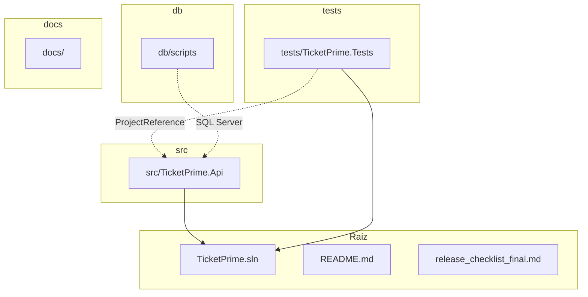
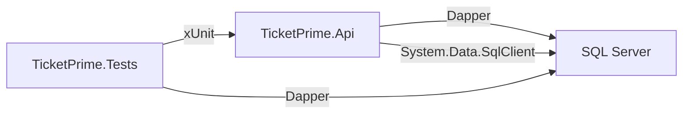

# Plano: Estrutura Inicial do TicketPrime

## Visão Geral

Criação da estrutura inicial do projeto **TicketPrime** usando .NET 8, Minimal API, Dapper, SQL Server e xUnit.

---

## Tecnologias e Restrições

| Tecnologia | Versão | Uso |
|---|---|---|
| .NET | 8.0 | Runtime/Framework |
| Minimal API | n/d | Camada de apresentação (API REST) |
| Dapper | 2.x | Acesso a dados (ADO.NET) |
| SQL Server | 2022+ | Banco de dados relacional |
| xUnit | 2.x | Testes unitários e de integração |

### Restrições Obrigatórias (Checklist de Verificação)

- [ ] **NÃO** usar Entity Framework (nem EF Core, nem EF6)
- [ ] **NÃO** usar banco em memória (InMemory Database)
- [ ] **NÃO** alterar nomes de pastas definidos (`/docs`, `/db`, `/src`, `/tests`)
- [ ] **NÃO** alterar nomes de rotas
- [ ] **NÃO** usar SQL interpolation (ex: `$"SELECT * FROM {tabela}"`)
- [ ] **NÃO** usar concatenação SQL (ex: `"SELECT * FROM " + tabela`)

---

## Estrutura de Diretórios

```
/home/pedro/Downloads/ticket og/
├── docs/                          # Documentação do projeto
├── db/                            # Scripts de banco de dados
│   └── scripts/
│       └── 001_CreateSchema.sql   # Script inicial de schema
├── src/                           # Código fonte
│   └── TicketPrime.Api/           # Projeto da Minimal API
│       ├── Program.cs             # Entry point da aplicação
│       ├── appsettings.json       # Configurações (connection string)
│       ├── appsettings.Development.json
│       └── TicketPrime.Api.csproj
├── tests/                         # Projetos de teste
│   └── TicketPrime.Tests/         # Testes xUnit
│       ├── UnitTest1.cs           # Teste dummy inicial
│       └── TicketPrime.Tests.csproj
├── TicketPrime.sln                # Arquivo de solução
├── README.md                      # Documento descritivo do projeto
└── release_checklist_final.md     # Checklist de release
```

---

## Passos de Implementação

### Passo 1: Criar Diretórios

Criar a estrutura de pastas: `docs/`, `db/scripts/`, `src/`, `tests/`.

### Passo 2: Criar Solução e Projetos

```bash
dotnet new sln -n TicketPrime
dotnet new webapi -n TicketPrime.Api -o src/TicketPrime.Api --no-https
dotnet new xunit -n TicketPrime.Tests -o tests/TicketPrime.Tests
dotnet sln add src/TicketPrime.Api/TicketPrime.Api.csproj
dotnet sln add tests/TicketPrime.Tests/TicketPrime.Tests.csproj
```

### Passo 3: Configurar Projeto API

**TicketPrime.Api.csproj** - Adicionar pacote Dapper:
```xml
<PackageReference Include="Dapper" Version="2.*" />
```

**Program.cs** - Estrutura mínima com:
- Builder padrão
- Swagger (opcional mas comum para dev)
- Mapeamento vazio (sem endpoints ainda)
- Conexão com SQL Server via `SqlConnection` + Dapper

**appsettings.json** - Connection string para SQL Server (placeholder).

### Passo 4: Configurar Projeto de Testes

**TicketPrime.Tests.csproj** - Adicionar dependência do projeto API:
```xml
<ProjectReference Include="..\..\src\TicketPrime.Api\TicketPrime.Api.csproj" />
```

### Passo 5: Criar Script SQL Inicial

`db/scripts/001_CreateSchema.sql` - Schema inicial vazio (apenas estrutura de banco, sem regras de negócio ainda).

### Passo 6: Criar Documentação

- **README.md** - Visão geral, tecnologias, pré-requisitos, estrutura.
- **release_checklist_final.md** - Checklist de release.

---

## Diagrama da Estrutura



## Diagrama de Dependências



---

## Verificação de Conformidade com Restrições

| Restrição | Como garantir |
|---|---|
| Sem Entity Framework | Não adicionar pacote `Microsoft.EntityFrameworkCore` |
| Sem banco em memória | Não usar `UseInMemoryDatabase` |
| Nomes de pastas fixos | Criar exatamente `docs/`, `db/`, `src/`, `tests/` |
| Nomes de rotas fixos | Não definir endpoints ainda |
| Sem SQL interpolation | Usar Dapper com parâmetros nomeados (`@param`) |
| Sem concatenação SQL | Usar Dapper com parâmetros tipados |

---

## Próximos Passos (após estrutura inicial)

1. Definir modelos de domínio (entidades)
2. Implementar repositórios com Dapper
3. Criar endpoints da Minimal API
4. Implementar testes unitários e de integração
5. Configurar pipeline de CI/CD
