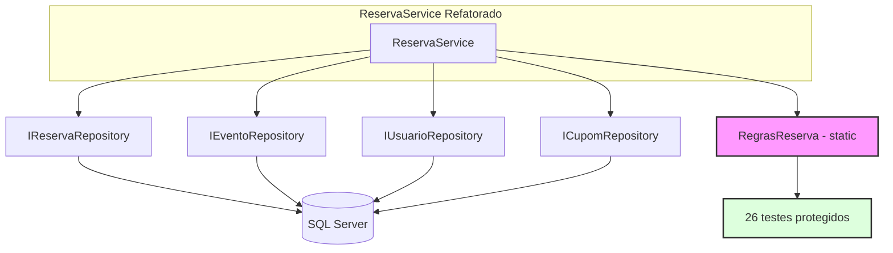
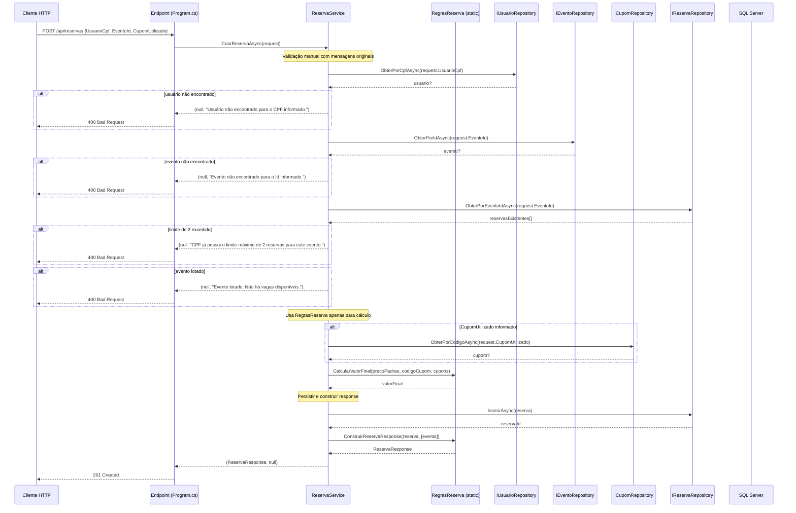
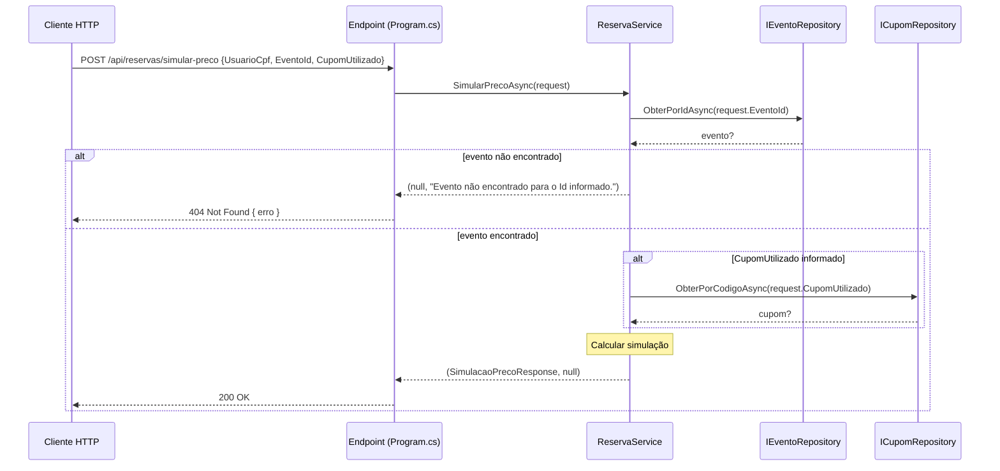
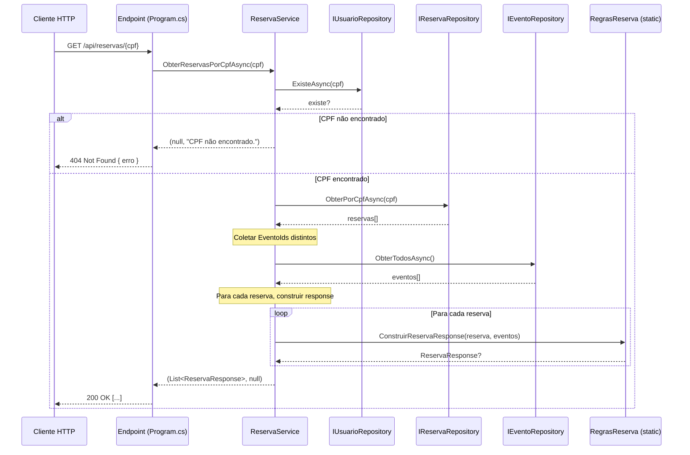

# Plano da Etapa 10b — Migrar Domínio Reservas (Risco: Médio-Alto)

**Projeto:** TicketPrime — Fase 2: Separação de Camadas
**Pré-requisito:** Etapa 10a concluída e aprovada (Build OK, 103/103 testes)
**Base:** [`ReservaService`](src/TicketPrime.Api/Services/ReservaService.cs) pós-extração de [`RegrasReserva`](src/TicketPrime.Api/Services/RegrasReserva.cs) — 4 métodos delegadores puros
**Dependências:** Etapa 2 (infra repositórios), Etapa 3 (Usuários), Etapa 5 (Eventos), Etapa 4 (Cupons), **Etapa 10a (C3 — RegrasReserva)**

---

## 1. Objetivo da Etapa 10b

Refatorar o [`ReservaService`](src/TicketPrime.Api/Services/ReservaService.cs) de um service **puro (sem DB)** para um service **orquestrador** que:

1. Injeta `IReservaRepository`, `IEventoRepository`, `IUsuarioRepository` e opcionalmente `ICupomRepository`
2. Chama repositórios para **buscar dados do banco**
3. Faz validações com **mensagens originais** do endpoint `POST /api/reservas` (Estratégia A — ver seção 12)
4. Usa [`RegrasReserva`](src/TicketPrime.Api/Services/RegrasReserva.cs) apenas para `CalcularValorFinal`, `ConstruirReservaResponse` e `CupomPodeSerAplicado`
5. Chama repositórios para **persistir** resultados
6. Remove os **4 métodos delegadores** (pass-through) que só existiam como ponte da Etapa 10a

**Endpoints a migrar** (3 endpoints — atualmente com SQL inline em [`Program.cs`](src/TicketPrime.Api/Program.cs)):

| Endpoint | Linhas em [`Program.cs`](src/TicketPrime.Api/Program.cs) | SQL Inline |
|:---------|:--------------------------------------------------------:|:----------:|
| `POST /api/reservas` | 452-539 (87 linhas) | 6 consultas + 1 INSERT |
| `POST /api/reservas/simular-preco` | 559-616 (57 linhas) | 2 consultas |
| `GET /api/reservas/{cpf}` | 632-652 (20 linhas) | 2 consultas |

---

## 2. Arquivos que Serão Alterados

### 2.1. [`src/TicketPrime.Api/Repositories/IReservaRepository.cs`](src/TicketPrime.Api/Repositories/IReservaRepository.cs)
**Estado atual:** Apenas `ObterPorIdAsync(int id, IDbTransaction? transaction = null)` — criado na Etapa 8 para atender Ingressos.

**Mudanças:** Adicionar **5 novos métodos** seguindo a **convenção C6** (`IDbTransaction? transaction = null`):

```csharp
// Já existe:
Task<Reserva?> ObterPorIdAsync(int id, IDbTransaction? transaction = null);

// NOVOS:
/// <summary>Insere uma reserva e retorna o Id gerado.</summary>
Task<int> InserirAsync(Reserva reserva, IDbTransaction? transaction = null);

/// <summary>Conta reservas de um CPF em um evento específico (limite de 2).</summary>
Task<int> ContarPorCpfEEventoAsync(string cpf, int eventoId, IDbTransaction? transaction = null);

/// <summary>Conta reservas de um evento (verificação de capacidade).</summary>
Task<int> ContarPorEventoAsync(int eventoId, IDbTransaction? transaction = null);

/// <summary>Retorna todas as reservas de um CPF.</summary>
Task<IEnumerable<Reserva>> ObterPorCpfAsync(string cpf, IDbTransaction? transaction = null);

/// <summary>Retorna todas as reservas de um evento.</summary>
Task<IEnumerable<Reserva>> ObterPorEventoIdAsync(int eventoId, IDbTransaction? transaction = null);
```

### 2.2. [`src/TicketPrime.Api/Repositories/ReservaRepository.cs`](src/TicketPrime.Api/Repositories/ReservaRepository.cs)
**Estado atual:** Apenas implementa `ObterPorIdAsync`.

**Mudanças:** Implementar os **5 novos métodos** com Dapper, respeitando C6.

### 2.3. [`src/TicketPrime.Api/Services/ReservaService.cs`](src/TicketPrime.Api/Services/ReservaService.cs)
**Estado atual (pós-Etapa 10a):** 4 métodos delegadores (pass-through) para [`RegrasReserva`](src/TicketPrime.Api/Services/RegrasReserva.cs). Sem construtor. Sem dependências.

**Mudanças — substituição completa:**

**a) Adicionar construtor com injeção de dependências:**
```csharp
public class ReservaService
{
    private readonly IReservaRepository _reservaRepository;
    private readonly IEventoRepository _eventoRepository;
    private readonly IUsuarioRepository _usuarioRepository;
    private readonly ICupomRepository _cupomRepository;

    public ReservaService(
        IReservaRepository reservaRepository,
        IEventoRepository eventoRepository,
        IUsuarioRepository usuarioRepository,
        ICupomRepository cupomRepository)
    {
        _reservaRepository = reservaRepository;
        _eventoRepository = eventoRepository;
        _usuarioRepository = usuarioRepository;
        _cupomRepository = cupomRepository;
    }
}
```

> ✅ **Decidido:** `IncrementoService` **não será usado** para evitar dependência morta. A lógica de `SimularPrecoAsync` replica o cálculo inline original (ver seção 10).

**b) Remover os 4 métodos pass-through** (já que os testes chamam [`RegrasReserva`](src/TicketPrime.Api/Services/RegrasReserva.cs) diretamente):
- `ValidarReserva(...)` → REMOVIDO
- `CalcularValorFinal(...)` → REMOVIDO
- `CupomPodeSerAplicado(...)` → REMOVIDO
- `ConstruirReservaResponse(...)` → REMOVIDO

**c) Adicionar 3 métodos de orquestração:**

```csharp
// POST /api/reservas
public async Task<(ReservaResponse? Reserva, string? Erro)> CriarReservaAsync(ReservaRequest request)

// POST /api/reservas/simular-preco  
public async Task<(SimulacaoPrecoResponse? Simulacao, string? Erro)> SimularPrecoAsync(SimulacaoPrecoRequest request)

// GET /api/reservas/{cpf}
public async Task<(List<ReservaResponse>? Reservas, string? Erro)> ObterReservasPorCpfAsync(string cpf)
```

### 2.4. [`src/TicketPrime.Api/Program.cs`](src/TicketPrime.Api/Program.cs)

**a) Registrar [`ReservaService`](src/TicketPrime.Api/Services/ReservaService.cs) no DI:**
```csharp
builder.Services.AddScoped<ReservaService>();  // ← NOVA linha
```
(Junto com as demais linhas de DI, próximo à linha 34)

**b) Substituir endpoint `POST /api/reservas`** (linhas 452-539):
```csharp
app.MapPost("/api/reservas", async (ReservaService service, [FromBody] ReservaRequest request) =>
{
    var (reserva, erro) = await service.CriarReservaAsync(request);
    return erro is not null
        ? Results.BadRequest(new { erro })
        : Results.Created($"/api/reservas/{reserva!.Id}", reserva);
});
```

**c) Substituir endpoint `POST /api/reservas/simular-preco`** (linhas 559-616):
```csharp
app.MapPost("/api/reservas/simular-preco", async (ReservaService service, [FromBody] SimulacaoPrecoRequest request) =>
{
    var (simulacao, erro) = await service.SimularPrecoAsync(request);
    return erro is not null
        ? Results.BadRequest(new { erro })
        : Results.Ok(simulacao);
});
```

**d) Substituir endpoint `GET /api/reservas/{cpf}`** (linhas 632-652):
```csharp
app.MapGet("/api/reservas/{cpf}", async (ReservaService service, string cpf) =>
{
    var (reservas, erro) = await service.ObterReservasPorCpfAsync(cpf);
    if (erro is not null)
        return Results.NotFound(new { erro });
    return Results.Ok(reservas);
});
```

**Redução estimada:** ~164 linhas de SQL/regras inline eliminadas de [`Program.cs`](src/TicketPrime.Api/Program.cs).

---

## 3. Arquivos que Serão Criados

**Nenhum.** Todos os arquivos necessários já existem:
- [`IReservaRepository.cs`](src/TicketPrime.Api/Repositories/IReservaRepository.cs) — expandido (não criado)
- [`ReservaRepository.cs`](src/TicketPrime.Api/Repositories/ReservaRepository.cs) — expandido (não criado)
- [`ReservaService.cs`](src/TicketPrime.Api/Services/ReservaService.cs) — refatorado (não criado)
- [`RegrasReserva.cs`](src/TicketPrime.Api/Services/RegrasReserva.cs) — já existe (Etapa 10a), **não será alterado**

---

## 4. Dependências da Etapa

| Dependência | Etapa | Status | Por quê? |
|:------------|:-----:|:------:|:---------|
| Infra repositórios (C6) | 2 | ✅ Concluída | Padrão `IDbTransaction?` estabelecido |
| [`IUsuarioRepository`](src/TicketPrime.Api/Repositories/IUsuarioRepository.cs) | 3 | ✅ Concluída | Verificar CPF existe |
| [`ICupomRepository`](src/TicketPrime.Api/Repositories/ICupomRepository.cs) | 4 | ✅ Concluída | Buscar dados de cupom |
| [`IEventoRepository`](src/TicketPrime.Api/Repositories/IEventoRepository.cs) | 5 | ✅ Concluída | Buscar dados do evento |
| **`RegrasReserva` (C3)** | **10a** | ✅ **Concluída** | **Métodos puros (CalcularValorFinal, ConstruirReservaResponse, CupomPodeSerAplicado)** |
**Diagrama de dependências:**


---

## 5. Estratégia de Preservação das Mensagens (Estratégia A)

### 5.1. Problema identificado

O método [`RegrasReserva.ValidarReserva()`](src/TicketPrime.Api/Services/RegrasReserva.cs:25) possui mensagens de erro DIFERENTES das mensagens originais do endpoint `POST /api/reservas`:

| Validação | Mensagem original (Program.cs:452-539) | Mensagem em RegrasReserva.ValidarReserva |
|:----------|:---------------------------------------|:-----------------------------------------|
| CPF não encontrado | `"Usuário não encontrado para o CPF informado."` | `"CPF do usuário não encontrado. Realize o cadastro antes de reservar."` |
| Evento não encontrado | `"Evento não encontrado para o Id informado."` | `"Evento não encontrado."` |
| Limite de 2 reservas | `"CPF já possui o limite máximo de 2 reservas para este evento."` | `"Limite de reservas atingido para este CPF no evento (máximo 2)."` |
| Evento lotado | `"Evento lotado. Não há vagas disponíveis."` | `"Evento lotado. Não há ingressos disponíveis."` |

**Não podemos alterar `RegrasReserva.ValidarReserva`** pois os 26 testes existentes já validam essas mensagens atuais (via `Assert.Contains`). Alterar quebraria os testes.

### 5.2. Solução: Estratégia A

O [`ReservaService.CriarReservaAsync()`](src/TicketPrime.Api/Services/ReservaService.cs) fará as **validações manualmente** com as **mensagens originais** do endpoint, sem chamar `RegrasReserva.ValidarReserva`.

```csharp
public async Task<(ReservaResponse? Reserva, string? Erro)> CriarReservaAsync(ReservaRequest request)
{
    // 1. Buscar usuário
    var usuario = await _usuarioRepository.ObterPorCpfAsync(request.UsuarioCpf);
    if (usuario is null)
        return (null, "Usuário não encontrado para o CPF informado.");

    // 2. Buscar evento
    var evento = await _eventoRepository.ObterPorIdAsync(request.EventoId);
    if (evento is null)
        return (null, "Evento não encontrado para o Id informado.");

    // 3. Verificar limite de 2 reservas por CPF no mesmo evento
    var reservasExistentes = (await _reservaRepository.ObterPorEventoIdAsync(request.EventoId)).ToList();
    var reservasCpfEvento = reservasExistentes.Count(r => r.UsuarioCpf == request.UsuarioCpf);
    if (reservasCpfEvento >= 2)
        return (null, "CPF já possui o limite máximo de 2 reservas para este evento.");

    // 4. Verificar capacidade do evento
    if (reservasExistentes.Count >= evento.CapacidadeTotal)
        return (null, "Evento lotado. Não há vagas disponíveis.");

    // 5. Processar cupom (se informado)
    var cupomAplicado = request.CupomUtilizado;
    var cupons = new List<Cupom>();
    if (!string.IsNullOrWhiteSpace(request.CupomUtilizado))
    {
        var cupom = await _cupomRepository.ObterPorCodigoAsync(request.CupomUtilizado);
        if (cupom is not null)
            cupons.Add(cupom);
    }

    // 6. Calcular valor final usando RegrasReserva (apenas cálculo, sem validação)
    decimal valorFinal = RegrasReserva.CalcularValorFinal(evento.PrecoPadrao, request.CupomUtilizado, cupons);

    // 7. Persistir reserva
    var reserva = new Reserva
    {
        UsuarioCpf = request.UsuarioCpf,
        EventoId = request.EventoId,
        CupomUtilizado = string.IsNullOrWhiteSpace(request.CupomUtilizado) ? null : request.CupomUtilizado,
        ValorFinalPago = valorFinal
    };
    var reservaId = await _reservaRepository.InserirAsync(reserva);

    // 8. Construir response usando RegrasReserva
    reserva.Id = reservaId;
    var eventos = new List<Evento> { evento };
    var response = RegrasReserva.ConstruirReservaResponse(reserva, eventos);

    return (response, null);
}
```

### 5.3. Impacto no fluxo



---

## 6. Lista Final dos 5 Métodos de IReservaRepository

| # | Método | Descrição | C6 | Usado em |
|:-:|:-------|:----------|:--|:---------|
| 0 | `ObterPorIdAsync(int id, IDbTransaction? t = null)` | Já existe (Etapa 8) | ✅ | Ingressos |
| **1** | **`InserirAsync(Reserva reserva, IDbTransaction? t = null)`** | Insere reserva, retorna Id | ✅ | `CriarReservaAsync` |
| **2** | **`ContarPorCpfEEventoAsync(string cpf, int eventoId, IDbTransaction? t = null)`** | Conta reservas de um CPF em um evento | ✅ | Preparatório p/ Etapa 11b |
| **3** | **`ContarPorEventoAsync(int eventoId, IDbTransaction? t = null)`** | Conta reservas de um evento | ✅ | Preparatório p/ Etapa 11b |
| **4** | **`ObterPorCpfAsync(string cpf, IDbTransaction? t = null)`** | Retorna reservas de um CPF | ✅ | `ObterReservasPorCpfAsync` |
| **5** | **`ObterPorEventoIdAsync(int eventoId, IDbTransaction? t = null)`** | Retorna reservas de um evento | ✅ | `CriarReservaAsync` |

> **Total: 5 novos métodos** (não 4 como no plano anterior).

### 6.1. C6 confirmado em ObterPorEventoIdAsync

O método [`ObterPorEventoIdAsync`] terá o parâmetro `IDbTransaction? transaction = null` seguindo a convenção C6, assim como todos os demais.

### 6.2. Observação sobre métodos preparatórios

Os métodos:
- [`ContarPorCpfEEventoAsync`](src/TicketPrime.Api/Repositories/IReservaRepository.cs)
- [`ContarPorEventoAsync`](src/TicketPrime.Api/Repositories/IReservaRepository.cs)

São métodos preparatórios para a **Etapa 11b** (confirmação de carrinho transacional). Nesta Etapa 10b, **podem não ser usados diretamente** pelo `ReservaService`, pois:

- `ObterPorEventoIdAsync` retorna a lista completa de reservas, e as contagens são feitas via LINQ no service (linha 3 do fluxo: `reservasExistentes.Count(r => r.UsuarioCpf == request.UsuarioCpf)`)
- Os métodos de contagem (`ContarPor...`) serão usados na Etapa 11b dentro de transações, onde COUNT(1) direto no SQL é mais eficiente que trazer a lista toda

---

## 7. Como RegrasReserva Será Usada

`RegrasReserva` é uma classe `public static` com 4 métodos puros. O novo [`ReservaService`](src/TicketPrime.Api/Services/ReservaService.cs) a utilizará **apenas para cálculo e construção de response**, NÃO para validação com retorno de erro HTTP.

### Chamadas do service para RegrasReserva:

| Método do Service | Método de RegrasReserva | Quando | Observação |
|:-----------------|:------------------------|:-------|:-----------|
| `CriarReservaAsync` | `RegrasReserva.CalcularValorFinal(precoPadrao, codigoCupom, cupons)` | Após validações manuais, para calcular preço com desconto | Usado |
| `CriarReservaAsync` | `RegrasReserva.ConstruirReservaResponse(reserva, eventos)` | Após inserir a reserva, para montar o response com NomeEvento | Usado |
| `ObterReservasPorCpfAsync` | `RegrasReserva.ConstruirReservaResponse(reserva, eventos)` | Para cada reserva retornada | Usado |

### Métodos NÃO usados pelo service:

| Método de RegrasReserva | Motivo |
|:-----------------------|:-------|
| `RegrasReserva.ValidarReserva(...)` | ❌ **Não usado.** Mensagens divergem das originais. O service faz validação manual. |
| `RegrasReserva.CupomPodeSerAplicado(...)` | ⚠️ **Não usado diretamente.** O cálculo de desconto é delegado a `CalcularValorFinal`, que internamente já verifica `ValorMinimoRegra`. |

### O que NÃO muda em RegrasReserva:

- Assinaturas dos 4 métodos (idênticas)
- Lógica interna de validação (incluindo `ValidarReserva` com suas mensagens atuais)
- Classe `ResultadoReserva` (Sucesso, Erro, ValorFinalPago, CupomAplicado)
- Todos os 26 testes existentes (continuam chamando `RegrasReserva` diretamente)

---

## 8. Como os 26 Testes Continuam Protegidos

### Situação atual (pós-Etapa 10a): ✅

```
ReservaServiceTests (26 testes)
    └── Chama diretamente RegrasReserva.Metodo() ← static
         └── Não instancia ReservaService
         └── Não usa banco de dados
         └── Passa listas em memória
```

### Após Etapa 10b: ✅ (idêntico)

```
ReservaServiceTests (26 testes) — NENHUMA ALTERAÇÃO
    └── Chama diretamente RegrasReserva.Metodo() ← static (MESMA COISA)
         └── Não instancia ReservaService
         └── Não usa banco de dados
         └── Passa listas em memória
```

**Garantias:**
1. Nenhum teste em [`ReservaServiceTests.cs`](tests/TicketPrime.Tests/ReservaServiceTests.cs) referencia a classe `ReservaService` como instância
2. Nenhum teste usa `new ReservaService()` ou injeção de dependência
3. Todos os 26 testes chamam `RegrasReserva.XXX(...)` — métodos estáticos
4. Remover os 4 métodos pass-through de [`ReservaService`](src/TicketPrime.Api/Services/ReservaService.cs) não afeta os testes (eles não os chamam)
5. `dotnet test --filter ReservaServiceTests` continuará passando 26/26 **sem nenhuma modificação nos testes**

### Cobertura dos cenários:

Os 26 testes cobrem:
- CPF inexistente → testa `RegrasReserva.ValidarReserva` com lista de usuários
- Evento inexistente → testa `RegrasReserva.ValidarReserva` com lista de eventos
- Limite de 2 reservas → testa `RegrasReserva.ValidarReserva` com lista de reservas
- Evento lotado → testa `RegrasReserva.ValidarReserva` com lista de reservas
- Cupom válido/inválido → testa `RegrasReserva.ValidarReserva` e `CalcularValorFinal`
- ConstruirReservaResponse → testa `RegrasReserva.ConstruirReservaResponse`

**O `ReservaService.CriarReservaAsync` replica a mesma lógica de validação, mas com mensagens originais.** Se houver um bug no service, ele será capturado por:
- Testes de contrato (curl/Postman) no checklist
- Testes de integração futuros (fora do escopo da Fase 2)

---

## 9. Como a Etapa 10b Prepara a Etapa 11b

A Etapa 11b (confirmação de carrinho transacional — `POST /api/carrinho/{cpf}/confirmar`) depende da Etapa 10b pelos seguintes motivos:

### 9.1. Dependência direta de `IReservaRepository`

O fluxo de confirmação de carrinho (linhas 1096-1295 em [`Program.cs`](src/TicketPrime.Api/Program.cs)) cria **reservas dentro de uma transação**. Atualmente isso é feito com SQL inline.

Após a Etapa 10b, o `IReservaRepository.InserirAsync()` já existirá com suporte a `IDbTransaction?` (C6). A Etapa 11b poderá chamar:

```csharp
var reservaId = await _reservaRepository.InserirAsync(reserva, transaction);
```

### 9.2. Dependência de métodos de contagem

A Etapa 11b também verifica o limite de 2 reservas por CPF/evento dentro da transação. Após a Etapa 10b, isso será substituído por:

```csharp
var count = await _reservaRepository.ContarPorCpfEEventoAsync(cpf, eventoId, transaction);
```

### 9.3. Resumo da preparação

| O que a Etapa 10b entrega | Como a Etapa 11b usa |
|:--------------------------|:---------------------|
| `IReservaRepository.InserirAsync(reserva, transaction)` | Criar reservas dentro da transação de confirmação |
| `IReservaRepository.ContarPorCpfEEventoAsync(cpf, eventoId, transaction)` | Verificar limite de 2 reservas dentro da transação |
| `IReservaRepository.ContarPorEventoAsync(eventoId, transaction)` | Verificar capacidade dentro da transação |
| `ReservaService` com injeção de dependências | (Não usado diretamente — a Etapa 11b usa os repositórios diretamente, não o service) |

---

## 10. Decisão: IncrementoService NÃO será usado

**Decisão:** Opção B — replicar a lógica inline original no [`ReservaService.SimularPrecoAsync()`](src/TicketPrime.Api/Services/ReservaService.cs).

### 10.1. Motivo

Evitar dependência morta, conforme orientação das Etapas 8 e 9. O `IncrementoService` não é necessário em nenhum outro fluxo de `ReservaService`.

### 10.2. Implementação esperada

```csharp
public async Task<(SimulacaoPrecoResponse? Simulacao, string? Erro)> SimularPrecoAsync(SimulacaoPrecoRequest request)
{
    // 1. Buscar evento
    var evento = await _eventoRepository.ObterPorIdAsync(request.EventoId);
    if (evento is null)
        return (null, "Evento não encontrado para o Id informado.");

    // 2. Calcular PrecoBase
    decimal precoBase = evento.PrecoPadrao;

    // 3. Calcular TaxaServico (10%)
    decimal taxaServico = Math.Round(precoBase * 0.10m, 2);

    // 4. Calcular ValorDesconto
    decimal valorDesconto = 0m;
    if (!string.IsNullOrWhiteSpace(request.CupomUtilizado))
    {
        var cupom = await _cupomRepository.ObterPorCodigoAsync(request.CupomUtilizado);
        if (cupom is not null && precoBase >= cupom.ValorMinimoRegra)
        {
            valorDesconto = Math.Round(precoBase * cupom.PorcentagemDesconto / 100m, 2);
        }
    }

    // 5. Calcular ValorFinal
    decimal valorFinal = precoBase + taxaServico - valorDesconto;

    var response = new SimulacaoPrecoResponse
    {
        PrecoBase = precoBase,
        TaxaServico = taxaServico,
        ValorDesconto = valorDesconto,
        ValorFinal = valorFinal
    };

    return (response, null);
}
```

> ⚠️ **Nota:** O `IncrementoService.SimularPreco` possui um `Math.Round(valorFinal, 2)` adicional que não existe na lógica original. Para os valores atuais (2 casas decimais) é equivalente, mas como optamos por não usar o `IncrementoService`, replicamos exatamente a lógica original sem o Round extra, preservando o comportamento contratual.

---

## 11. Dependências Finais do ReservaService

| Dependência | Obrigatória? | Usada em | Finalidade |
|:------------|:------------:|:---------|:-----------|
| `IReservaRepository` | ✅ Sim | `CriarReservaAsync`, `ObterReservasPorCpfAsync` | Persistir e consultar reservas |
| `IEventoRepository` | ✅ Sim | `CriarReservaAsync`, `SimularPrecoAsync`, `ObterReservasPorCpfAsync` | Obter dados do evento |
| `IUsuarioRepository` | ✅ Sim | `CriarReservaAsync`, `ObterReservasPorCpfAsync` | Verificar CPF existe |
| `ICupomRepository` | ✅ Sim | `CriarReservaAsync`, `SimularPrecoAsync` | Buscar dados de cupom |

---

## 12. Riscos

| # | Risco | Probabilidade | Impacto | Mitigação |
|:-:|-------|:-------------:|:-------:|-----------|
| R1 | **Quebra dos 26 testes** ao remover os métodos pass-through | Muito Baixa | Alto | Testes chamam `RegrasReserva` diretamente, não `ReservaService` — já verificado no código |
| R2 | **Mensagem de erro divergente** entre service e RegrasReserva | Baixa | Médio | Documentado na seção 5. Service usa mensagens originais; RegrasReserva mantém as atuais para os testes. |
| R3 | **Erro de DI** — esquecer de registrar `ReservaService` | Média | Alto | Checklist incluir verificação de `builder.Services.AddScoped<ReservaService>()` |
| R4 | **Regressão em validação de CPF** (formato vs existência) | Baixa | Médio | O `POST /api/reservas` atual valida formato + existência. As validações de formato (obrigatório, 11 dígitos, >0) permanecem no endpoint (Program.cs) |
| R5 | **`POST /api/reservas` retornar 201 Created vs 200 OK** | Baixa | Médio | O contrato atual retorna 201 com `ReservaResponse`. O service deve preservar isso. |
| R6 | **Commit grande demais** (3 endpoints + repositório + service) | Média | Médio | Todos os 3 endpoints de reserva estão no mesmo domínio. Commit único justificado, mas com checklist rigoroso. |

---

## 13. Critérios de Aceite

- [ ] **CA1:** `dotnet build` compila sem erros nem warnings (exceto nullability pré-existente)
- [ ] **CA2:** `dotnet test` passa **103/103** — os 26 testes de `ReservaServiceTests` continuam intactos (chamam `RegrasReserva` diretamente)
- [ ] **CA3:** Contratos da API preservados — mesmas rotas, métodos HTTP, request bodies, response bodies
  - `POST /api/reservas` → 201 Created + `ReservaResponse` (inalterado)
  - `POST /api/reservas/simular-preco` → 200 OK + `SimulacaoPrecoResponse` (inalterado)
  - `GET /api/reservas/{cpf}` → 200 OK + `List<ReservaResponse>` (inalterado)
- [ ] **CA4:** Mensagens de erro do `POST /api/reservas` preservadas:
  - `"Usuário não encontrado para o CPF informado."` (CPF inexistente)
  - `"Evento não encontrado para o Id informado."` (evento inexistente)
  - `"CPF já possui o limite máximo de 2 reservas para este evento."` (limite excedido)
  - `"Evento lotado. Não há vagas disponíveis."` (capacidade esgotada)
- [ ] **CA5:** Nenhuma tabela, coluna, constraint, índice ou view alterada no banco
- [ ] **CA6:** Autenticação/autorização preservada (nenhum endpoint de reserva tem `.RequireAuthorization()`)
- [ ] **CA7:** [`Program.cs`](src/TicketPrime.Api/Program.cs) reduzido em ~164 linhas
- [ ] **C6:** Todos os **5 novos métodos** de `IReservaRepository` possuem `IDbTransaction? transaction = null`:
  - `InserirAsync`
  - `ContarPorCpfEEventoAsync`
  - `ContarPorEventoAsync`
  - `ObterPorCpfAsync`
  - **`ObterPorEventoIdAsync`** ← confirmado C6

---

## 14. Estratégia de Rollback

```bash
# Antes de iniciar, criar checkpoint
git add -A && git commit -m "checkpoint antes da Etapa 10b"

# Em caso de falha:
# Opção 1: Reverter o commit
git revert HEAD

# Opção 2: Resetar para o checkpoint (se ainda não houve commit pós-falha)
git checkout -- src/TicketPrime.Api/Repositories/IReservaRepository.cs
git checkout -- src/TicketPrime.Api/Repositories/ReservaRepository.cs
git checkout -- src/TicketPrime.Api/Services/ReservaService.cs
git checkout -- src/TicketPrime.Api/Program.cs
```

---

## 15. Impacto Esperado no [`Program.cs`](src/TicketPrime.Api/Program.cs)

| Métrica | Antes | Depois | Redução |
|:--------|:-----:|:------:|:-------:|
| Linhas totais | ~1557 | ~1393 | -164 |
| Linhas de SQL inline em endpoints de reserva | ~164 | 0 | -100% |
| Endpoints com SQL/regras inline | 3 | 0 | -100% |
| Linhas de DI | ~20 | ~21 | +1 (AddScoped<ReservaService>) |

**Adições específicas:**
- `builder.Services.AddScoped<ReservaService>();` (1 linha, junto dos demais registros)

**Remoções específicas:**
- Endpoint `POST /api/reservas`: ~87 linhas → ~10 linhas
- Endpoint `POST /api/reservas/simular-preco`: ~57 linhas → ~10 linhas
- Endpoint `GET /api/reservas/{cpf}`: ~20 linhas → ~10 linhas
- Total removido: ~164 linhas → ~30 linhas adicionadas = **redução líquida de ~134 linhas**

---

## 16. O que NÃO Será Alterado

| Arquivo | Motivo |
|:--------|:-------|
| [`RegrasReserva.cs`](src/TicketPrime.Api/Services/RegrasReserva.cs) | Já extraído na Etapa 10a. Métodos puros protegidos por C3. Mensagens de `ValidarReserva` preservadas para os 26 testes. |
| [`ReservaServiceTests.cs`](tests/TicketPrime.Tests/ReservaServiceTests.cs) | 26 testes chamam `RegrasReserva` diretamente. Nenhuma linha precisa mudar. |
| [`Reserva.cs`](src/TicketPrime.Api/Models/Reserva.cs) | Modelo de domínio permanece idêntico. |
| [`ReservaRequest.cs`](src/TicketPrime.Api/Models/ReservaRequest.cs) | Request model permanece idêntico (extraído na Etapa 1). |
| [`ReservaResponse.cs`](src/TicketPrime.Api/Models/ReservaResponse.cs) | Response model permanece idêntico. |
| [`SimulacaoPrecoRequest.cs`](src/TicketPrime.Api/Models/SimulacaoPrecoRequest.cs) | Request model permanece idêntico. |
| [`SimulacaoPrecoResponse.cs`](src/TicketPrime.Api/Models/SimulacaoPrecoResponse.cs) | Response model permanece idêntico. |
| [`IEventoRepository.cs`](src/TicketPrime.Api/Repositories/IEventoRepository.cs) | Já possui métodos necessários (`ObterPorIdAsync`, `ObterTodosAsync`). |
| [`IUsuarioRepository.cs`](src/TicketPrime.Api/Repositories/IUsuarioRepository.cs) | Já possui métodos necessários (`ObterPorCpfAsync`, `ExisteAsync`). |
| [`ICupomRepository.cs`](src/TicketPrime.Api/Repositories/ICupomRepository.cs) | Já possui métodos necessários (`ObterPorCodigoAsync`). |
| [`EventoRepository.cs`](src/TicketPrime.Api/Repositories/EventoRepository.cs) | Implementação existente atende. |
| [`UsuarioRepository.cs`](src/TicketPrime.Api/Repositories/UsuarioRepository.cs) | Implementação existente atende. |
| [`CupomRepository.cs`](src/TicketPrime.Api/Repositories/CupomRepository.cs) | Implementação existente atende. |
| Qualquer outra interface/implementação de repositório | Escopo restrito ao domínio Reservas. |
| Qualquer outro endpoint em [`Program.cs`](src/TicketPrime.Api/Program.cs) | Escopo restrito aos 3 endpoints de reserva. |

---

## 17. Impacto Esperado nos Testes

**Nenhum.** Zero. Absolutamente nenhum.

Os 26 testes de [`ReservaServiceTests`](tests/TicketPrime.Tests/ReservaServiceTests.cs) chamam [`RegrasReserva`](src/TicketPrime.Api/Services/RegrasReserva.cs) **diretamente** como métodos estáticos:

```csharp
// Linha 54: RegrasReserva.ValidarReserva(...)
// Linha 206: RegrasReserva.CupomPodeSerAplicado(...)
// Linha 235: RegrasReserva.CalcularValorFinal(...)
// Linha 370: RegrasReserva.ConstruirReservaResponse(...)
```

Nenhum teste referencia `ReservaService` como instância. Portanto:

| Aspecto | Impacto |
|:--------|:--------|
| Build | ✅ Compila sem alterações |
| Testes existentes (26) | ✅ 26/26 intactos — mesmas asserções, mesmos dados |
| Novos testes necessários | ❌ Nenhum — regras já cobertas por `RegrasReserva` |
| Cobertura | ✅ Regras puras cobertas. Repositórios não são testados unitariamente (decisão arquitetural — R6 do plano da Fase 2). |

---

## 18. Fluxos dos Demais Endpoints

### 18.1. Fluxo do `SimularPrecoAsync(SimulacaoPrecoRequest request)` — (POST /api/reservas/simular-preco)



### 18.2. Fluxo do `ObterReservasPorCpfAsync(string cpf)` — (GET /api/reservas/{cpf})



---

## 19. Checklist de Execução

- [ ] 1. Expandir [`IReservaRepository`](src/TicketPrime.Api/Repositories/IReservaRepository.cs) — adicionar **5 novos métodos** com C6
- [ ] 2. Implementar os **5 novos métodos** em [`ReservaRepository`](src/TicketPrime.Api/Repositories/ReservaRepository.cs)
- [ ] 3. Verificar C6: todo método novo tem `IDbTransaction? transaction = null` (incluindo `ObterPorEventoIdAsync`)
- [ ] 4. Refatorar [`ReservaService`](src/TicketPrime.Api/Services/ReservaService.cs):
  - [ ] 4a. Adicionar construtor com 4 dependências (IReservaRepository, IEventoRepository, IUsuarioRepository, ICupomRepository)
  - [ ] 4b. Remover 4 métodos pass-through (herdados da Etapa 10a)
  - [ ] 4c. Implementar `CriarReservaAsync(ReservaRequest)` com **validação manual e mensagens originais**
  - [ ] 4d. Implementar `SimularPrecoAsync(SimulacaoPrecoRequest)` 
  - [ ] 4e. Implementar `ObterReservasPorCpfAsync(string cpf)`
- [ ] 5. Registrar [`ReservaService`](src/TicketPrime.Api/Services/ReservaService.cs) no DI em [`Program.cs`](src/TicketPrime.Api/Program.cs)
- [ ] 6. Substituir endpoint `POST /api/reservas` (87 linhas → ~10 linhas)
- [ ] 7. Substituir endpoint `POST /api/reservas/simular-preco` (57 linhas → ~10 linhas)
- [ ] 8. Substituir endpoint `GET /api/reservas/{cpf}` (20 linhas → ~10 linhas)
- [ ] 9. Executar `dotnet build` (zero erros)
- [ ] 10. Executar `dotnet test` (103/103 aprovados — 26 de Reserva intactos)
- [ ] 11. Verificar que nenhum teste foi alterado (`git diff tests/`)
- [ ] 12. Verificar que [`RegrasReserva.cs`](src/TicketPrime.Api/Services/RegrasReserva.cs) não foi alterado (`git diff src/TicketPrime.Api/Services/RegrasReserva.cs`)
- [ ] 13. Testar manualmente os 3 endpoints (curl ou Postman)
- [ ] 14. Commit com mensagem descritiva

---

## 20. Diagrama de Arquitetura Final (pós-Etapa 10b)

```mermaid
flowchart TD
    Client[Cliente HTTP] --> Program[Program.cs]
    
    Program --> EP1[POST /api/reservas]
    Program --> EP2[POST /api/reservas/simular-preco]
    Program --> EP3[GET /api/reservas/{cpf}]
    
    EP1 --> RS[ReservaService]
    EP2 --> RS
    EP3 --> RS
    
    RS --> R1[IReservaRepository - 5 métodos]
    RS --> R2[IEventoRepository]
    RS --> R3[IUsuarioRepository]
    RS --> R4[ICupomRepository]
    
    RS --> RR[RegrasReserva static]
    RR --> Testes[26 testes - protegidos]
    
    subgraph Validacao_Original[Validação com mensagens originais]
        RS_Val[ReservaService valida manualmente:]
        M1["Usuário não encontrado para o CPF informado."]
        M2["Evento não encontrado para o Id informado."]
        M3["CPF já possui o limite máximo de 2 reservas para este evento."]
        M4["Evento lotado. Não há vagas disponíveis."]
    end
    
    subgraph Regras_Puras[Regras de Negócio - C3]
        RR
    end
    
    subgraph Acesso_Dados[Acesso a Dados - C6]
        R1
        R2
        R3
        R4
    end
    
    style Testes fill:#dfd,stroke:#333,stroke-width:2px
    style Regras_Puras fill:#bbf,stroke:#333,stroke-width:1px
    style Acesso_Dados fill:#fdb,stroke:#333,stroke-width:1px
    style Validacao_Original fill:#dfd,stroke:#333,stroke-width:1px
```
