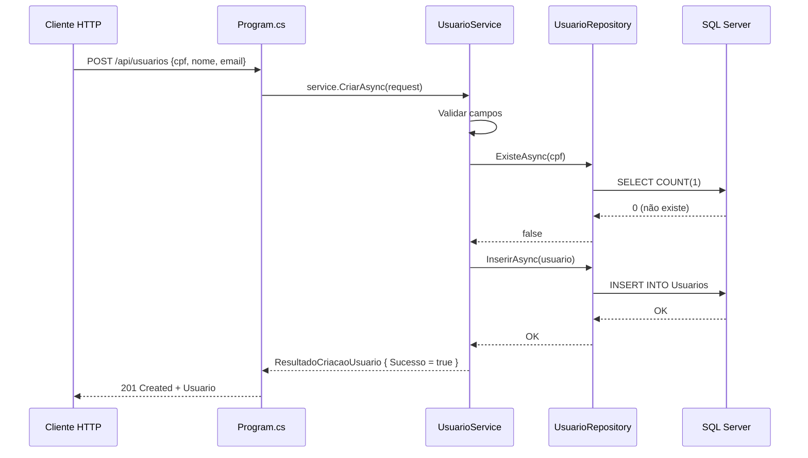

# Planejamento — Etapa 3: Migrar Domínio Usuários

**Projeto:** TicketPrime — Fase 2: Separação de Camadas e Redução do Acoplamento
**Data:** 2026-06-03
**Risco:** Muito Baixo
**Correção:** C6 (convenção `IDbTransaction? transaction = null` — já estabelecida na Etapa 2)

---

## 1. Objetivo da Etapa 3

Extrair do [`Program.cs`](src/TicketPrime.Api/Program.cs) toda a responsabilidade referente ao domínio **Usuários** — SQL, validação e regras de negócio — movendo-as para as camadas **Repository** (já existe da Etapa 2) e **Service** (a ser criado).

O endpoint `POST /api/usuarios` (linhas 420-467 do [`Program.cs`](src/TicketPrime.Api/Program.cs:420)) será reduzido a **~3-5 linhas**, passando a injetar [`UsuarioService`](src/TicketPrime.Api/Services/UsuarioService.cs) como dependência.

---

## 2. Arquivos que serão alterados

| Arquivo | Tipo de Alteração | Descrição |
|---------|:-----------------:|-----------|
| [`src/TicketPrime.Api/Program.cs`](src/TicketPrime.Api/Program.cs) | Modificação | Substituir o endpoint inline de [`POST /api/usuarios`](src/TicketPrime.Api/Program.cs:420-467) por uma chamada delegada ao [`UsuarioService`](src/TicketPrime.Api/Services/UsuarioService.cs); adicionar registro DI |
| Nenhum outro arquivo existente será alterado | — | — |

### 2.1. Substituição no endpoint

**ANTES** (48 linhos, linhas 420-467):
```csharp
app.MapPost("/api/usuarios", async (IDbConnection db, [FromBody] UsuarioRequest request) =>
{
    // 10 validações inline
    // SELECT COUNT(1) FROM Usuarios WHERE Cpf = @Cpf
    // INSERT INTO Usuarios ...
    // return Results.Created(...)
});
```

**DEPOIS** (~3-5 linhas):
```csharp
app.MapPost("/api/usuarios", async (UsuarioService service, [FromBody] UsuarioRequest request) =>
{
    var resultado = await service.CriarAsync(request);
    return resultado.Sucesso
        ? Results.Created($"/api/usuarios/{resultado.Cpf}", resultado.Usuario)
        : Results.BadRequest(new { erro = resultado.Erro });
});
```

### 2.2. Registro DI adicionado em [`Program.cs`](src/TicketPrime.Api/Program.cs:18)

Após a linha 18 (registro de `IUsuarioRepository`):
```csharp
builder.Services.AddScoped<UsuarioService>();
```

---

## 3. Arquivos que serão criados

| Arquivo | Descrição |
|---------|-----------|
| [`src/TicketPrime.Api/Services/UsuarioService.cs`](src/TicketPrime.Api/Services/UsuarioService.cs) | **Service** com validação de CPF, Nome, Email, verificação de duplicidade e orquestração da persistência via [`IUsuarioRepository`](src/TicketPrime.Api/Repositories/IUsuarioRepository.cs) |

### 3.1. Estrutura do [`UsuarioService`](src/TicketPrime.Api/Services/UsuarioService.cs)

```csharp
namespace TicketPrime.Api.Services;

public class UsuarioService
{
    private readonly IUsuarioRepository _repository;

    public UsuarioService(IUsuarioRepository repository)
    {
        _repository = repository;
    }

    public async Task<ResultadoCriacaoUsuario> CriarAsync(UsuarioRequest request)
    {
        // 1. Validações de entrada (CPF obrigatório, dígitos, 11 chars,
        //    Nome obrigatório <= 100, Email obrigatório <= 150, formato @)
        // 2. Verificar duplicidade via _repository.ExisteAsync(cpf)
        // 3. Inserir via _repository.InserirAsync(usuario)
        // 4. Retornar ResultadoCriacaoUsuario com Sucesso/Erro
    }
}

public class ResultadoCriacaoUsuario
{
    public bool Sucesso { get; set; }
    public string? Erro { get; set; }
    public string? Cpf { get; set; }
    public Usuario? Usuario { get; set; }
}
```

### 3.2. Observação sobre repositórios

Os repositórios [`IUsuarioRepository`](src/TicketPrime.Api/Repositories/IUsuarioRepository.cs) e [`UsuarioRepository`](src/TicketPrime.Api/Repositories/UsuarioRepository.cs) **já foram criados na Etapa 2** e estão prontos para uso. Nenhuma modificação neles é necessária nesta etapa.

---

## 4. Dependências da etapa

### 4.1. Pré-requisitos (já atendidos)

- [x] **Etapa 1 concluída:** [`UsuarioRequest`](src/TicketPrime.Api/Models/UsuarioRequest.cs) extraído para [`Models/`](src/TicketPrime.Api/Models/)
- [x] **Etapa 2 concluída:** [`IUsuarioRepository`](src/TicketPrime.Api/Repositories/IUsuarioRepository.cs) e [`UsuarioRepository`](src/TicketPrime.Api/Repositories/UsuarioRepository.cs) criados com convenção C6
- [x] **Build OK:** `dotnet build` compila sem erros
- [x] **Testes OK:** `dotnet test` passa 103/103
- [x] **Checkpoint Git:** `git tag fase2-checkpoint-inicial` existe (ou similar)

### 4.2. Dependências para etapas futuras

| Etapa | Depende da Etapa 3? | Motivo |
|:-----:|:-------------------:|--------|
| 4-9, 10b, 11a, 11b, 12 | **Não diretamente** | Cada etapa é independente; o padrão arquitetural (Service → Repository) é o mesmo |
| 10a | **Não** | Etapa puramente dentro de [`Services/`](src/TicketPrime.Api/Services/) |

> **Nota:** Embora as etapas sejam independentes, a Etapa 3 serve como **prova de conceito** do padrão de migração que será replicado nas Etapas 4-12 (Service + Repository + endpoint delegado).

### 4.3. Nenhuma dependência externa

- Nenhum pacote NuGet novo (Dapper, Microsoft.Data.SqlClient já estão no csproj)
- Nenhuma dependência de banco de dados
- Nenhuma dependência de infraestrutura externa

---

## 5. Riscos

| # | Risco | Probabilidade | Impacto | Mitigação |
|:-:|-------|:-------------:|:-------:|-----------|
| R3.1 | **Validação movida incorretamente** — diferença entre validação inline original e a do service | Muito Baixa | Alto | `dotnet test` cobre 103 testes; criar um teste de aceitação manual que chama `POST /api/usuarios` com payloads válido/inválido e compara resposta |
| R3.2 | **Convenção C6 não respeitada** no service ao chamar o repository | Muito Baixa | Médio | O `UsuarioService` não gerencia transações (não há necessidade neste domínio), mas o repository já tem o parâmetro opcional `IDbTransaction?` |
| R3.3 | **Esquecer de registrar DI** para `UsuarioService` | Baixa | Médio | Checklist pós-implementação incluir verificação de `builder.Services.AddScoped<UsuarioService>()` em [`Program.cs`](src/TicketPrime.Api/Program.cs) |
| R3.4 | **Quebra do contrato da API** — response diferente do original | Muito Baixa | Alto | O endpoint original retorna `Results.Created` com `Usuario` e `Results.BadRequest` com `{ erro: "..." }`. O service deve replicar exatamente o mesmo formato |
| R3.5 | **Testes `UsuarioValidationTests.cs` quebrados** — esses 5 testes validam modelos, não o endpoint | Muito Baixa | Alto | Nenhum teste existente referencia o endpoint ou o service — risco teórico |

---

## 6. Critérios de aceite

### 6.1. Obrigatórios

- [ ] **CA3.1:** [`UsuarioService`](src/TicketPrime.Api/Services/UsuarioService.cs) compila sem erros
- [ ] **CA3.2:** O endpoint `POST /api/usuarios` permanece funcional com o mesmo contrato (request/response idênticos)
- [ ] **CA3.3:** Nenhuma validação existente foi removida ou alterada (CPF obrigatório + dígitos + 11 chars, Nome obrigatório + max 100, Email obrigatório + max 150 + formato)
- [ ] **CA3.4:** SQL executado é idêntico ao original (`SELECT COUNT(1)` e `INSERT INTO Usuarios`)
- [ ] **CA3.5:** Nenhum SQL ou validação permanece inline no [`Program.cs`](src/TicketPrime.Api/Program.cs) para o domínio Usuários
- [ ] **CA3.6:** [`UsuarioService`](src/TicketPrime.Api/Services/UsuarioService.cs) registrado no DI em [`Program.cs`](src/TicketPrime.Api/Program.cs)
- [ ] **CA3.7:** `dotnet build` compila com zero erros
- [ ] **CA3.8:** `dotnet test` passa 103/103 **sem modificações** nos testes
- [ ] **CA3.9:** Nenhum arquivo de teste foi alterado
- [ ] **CA3.10:** Nenhum outro endpoint existente foi alterado
- [ ] **CA3.11:** Nenhuma classe [`Models/`](src/TicketPrime.Api/Models/) foi alterada

### 6.2. Verificações de qualidade

- [ ] **CA3.12:** Convenção C6 preservada nos repositórios (não há modificação nos repositórios, apenas verificação)
- [ ] **CA3.13:** Nomes de métodos seguem padrão do projeto (PascalCase, Async suffix)
- [ ] **CA3.14:** Nenhum warning novo de compilação
- [ ] **CA3.15:** O endpoint `POST /api/usuarios` em [`Program.cs`](src/TicketPrime.Api/Program.cs) tem no máximo ~5 linhas

---

## 7. Estratégia de rollback

### 7.1. Procedimento

```bash
# Opção 1 — Reverter commit (recomendado)
git revert HEAD --no-edit

# Opção 2 — Checkout manual
git checkout HEAD~1
```

### 7.2. Passos manuais (caso rollback automático não seja possível)

| Passo | Ação | Tempo |
|:-----:|------|:-----:|
| 1 | Remover o arquivo [`src/TicketPrime.Api/Services/UsuarioService.cs`](src/TicketPrime.Api/Services/UsuarioService.cs) | ~1 min |
| 2 | Restaurar o endpoint inline em [`Program.cs`](src/TicketPrime.Api/Program.cs) revertendo as linhas 420-467 ao original (48 linhas) | ~2 min |
| 3 | Remover `builder.Services.AddScoped<UsuarioService>()` de [`Program.cs`](src/TicketPrime.Api/Program.cs) | ~1 min |
| 4 | Executar `dotnet build` e `dotnet test` | ~2 min |
| | **Total** | **~6 min** |

### 7.3. Verificação pós-rollback

```bash
dotnet build    # zero erros
dotnet test     # 103/103
```

---

## 8. Impacto esperado no Program.cs

### 8.1. Linhas alteradas

| Região | Antes | Depois | Diferença |
|--------|:-----:|:------:|:---------:|
| Endpoint `POST /api/usuarios` (linhas 420-467) | **48 linhas** (validação + SQL + response inline) | **~5 linhas** (delega ao service) | **-43 linhas** |
| Registro DI (após linha 18) | `IUsuarioRepository` apenas | + `UsuarioService` | **+1 linha** |
| **Saldo líquido** | | | **-42 linhas** |

### 8.2. Estado esperado após a Etapa 3

- [`Program.cs`](src/TicketPrime.Api/Program.cs) reduz de ~2225 para ~2183 linhas
- Nenhuma configuração de middleware, CORS, auth ou JSON é alterada
- Nenhum SQL permanece no endpoint de usuários

### 8.3. Fluxo arquitetural após a Etapa 3



---

## 9. O que NÃO será alterado

### 🚫 Blindado (não tocar)

| Item | Motivo |
|------|--------|
| **Contratos da API** (rota `POST /api/usuarios`, request/response bodies) | CA3 — contrato deve permanecer idêntico |
| **Banco de Dados** (tabela Usuarios, colunas, constraints) | CA5 — SQL permanece idêntico ao atual |
| **Regras de Negócio** (validações de CPF, Nome, Email) | CA4 — são movidas, não alteradas |
| **Autenticação e Autorização** | CA6 — nenhuma alteração |
| **CORS** | CA7 — nenhuma alteração |
| **Testes existentes** (103/103, incluindo [`UsuarioValidationTests.cs`](tests/TicketPrime.Tests/UsuarioValidationTests.cs) com 5 testes) | CA2 — nenhuma linha de teste é alterada |
| **Models** ([`Usuario.cs`](src/TicketPrime.Api/Models/Usuario.cs), [`UsuarioRequest.cs`](src/TicketPrime.Api/Models/UsuarioRequest.cs)) | Já extraídos na Etapa 1 |
| **Repositórios existentes** ([`IUsuarioRepository`](src/TicketPrime.Api/Repositories/IUsuarioRepository.cs), [`UsuarioRepository`](src/TicketPrime.Api/Repositories/UsuarioRepository.cs)) | Criados na Etapa 2, permanecem inalterados |
| **Services existentes** ([`ReservaService`](src/TicketPrime.Api/Services/ReservaService.cs), [`IncrementoService`](src/TicketPrime.Api/Services/IncrementoService.cs)) | Permanecem puros, sem injeção de repositório |
| **Middleware** ([`ExceptionHandlingMiddleware`](src/TicketPrime.Api/Middleware/ExceptionHandlingMiddleware.cs)) | Sem alterações |
| **Authentication** ([`ApiKeyAuthenticationHandler`](src/TicketPrime.Api/Authentication/ApiKeyAuthenticationHandler.cs)) | Sem alterações |
| **Estrutura de diretórios existente** | Nomes de pastas fixos conforme requisito |
| **`GerarCodigoUnicoAsync`** em [`Program.cs`](src/TicketPrime.Api/Program.cs) | Permanece inline — será movido na Etapa 8 |
| **Demais endpoints** (Eventos, Cupons, Reservas, etc.) | Nenhum outro endpoint é alterado nesta etapa |
| **`Program.cs` linhas 1-419** | Nenhuma alteração de configuração, middleware ou outros endpoints |

### ✅ O que é alterado (apenas)

1. **Criação** do arquivo [`src/TicketPrime.Api/Services/UsuarioService.cs`](src/TicketPrime.Api/Services/UsuarioService.cs)
2. **Modificação** do endpoint `POST /api/usuarios` em [`Program.cs`](src/TicketPrime.Api/Program.cs) (48 linhas → ~5 linhas)
3. **Adição** de 1 linha de DI (`builder.Services.AddScoped<UsuarioService>()`) em [`Program.cs`](src/TicketPrime.Api/Program.cs)

---

## 10. Impacto esperado nos testes

### 10.1. Testes existentes (103/103)

Nenhum teste existente será alterado, removido ou modificado.

| Arquivo de teste | Testes | Impacto |
|-----------------|:------:|:-------:|
| [`UsuarioValidationTests.cs`](tests/TicketPrime.Tests/UsuarioValidationTests.cs) | 5 | **Nenhum** — validam modelos `Usuario` e `UsuarioRequest`, que não são alterados |
| [`CupomValidationTests.cs`](tests/TicketPrime.Tests/CupomValidationTests.cs) | 5 | Nenhum |
| [`EventoValidationTests.cs`](tests/TicketPrime.Tests/EventoValidationTests.cs) | 3 | Nenhum |
| [`ReservaServiceTests.cs`](tests/TicketPrime.Tests/ReservaServiceTests.cs) | 26 | Nenhum |
| [`IncrementoServiceTests.cs`](tests/TicketPrime.Tests/IncrementoServiceTests.cs) | 64 | Nenhum |
| **Total** | **103** | **Zero regressões** |

### 10.2. Testes futuros (recomendação fora do escopo)

Para aumentar a cobertura, recomenda-se adicionar futuramente:

- **`UsuarioServiceTests.cs`** — testar `CriarAsync` com:
  - CPF inválido (vazio, letras, != 11 dígitos)
  - Nome vazio/excedendo 100 caracteres
  - Email inválido (sem @, @ na primeira/última posição, excedendo 150)
  - CPF já cadastrado (mockando repository)
  - Sucesso (dados válidos)

> **Nota:** Estes testes **não fazem parte** do escopo da Etapa 3 e serão adicionados em momentos futuros definidos no plano da Fase 2.

---

## 11. Checklist de Implementação

- [ ] Criar [`src/TicketPrime.Api/Services/UsuarioService.cs`](src/TicketPrime.Api/Services/UsuarioService.cs) com:
  - Classe `UsuarioService` injetando `IUsuarioRepository`
  - Método `CriarAsync(UsuarioRequest request)` com todas as validações
  - Classe `ResultadoCriacaoUsuario` para o retorno
- [ ] Modificar endpoint `POST /api/usuarios` em [`Program.cs`](src/TicketPrime.Api/Program.cs:420):
  - Remover as 48 linhas de validação + SQL inline
  - Substituir por delegação ao `UsuarioService`
- [ ] Adicionar `builder.Services.AddScoped<UsuarioService>()` em [`Program.cs`](src/TicketPrime.Api/Program.cs) (após linha 18)
- [ ] Executar `dotnet build` — verificar zero erros
- [ ] Executar `dotnet test` — verificar 103/103 aprovados
- [ ] Verificar manualmente que o contrato `POST /api/usuarios` permanece idêntico
- [ ] Confirmar que nenhum outro arquivo foi alterado

---

## 12. Diagrama de estado: antes e depois da Etapa 3

### Antes (atual — Etapa 2 concluída)

```mermaid
flowchart LR
    subgraph Program.cs
        EndpointUsuario[POST /api/usuarios<br/>48 linhas<br/>validação + SQL inline]
    end
    EndpointUsuario --> UR[UsuarioRepository]
    UR --> DB[(SQL Server)]
    EndpointUsuario -.-> DB
    
    note right of EndpointUsuario: 10 validações + 2 SQLs<br/>tudo no Program.cs
```

### Depois (alvo — Etapa 3 concluída)

```mermaid
flowchart LR
    subgraph Program.cs
        EndpointUsuario[POST /api/usuarios<br/>~5 linhas<br/>apenas delegação]
    end
    EndpointUsuario --> US[UsuarioService]
    US --> UR[UsuarioRepository]
    UR --> DB[(SQL Server)]
    
    subgraph Services
        US
    end
    
    subgraph Repositories
        UR
    end
    
    note right of EndpointUsuario: Chama service apenas
    note right of US: Validações + orquestração
    note right of UR: SQL puro + C6
```
