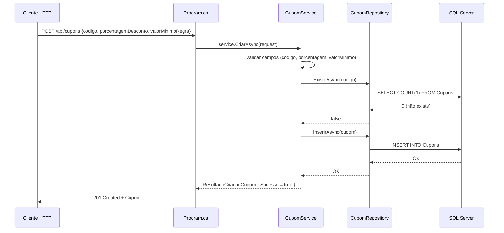

# Planejamento — Etapa 4: Migrar Domínio Cupons

**Projeto:** TicketPrime — Fase 2: Separação de Camadas e Redução do Acoplamento
**Data:** 2026-06-03
**Risco:** Muito Baixo
**Correção:** C6 (convenção `IDbTransaction? transaction = null` — já estabelecida na Etapa 2)

---

## 1. Objetivo da Etapa 4

Extrair do [`Program.cs`](src/TicketPrime.Api/Program.cs) toda a responsabilidade referente ao domínio **Cupons** — SQL, validação e regras de negócio — movendo-as para as camadas **Repository** (a ser criado) e **Service** (a ser criado), exatamente no mesmo padrão estabelecido na Etapa 3.

O endpoint `POST /api/cupons` (linhas 649-682 do [`Program.cs`](src/TicketPrime.Api/Program.cs:649)) será reduzido de **~34 linhas** para **~5 linhas**, passando a injetar [`CupomService`](src/TicketPrime.Api/Services/CupomService.cs) como dependência.

**Importante:** Esta etapa **não altera** as consultas a cupons feitas por outros endpoints ([`POST /api/reservas`](src/TicketPrime.Api/Program.cs:523), [`POST /api/reservas/simular-preco`](src/TicketPrime.Api/Program.cs:612), [`POST /api/reservas/{id}/ingresso`](src/TicketPrime.Api/Program.cs:749), [`POST /api/carrinho/{cpf}/confirmar`](src/TicketPrime.Api/Program.cs:1696)). Essas referências serão migradas para usar [`ICupomRepository`](src/TicketPrime.Api/Repositories/ICupomRepository.cs) em suas respectivas etapas (10b, 8, 11b).

---

## 2. Arquivos que serão alterados

| Arquivo | Tipo de Alteração | Descrição |
|---------|:-----------------:|-----------|
| [`src/TicketPrime.Api/Program.cs`](src/TicketPrime.Api/Program.cs) | Modificação | Substituir o endpoint inline de [`POST /api/cupons`](src/TicketPrime.Api/Program.cs:649-682) por uma chamada delegada ao [`CupomService`](src/TicketPrime.Api/Services/CupomService.cs); adicionar registro DI |
| Nenhum outro arquivo existente será alterado | — | — |

### 2.1. Substituição no endpoint

**ANTES** (34 linhas, linhas 649-682):
```csharp
app.MapPost("/api/cupons", async (IDbConnection db, [FromBody] CupomRequest request) =>
{
    if (string.IsNullOrWhiteSpace(request.Codigo))
        return Results.BadRequest(new { erro = "Código é obrigatório." });

    if (request.Codigo.Length > 50)
        return Results.BadRequest(new { erro = "Código não pode exceder 50 caracteres." });

    if (request.PorcentagemDesconto <= 0)
        return Results.BadRequest(new { erro = "PorcentagemDesconto deve ser maior que zero." });

    if (request.ValorMinimoRegra < 0)
        return Results.BadRequest(new { erro = "ValorMinimoRegra não pode ser negativo." });

    var existe = await db.ExecuteScalarAsync<int>(
        "SELECT COUNT(1) FROM Cupons WHERE Codigo = @Codigo",
        new { request.Codigo });

    if (existe > 0)
        return Results.BadRequest(new { erro = "Código já existe." });

    await db.ExecuteAsync(
        "INSERT INTO Cupons (Codigo, PorcentagemDesconto, ValorMinimoRegra) VALUES (@Codigo, @PorcentagemDesconto, @ValorMinimoRegra)",
        new { request.Codigo, request.PorcentagemDesconto, request.ValorMinimoRegra });

    var cupom = new Cupom
    {
        Codigo = request.Codigo,
        PorcentagemDesconto = request.PorcentagemDesconto,
        ValorMinimoRegra = request.ValorMinimoRegra
    };

    return Results.Created($"/api/cupons/{request.Codigo}", cupom);
});
```

**DEPOIS** (~5 linhas):
```csharp
app.MapPost("/api/cupons", async (CupomService service, [FromBody] CupomRequest request) =>
{
    var resultado = await service.CriarAsync(request);
    return resultado.Sucesso
        ? Results.Created($"/api/cupons/{resultado.Codigo}", resultado.Cupom)
        : Results.BadRequest(new { erro = resultado.Erro });
});
```

### 2.2. Registro DI adicionado em [`Program.cs`](src/TicketPrime.Api/Program.cs)

Após a linha 20 (`builder.Services.AddScoped<UsuarioService>()`):
```csharp
builder.Services.AddScoped<ICupomRepository, CupomRepository>();
builder.Services.AddScoped<CupomService>();
```

Total: **2 linhas adicionadas** no bloco de DI.

---

## 3. Arquivos que serão criados

| Arquivo | Descrição |
|---------|-----------|
| [`src/TicketPrime.Api/Repositories/ICupomRepository.cs`](src/TicketPrime.Api/Repositories/ICupomRepository.cs) | Interface com métodos de acesso a dados de cupons, seguindo convenção C6 |
| [`src/TicketPrime.Api/Repositories/CupomRepository.cs`](src/TicketPrime.Api/Repositories/CupomRepository.cs) | Implementação concreta injetando `IDbConnection`, encapsulando SQL |
| [`src/TicketPrime.Api/Services/CupomService.cs`](src/TicketPrime.Api/Services/CupomService.cs) | Service com validação e orquestração da persistência via `ICupomRepository` |

### 3.1. Estrutura do [`ICupomRepository`](src/TicketPrime.Api/Repositories/ICupomRepository.cs)

```csharp
namespace TicketPrime.Api.Repositories;

public interface ICupomRepository
{
    Task<Cupom?> ObterPorCodigoAsync(string codigo, IDbTransaction? transaction = null);  // C6
    Task<bool> ExisteAsync(string codigo, IDbTransaction? transaction = null);              // C6
    Task InserirAsync(Cupom cupom, IDbTransaction? transaction = null);                     // C6
}
```

**Métodos definidos:**
| Método | SQL encapsulado | Uso atual em Program.cs |
|--------|----------------|:----------------------:|
| `ObterPorCodigoAsync(string codigo)` | `SELECT Codigo, PorcentagemDesconto, ValorMinimoRegra FROM Cupons WHERE Codigo = @Codigo` | Endpoints de reserva, ingresso e carrinho (serão migrados em etapas futuras) |
| `ExisteAsync(string codigo)` | `SELECT COUNT(1) FROM Cupons WHERE Codigo = @Codigo` | `POST /api/cupons` (linha 663) |
| `InserirAsync(Cupom cupom)` | `INSERT INTO Cupons (Codigo, PorcentagemDesconto, ValorMinimoRegra) VALUES (...)` | `POST /api/cupons` (linha 670) |

### 3.2. Estrutura do [`CupomRepository`](src/TicketPrime.Api/Repositories/CupomRepository.cs)

```csharp
namespace TicketPrime.Api.Repositories;

public class CupomRepository : ICupomRepository
{
    private readonly IDbConnection _db;

    public CupomRepository(IDbConnection db)
    {
        _db = db;
    }

    public async Task<Cupom?> ObterPorCodigoAsync(string codigo, IDbTransaction? transaction = null)  // C6
    {
        return await _db.QuerySingleOrDefaultAsync<Cupom>(
            "SELECT Codigo, PorcentagemDesconto, ValorMinimoRegra FROM Cupons WHERE Codigo = @Codigo",
            new { Codigo = codigo },
            transaction: transaction);
    }

    public async Task<bool> ExisteAsync(string codigo, IDbTransaction? transaction = null)  // C6
    {
        return await _db.ExecuteScalarAsync<int>(
            "SELECT COUNT(1) FROM Cupons WHERE Codigo = @Codigo",
            new { Codigo = codigo },
            transaction: transaction) > 0;
    }

    public async Task InserirAsync(Cupom cupom, IDbTransaction? transaction = null)  // C6
    {
        await _db.ExecuteAsync(
            "INSERT INTO Cupons (Codigo, PorcentagemDesconto, ValorMinimoRegra) VALUES (@Codigo, @PorcentagemDesconto, @ValorMinimoRegra)",
            cupom,
            transaction: transaction);
    }
}
```

### 3.3. Estrutura do [`CupomService`](src/TicketPrime.Api/Services/CupomService.cs)

```csharp
namespace TicketPrime.Api.Services;

public class CupomService
{
    private readonly ICupomRepository _repository;

    public CupomService(ICupomRepository repository)
    {
        _repository = repository;
    }

    public async Task<ResultadoCriacaoCupom> CriarAsync(CupomRequest request)
    {
        // 1. Validações de entrada:
        //    - Código obrigatório, <= 50 caracteres
        //    - PorcentagemDesconto > 0
        //    - ValorMinimoRegra >= 0
        // 2. Verificar duplicidade via _repository.ExisteAsync(codigo)
        // 3. Inserir via _repository.InserirAsync(cupom)
        // 4. Retornar ResultadoCriacaoCupom com Sucesso/Erro
    }
}

public class ResultadoCriacaoCupom
{
    public bool Sucesso { get; set; }
    public string? Erro { get; set; }
    public string? Codigo { get; set; }
    public Cupom? Cupom { get; set; }
}
```

### 3.4. Observação sobre reutilização do repositório

O [`ICupomRepository`](src/TicketPrime.Api/Repositories/ICupomRepository.cs) será usado **nesta etapa** apenas pelo [`CupomService`](src/TicketPrime.Api/Services/CupomService.cs) para o endpoint `POST /api/cupons`. 

No entanto, sua interface já inclui o método `ObterPorCodigoAsync` (C6) para que as etapas futuras possam utilizá-lo sem modificação:
- **Etapa 10b** ([`ReservaService`](src/TicketPrime.Api/Services/ReservaService.cs)): consultar cupom ao criar reserva
- **Etapa 8** ([`IngressoService`](src/TicketPrime.Api/Services/IngressoService.cs)): consultar cupom ao gerar ingresso
- **Etapa 11b** ([`CarrinhoService`](src/TicketPrime.Api/Services/CarrinhoService.cs)): consultar cupom ao confirmar carrinho

---

## 4. Dependências da etapa

### 4.1. Pré-requisitos (já atendidos)

- [x] **Etapa 1 concluída:** [`CupomRequest`](src/TicketPrime.Api/Models/CupomRequest.cs) extraído para [`Models/`](src/TicketPrime.Api/Models/)
- [x] **Etapa 2 concluída:** Padrão Repository + convenção C6 estabelecidos (exemplo: [`UsuarioRepository`](src/TicketPrime.Api/Repositories/UsuarioRepository.cs))
- [x] **Etapa 3 concluída:** Prova de conceito do padrão Service → Repository validada com [`UsuarioService`](src/TicketPrime.Api/Services/UsuarioService.cs)
- [x] **Build OK:** `dotnet build` compila sem erros
- [x] **Testes OK:** `dotnet test` passa 103/103
- [x] **Checkpoint Git:** estado conhecido antes da Etapa 4

### 4.2. Dependências para etapas futuras

| Etapa | Depende da Etapa 4? | Motivo |
|:-----:|:-------------------:|--------|
| 5-9 | **Não** | Cada domínio é independente |
| **10b** | **Sim** (indireta) | [`ReservaService`](src/TicketPrime.Api/Services/ReservaService.cs) refatorado usará [`ICupomRepository`](src/TicketPrime.Api/Repositories/ICupomRepository.cs) para consultar cupons |
| **11b** | **Sim** (indireta) | [`CarrinhoService.ConfirmarAsync()`](src/TicketPrime.Api/Services/CarrinhoService.cs) usará [`ICupomRepository`](src/TicketPrime.Api/Repositories/ICupomRepository.cs) |
| 10a, 11a, 12 | **Não** | Etapas independentes |

> **Nota:** Embora as etapas 10b e 11b dependam do [`ICupomRepository`](src/TicketPrime.Api/Repositories/ICupomRepository.cs) criado aqui, elas **não precisam** que a Etapa 4 esteja "completa" (o endpoint migrado). O repositório já está disponível via DI para ser injetado onde necessário.

### 4.3. Nenhuma dependência externa

- Nenhum pacote NuGet novo (Dapper e Microsoft.Data.SqlClient já estão no csproj)
- Nenhuma dependência de banco de dados
- Nenhuma dependência de infraestrutura externa

---

## 5. Riscos

| # | Risco | Probabilidade | Impacto | Mitigação |
|:-:|-------|:-------------:|:-------:|-----------|
| R4.1 | **Validação movida incorretamente** — diferença entre as validações inline originais e as do service | Muito Baixa | Alto | `dotnet test` cobre 103 testes; os 5 testes [`CupomValidationTests`](tests/TicketPrime.Tests/CupomValidationTests.cs) validam os modelos, não as regras de negócio — será necessário teste manual do endpoint |
| R4.2 | **SQL do repositório diferente do original** — query de INSERT ou SELECT com diferença sutil | Muito Baixa | Médio | Inspeção visual: a query INSERT usa exatamente os mesmos campos e parâmetros do inline; a query SELECT COUNT(1) é idêntica |
| R4.3 | **Esquecer de registrar DI** para `ICupomRepository`/`CupomRepository` ou `CupomService` | Baixa | Médio | Checklist pós-implementação incluir verificação de `builder.Services.AddScoped<>()` em [`Program.cs`](src/TicketPrime.Api/Program.cs) |
| R4.4 | **Quebra do contrato da API** — response diferente do original | Muito Baixa | Alto | O endpoint original retorna `Results.Created` com `Cupom` (objeto com Codigo, PorcentagemDesconto, ValorMinimoRegra) e `Results.BadRequest` com `{ erro: "..." }`. O service deve replicar exatamente o mesmo formato |
| R4.5 | **Testes `CupomValidationTests.cs` quebrados** — esses 5 testes validam modelos, não o endpoint | Muito Baixa | Alto | Nenhum teste existente referencia o endpoint ou o service — risco teórico. Os testes validam [`Cupom`](src/TicketPrime.Api/Models/Cupom.cs) e [`CupomRequest`](src/TicketPrime.Api/Models/CupomRequest.cs), que não são alterados |
| R4.6 | **Convenção C6 não respeitada** em algum método do repositório | Média | Alto (futuro) | Revisão de código obrigatória; violação da convenção bloqueia o PR |

---

## 6. Critérios de aceite

### 6.1. Obrigatórios

- [ ] **CA4.1:** [`ICupomRepository`](src/TicketPrime.Api/Repositories/ICupomRepository.cs) e [`CupomRepository`](src/TicketPrime.Api/Repositories/CupomRepository.cs) compilam sem erros
- [ ] **CA4.2:** Convenção **C6** aplicada em todos os métodos do [`CupomRepository`](src/TicketPrime.Api/Repositories/CupomRepository.cs) — `IDbTransaction? transaction = null` como último parâmetro
- [ ] **CA4.3:** [`CupomService`](src/TicketPrime.Api/Services/CupomService.cs) compila sem erros
- [ ] **CA4.4:** O endpoint `POST /api/cupons` permanece funcional com o mesmo contrato (request/response idênticos)
- [ ] **CA4.5:** Nenhuma validação existente foi removida ou alterada:
  - Código obrigatório, <= 50 caracteres
  - PorcentagemDesconto > 0
  - ValorMinimoRegra >= 0
  - Verificação de duplicidade (código já existe → 400 Bad Request)
- [ ] **CA4.6:** SQL executado é idêntico ao original (`SELECT COUNT(1)` e `INSERT INTO Cupons`)
- [ ] **CA4.7:** Nenhum SQL ou validação permanece inline no [`Program.cs`](src/TicketPrime.Api/Program.cs) para o domínio Cupons
- [ ] **CA4.8:** [`ICupomRepository`](src/TicketPrime.Api/Repositories/ICupomRepository.cs) e [`CupomService`](src/TicketPrime.Api/Services/CupomService.cs) registrados no DI em [`Program.cs`](src/TicketPrime.Api/Program.cs)
- [ ] **CA4.9:** `dotnet build` compila com zero erros
- [ ] **CA4.10:** `dotnet test` passa 103/103 **sem modificações** nos testes
- [ ] **CA4.11:** Nenhum arquivo de teste foi alterado
- [ ] **CA4.12:** Nenhum outro endpoint existente foi alterado
- [ ] **CA4.13:** Nenhuma classe [`Models/`](src/TicketPrime.Api/Models/) foi alterada
- [ ] **CA4.14:** Nenhum arquivo existente de repositório ou service foi alterado

### 6.2. Verificações de qualidade

- [ ] **CA4.15:** Convenção C6 verificada em todos os 3 métodos do repositório
- [ ] **CA4.16:** Nomes de métodos seguem padrão do projeto (PascalCase, Async suffix)
- [ ] **CA4.17:** Nenhum warning novo de compilação (exceto possíveis nullability warnings pré-existentes)
- [ ] **CA4.18:** O endpoint `POST /api/cupons` em [`Program.cs`](src/TicketPrime.Api/Program.cs) tem no máximo ~5 linhas

---

## 7. Estratégia de rollback

### 7.1. Procedimento

```bash
# Opção 1 — Reverter commit (recomendado)
git revert HEAD --no-edit

# Opção 2 — Checkout manual (se houver checkpoint)
git checkout HEAD~1
```

### 7.2. Passos manuais (caso rollback automático não seja possível)

| Passo | Ação | Tempo |
|:-----:|------|:-----:|
| 1 | Remover [`src/TicketPrime.Api/Repositories/ICupomRepository.cs`](src/TicketPrime.Api/Repositories/ICupomRepository.cs) | ~1 min |
| 2 | Remover [`src/TicketPrime.Api/Repositories/CupomRepository.cs`](src/TicketPrime.Api/Repositories/CupomRepository.cs) | ~1 min |
| 3 | Remover [`src/TicketPrime.Api/Services/CupomService.cs`](src/TicketPrime.Api/Services/CupomService.cs) | ~1 min |
| 4 | Restaurar o endpoint inline em [`Program.cs`](src/TicketPrime.Api/Program.cs) revertendo as linhas 649-682 ao original (34 linhas) | ~2 min |
| 5 | Remover `builder.Services.AddScoped<ICupomRepository, CupomRepository>()` e `builder.Services.AddScoped<CupomService>()` de [`Program.cs`](src/TicketPrime.Api/Program.cs) | ~1 min |
| 6 | Executar `dotnet build` e `dotnet test` | ~2 min |
| | **Total** | **~8 min** |

### 7.3. Verificação pós-rollback

```bash
dotnet build    # zero erros
dotnet test     # 103/103
```

---

## 8. Impacto esperado no Program.cs

### 8.1. Linhas alteradas

| Região | Antes | Depois | Diferença |
|--------|:-----:|:------:|:---------:|
| Endpoint `POST /api/cupons` (linhas 649-682) | **34 linhas** (validação + SQL + response inline) | **~5 linhas** (delega ao service) | **-29 linhas** |
| Registro DI (após linha 20) | `UsuarioService` apenas | + `ICupomRepository`/`CupomRepository` + `CupomService` | **+2 linhas** |
| **Saldo líquido** | | | **-27 linhas** |

### 8.2. Estado esperado após a Etapa 4

- [`Program.cs`](src/TicketPrime.Api/Program.cs) reduz de aproximadamente ~2186 para ~2159 linhas
- Nenhuma configuração de middleware, CORS, auth ou JSON é alterada
- Nenhum SQL permanece no endpoint de cupons
- Nenhuma referência a `IDbConnection` permanece no endpoint `POST /api/cupons`

### 8.3. Fluxo arquitetural após a Etapa 4



---

## 9. O que NÃO será alterado

### 🚫 Blindado (não tocar)

| Item | Motivo |
|------|--------|
| **Contratos da API** (rota `POST /api/cupons`, request/response bodies) | CA3 — contrato deve permanecer idêntico |
| **Banco de Dados** (tabela Cupons, colunas, constraints) | CA5 — SQL permanece idêntico ao atual |
| **Regras de Negócio** (validações de código, porcentagem, valor mínimo) | CA4 — são movidas, não alteradas |
| **Autenticação e Autorização** | CA6 — nenhuma alteração |
| **CORS** | CA7 — nenhuma alteração |
| **Testes existentes** (103/103, incluindo [`CupomValidationTests.cs`](tests/TicketPrime.Tests/CupomValidationTests.cs) com 5 testes) | CA2 — nenhuma linha de teste é alterada |
| **Models** ([`Cupom.cs`](src/TicketPrime.Api/Models/Cupom.cs), [`CupomRequest.cs`](src/TicketPrime.Api/Models/CupomRequest.cs)) | Já extraídos na Etapa 1 |
| **Repositórios existentes** ([`IUsuarioRepository`](src/TicketPrime.Api/Repositories/IUsuarioRepository.cs), [`UsuarioRepository`](src/TicketPrime.Api/Repositories/UsuarioRepository.cs)) | Criados na Etapa 2, permanecem inalterados |
| **Services existentes** ([`UsuarioService`](src/TicketPrime.Api/Services/UsuarioService.cs), [`ReservaService`](src/TicketPrime.Api/Services/ReservaService.cs), [`IncrementoService`](src/TicketPrime.Api/Services/IncrementoService.cs)) | Permanecem sem alterações |
| **Middleware** ([`ExceptionHandlingMiddleware`](src/TicketPrime.Api/Middleware/ExceptionHandlingMiddleware.cs)) | Sem alterações |
| **Authentication** ([`ApiKeyAuthenticationHandler`](src/TicketPrime.Api/Authentication/ApiKeyAuthenticationHandler.cs)) | Sem alterações |
| **Estrutura de diretórios existente** | Nomes de pastas fixos conforme requisito |
| **`GerarCodigoUnicoAsync`** em [`Program.cs`](src/TicketPrime.Api/Program.cs) | Permanece inline — será movido na Etapa 8 |
| **Demais endpoints** (Eventos, Reservas, Ingressos, CheckIn, Lotes, Carrinho, Histórico, Dashboard) | Nenhum outro endpoint é alterado nesta etapa |
| **Consultas a cupons em outros endpoints** ([`POST /api/reservas`](src/TicketPrime.Api/Program.cs:523), [`POST /api/reservas/simular-preco`](src/TicketPrime.Api/Program.cs:612), [`POST /api/reservas/{id}/ingresso`](src/TicketPrime.Api/Program.cs:749), [`POST /api/carrinho/{cpf}/confirmar`](src/TicketPrime.Api/Program.cs:1696)) | Permanecem usando `IDbConnection` diretamente — serão migrados em suas respectivas etapas (10b, 8, 11b) |

### ✅ O que é alterado (apenas)

1. **Criação** de [`src/TicketPrime.Api/Repositories/ICupomRepository.cs`](src/TicketPrime.Api/Repositories/ICupomRepository.cs)
2. **Criação** de [`src/TicketPrime.Api/Repositories/CupomRepository.cs`](src/TicketPrime.Api/Repositories/CupomRepository.cs)
3. **Criação** de [`src/TicketPrime.Api/Services/CupomService.cs`](src/TicketPrime.Api/Services/CupomService.cs)
4. **Modificação** do endpoint `POST /api/cupons` em [`Program.cs`](src/TicketPrime.Api/Program.cs) (34 linhas → ~5 linhas)
5. **Adição** de 2 linhas de DI em [`Program.cs`](src/TicketPrime.Api/Program.cs): `ICupomRepository`/`CupomRepository` e `CupomService`

---

## 10. Impacto esperado nos testes

### 10.1. Testes existentes (103/103)

Nenhum teste existente será alterado, removido ou modificado.

| Arquivo de teste | Testes | Impacto |
|-----------------|:------:|:-------:|
| [`CupomValidationTests.cs`](tests/TicketPrime.Tests/CupomValidationTests.cs) | 5 | **Nenhum** — validam modelos [`Cupom`](src/TicketPrime.Api/Models/Cupom.cs) e [`CupomRequest`](src/TicketPrime.Api/Models/CupomRequest.cs), que não são alterados |
| [`UsuarioValidationTests.cs`](tests/TicketPrime.Tests/UsuarioValidationTests.cs) | 5 | Nenhum |
| [`EventoValidationTests.cs`](tests/TicketPrime.Tests/EventoValidationTests.cs) | 3 | Nenhum |
| [`ReservaServiceTests.cs`](tests/TicketPrime.Tests/ReservaServiceTests.cs) | 26 | Nenhum |
| [`IncrementoServiceTests.cs`](tests/TicketPrime.Tests/IncrementoServiceTests.cs) | 64 | Nenhum |
| **Total** | **103** | **Zero regressões** |

### 10.2. Por que os testes não quebram

1. Os 5 testes em [`CupomValidationTests.cs`](tests/TicketPrime.Tests/CupomValidationTests.cs) validam apenas as propriedades dos modelos [`Cupom`](src/TicketPrime.Api/Models/Cupom.cs) e [`CupomRequest`](src/TicketPrime.Api/Models/CupomRequest.cs) — inicialização, atribuição e comparação. Nenhum deles referencia o endpoint, o repositório ou o service.
2. Nenhum dos 103 testes existentes faz referência a `ICupomRepository`, `CupomRepository` ou `CupomService` — eles simplesmente não existem ainda.
3. As regras de validação movidas para o [`CupomService`](src/TicketPrime.Api/Services/CupomService.cs) são uma transcrição direta das validações inline do endpoint — sem alteração de comportamento.

### 10.3. Testes futuros (recomendação fora do escopo)

Para aumentar a cobertura, recomenda-se adicionar futuramente:

- **`CupomServiceTests.cs`** — testar `CriarAsync` com:
  - Código vazio/nulo
  - Código excedendo 50 caracteres
  - PorcentagemDesconto <= 0 (zero e negativo)
  - ValorMinimoRegra negativo
  - Código já existente (mockando repository)
  - Sucesso (dados válidos)

> **Nota:** Estes testes **não fazem parte** do escopo da Etapa 4 e podem ser adicionados em momento futuro conforme definido no plano da Fase 2.

---

## 11. Checklist de Implementação

- [ ] Criar [`src/TicketPrime.Api/Repositories/ICupomRepository.cs`](src/TicketPrime.Api/Repositories/ICupomRepository.cs) com:
  - `Task<Cupom?> ObterPorCodigoAsync(string codigo, IDbTransaction? transaction = null)` — C6
  - `Task<bool> ExisteAsync(string codigo, IDbTransaction? transaction = null)` — C6
  - `Task InserirAsync(Cupom cupom, IDbTransaction? transaction = null)` — C6
- [ ] Criar [`src/TicketPrime.Api/Repositories/CupomRepository.cs`](src/TicketPrime.Api/Repositories/CupomRepository.cs) com:
  - Construtor injetando `IDbConnection`
  - Implementação dos 3 métodos encapsulando SQL idêntico ao de [`Program.cs`](src/TicketPrime.Api/Program.cs)
  - **Verificar C6** em cada método
- [ ] Criar [`src/TicketPrime.Api/Services/CupomService.cs`](src/TicketPrime.Api/Services/CupomService.cs) com:
  - Classe `CupomService` injetando `ICupomRepository`
  - Método `CriarAsync(CupomRequest request)` com todas as validações
  - Classe `ResultadoCriacaoCupom` para o retorno
- [ ] Modificar endpoint `POST /api/cupons` em [`Program.cs`](src/TicketPrime.Api/Program.cs:649):
  - Remover as 34 linhas de validação + SQL inline
  - Substituir por delegação ao `CupomService`
- [ ] Adicionar `builder.Services.AddScoped<ICupomRepository, CupomRepository>()` em [`Program.cs`](src/TicketPrime.Api/Program.cs) (após linha 20)
- [ ] Adicionar `builder.Services.AddScoped<CupomService>()` em [`Program.cs`](src/TicketPrime.Api/Program.cs) (após linha 20)
- [ ] Executar `dotnet build` — verificar zero erros
- [ ] Executar `dotnet test` — verificar 103/103 aprovados
- [ ] Verificar manualmente que o contrato `POST /api/cupons` permanece idêntico:
  - Request: `{ codigo: string, porcentagemDesconto: decimal, valorMinimoRegra: decimal }`
  - Response 201: `{ codigo: string, porcentagemDesconto: decimal, valorMinimoRegra: decimal }`
  - Response 400: `{ erro: string }`
- [ ] Confirmar que nenhum outro arquivo foi alterado
- [ ] Commitar com mensagem: `feat: migra domínio Cupons com CupomRepository, CupomService e convenção C6`

---

## 12. Diagrama de estado: antes e depois da Etapa 4

### Antes (atual — Etapa 3 concluída)

```mermaid
flowchart LR
    subgraph Program.cs
        EndpointCupom[POST /api/cupons<br/>34 linhas<br/>validação + SQL inline]
        EndpointUsuario[POST /api/usuarios<br/>~5 linhas<br/>delegado ao UsuarioService]
    end
    EndpointCupom --> DB[(SQL Server)]
    EndpointUsuario --> US[UsuarioService]
    US --> UR[UsuarioRepository]
    UR --> DB
    
    subgraph Services
        US
    end
    
    subgraph Repositories
        UR
    end
    
    note right of EndpointCupom: 4 validações + 2 SQLs<br/>tudo no Program.cs
```

### Depois (alvo — Etapa 4 concluída)

```mermaid
flowchart LR
    subgraph Program.cs
        EndpointCupom[POST /api/cupons<br/>~5 linhas<br/>apenas delegação]
        EndpointUsuario[POST /api/usuarios<br/>~5 linhas]
    end
    EndpointCupom --> CS[CupomService]
    CS --> CR[CupomRepository]
    CR --> DB[(SQL Server)]
    EndpointUsuario --> US[UsuarioService]
    US --> UR[UsuarioRepository]
    UR --> DB
    
    subgraph Services
        US
        CS
    end
    
    subgraph Repositories
        UR
        CR
    end
    
    note right of EndpointCupom: Chama service apenas
    note right of CS: Validações + orquestração
    note right of CR: SQL puro + C6
```
