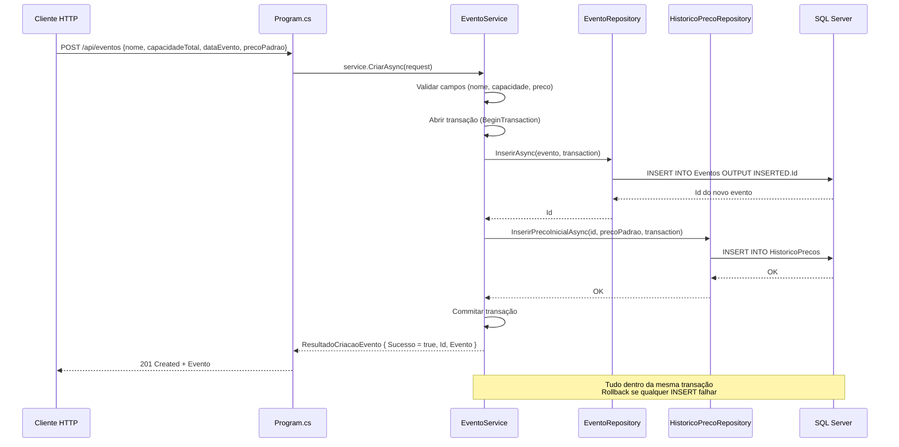
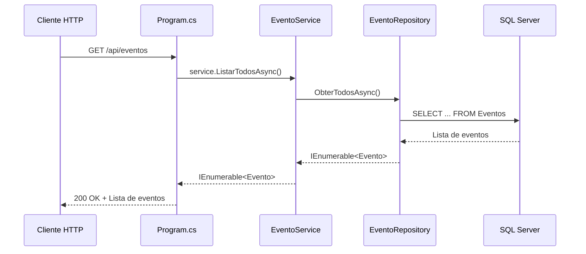

# Planejamento — Etapa 5: Migrar Domínio Eventos + Histórico de Preços (mínimo)

**Projeto:** TicketPrime — Fase 2: Separação de Camadas e Redução do Acoplamento
**Data:** 2026-06-03
**Risco:** Baixo
**Correção:** C6 (convenção `IDbTransaction? transaction = null` — já estabelecida na Etapa 2)

---

## 1. Objetivo da Etapa 5

Extrair do [`Program.cs`](src/TicketPrime.Api/Program.cs) toda a responsabilidade referente ao domínio **Eventos** — SQL, validação e regras de negócio — movendo-as para as camadas **Repository** e **Service**, seguindo exatamente o mesmo padrão estabelecido nas Etapas 3 (Usuários) e 4 (Cupons).

**Novo:** Criar também [`IHistoricoPrecoRepository`](src/TicketPrime.Api/Repositories/IHistoricoPrecoRepository.cs) + [`HistoricoPrecoRepository`](src/TicketPrime.Api/Repositories/HistoricoPrecoRepository.cs) com um método mínimo `InserirPrecoInicialAsync`, respeitando **SRP** desde o início (o histórico de preços não é responsabilidade do [`EventoRepository`](src/TicketPrime.Api/Repositories/EventoRepository.cs)).

Os **2 endpoints** de Eventos serão reduzidos:

| Endpoint | Linhas (antes) | Linhas (depois) | Redução |
|----------|:--------------:|:----------------:|:-------:|
| `POST /api/eventos` ([`Program.cs`](src/TicketPrime.Api/Program.cs:433)) | **~43** (validação + SQL + INSERT histórico) | **~5** (delega ao service) | **-38** |
| `GET /api/eventos` ([`Program.cs`](src/TicketPrime.Api/Program.cs:643)) | **~8** (SQL inline) | **~4** (delega ao service) | **-4** |
| **Total** | **51** | **9** | **-42** |

**Importante:** Esta etapa **não altera** as consultas a Eventos feitas por outros endpoints (`POST /api/reservas`, `POST /api/reservas/simular-preco`, `POST /api/reservas/{id}/ingresso`, `POST /api/carrinho/{cpf}/confirmar`, endpoints de Dashboard). Essas referências serão migradas para usar `IEventoRepository` em suas respectivas etapas (10b, 8, 11b, 12).

---

## 2. Arquivos que serão alterados

| Arquivo | Tipo de Alteração | Descrição |
|---------|:-----------------:|-----------|
| [`src/TicketPrime.Api/Program.cs`](src/TicketPrime.Api/Program.cs) | Modificação | Substituir os 2 endpoints inline (`POST /api/eventos` e `GET /api/eventos`) por delegação ao [`EventoService`](src/TicketPrime.Api/Services/EventoService.cs); adicionar registros DI |
| Nenhum outro arquivo existente será alterado | — | — |

### 2.1. Substituição no endpoint `POST /api/eventos` (linhas 433-475)

**ANTES** (~43 linhas):
```csharp
app.MapPost("/api/eventos", async (IDbConnection db, [FromBody] EventoRequest request) =>
{
    if (string.IsNullOrWhiteSpace(request.Nome))
        return Results.BadRequest(new { erro = "Nome é obrigatório." });

    if (request.Nome.Length > 200)
        return Results.BadRequest(new { erro = "Nome não pode exceder 200 caracteres." });

    if (request.CapacidadeTotal <= 0)
        return Results.BadRequest(new { erro = "CapacidadeTotal deve ser maior que zero." });

    if (request.PrecoPadrao < 0)
        return Results.BadRequest(new { erro = "PrecoPadrao não pode ser negativo." });

    var sql = @"INSERT INTO Eventos (Nome, CapacidadeTotal, DataEvento, PrecoPadrao)
                OUTPUT INSERTED.Id
                VALUES (@Nome, @CapacidadeTotal, @DataEvento, @PrecoPadrao)";

    var id = await db.QuerySingleAsync<int>(sql, new
    {
        request.Nome,
        request.CapacidadeTotal,
        request.DataEvento,
        request.PrecoPadrao
    });

    // Registra preço inicial no histórico (RF05)
    await db.ExecuteAsync(@"
        INSERT INTO HistoricoPrecos (EventoId, TipoIngressoId, PrecoAnterior, PrecoNovo, Motivo)
        VALUES (@EventoId, NULL, NULL, @PrecoNovo, 'Preço inicial do evento')",
        new { EventoId = id, PrecoNovo = request.PrecoPadrao });

    var evento = new Evento
    {
        Id = id,
        Nome = request.Nome,
        CapacidadeTotal = request.CapacidadeTotal,
        DataEvento = request.DataEvento,
        PrecoPadrao = request.PrecoPadrao
    };

    return Results.Created($"/api/eventos/{id}", evento);
});
```

**DEPOIS** (~5 linhas):
```csharp
app.MapPost("/api/eventos", async (EventoService service, [FromBody] EventoRequest request) =>
{
    var resultado = await service.CriarAsync(request);
    return resultado.Sucesso
        ? Results.Created($"/api/eventos/{resultado.Id}", resultado.Evento)
        : Results.BadRequest(new { erro = resultado.Erro });
});
```

### 2.2. Substituição no endpoint `GET /api/eventos` (linhas 643-650)

**ANTES** (~8 linhas):
```csharp
app.MapGet("/api/eventos", async (IDbConnection db) =>
{
    const string sql = "SELECT Id, Nome, CapacidadeTotal, DataEvento, PrecoPadrao FROM Eventos";

    var eventos = await db.QueryAsync<Evento>(sql);

    return Results.Ok(eventos);
});
```

**DEPOIS** (~4 linhas):
```csharp
app.MapGet("/api/eventos", async (EventoService service) =>
{
    var eventos = await service.ListarTodosAsync();
    return Results.Ok(eventos);
});
```

### 2.3. Registro DI adicionado em [`Program.cs`](src/TicketPrime.Api/Program.cs)

Após a linha 23 (`builder.Services.AddScoped<CupomService>()`):
```csharp
builder.Services.AddScoped<IEventoRepository, EventoRepository>();
builder.Services.AddScoped<IHistoricoPrecoRepository, HistoricoPrecoRepository>();
builder.Services.AddScoped<EventoService>();
```

Total: **3 linhas adicionadas** no bloco de DI.

---

## 3. Arquivos que serão criados

| Arquivo | Descrição |
|---------|-----------|
| [`src/TicketPrime.Api/Repositories/IEventoRepository.cs`](src/TicketPrime.Api/Repositories/IEventoRepository.cs) | Interface com métodos de acesso a dados de eventos, seguindo convenção C6 |
| [`src/TicketPrime.Api/Repositories/EventoRepository.cs`](src/TicketPrime.Api/Repositories/EventoRepository.cs) | Implementação concreta injetando `IDbConnection`, encapsulando SQL de eventos |
| [`src/TicketPrime.Api/Repositories/IHistoricoPrecoRepository.cs`](src/TicketPrime.Api/Repositories/IHistoricoPrecoRepository.cs) | Interface com método mínimo para inserir preço inicial no histórico |
| [`src/TicketPrime.Api/Repositories/HistoricoPrecoRepository.cs`](src/TicketPrime.Api/Repositories/HistoricoPrecoRepository.cs) | Implementação concreta injetando `IDbConnection`, encapsulando SQL de histórico |
| [`src/TicketPrime.Api/Services/EventoService.cs`](src/TicketPrime.Api/Services/EventoService.cs) | Service com validação e orquestração da persistência via ambos os repositórios |

### 3.1. Estrutura do [`IEventoRepository`](src/TicketPrime.Api/Repositories/IEventoRepository.cs)

```csharp
namespace TicketPrime.Api.Repositories;

public interface IEventoRepository
{
    Task<Evento?> ObterPorIdAsync(int id, IDbTransaction? transaction = null);     // C6
    Task<IEnumerable<Evento>> ObterTodosAsync(IDbTransaction? transaction = null);   // C6
    Task<int> InserirAsync(Evento evento, IDbTransaction? transaction = null);       // C6 — retorna Id
}
```

**Métodos definidos:**

| Método | SQL encapsulado | Uso atual em Program.cs |
|--------|----------------|:----------------------:|
| `ObterPorIdAsync(int id)` | `SELECT Id, Nome, CapacidadeTotal, DataEvento, PrecoPadrao FROM Eventos WHERE Id = @Id` | Usado por 6+ endpoints (reservas, ingressos, carrinho, dashboard — migrados em etapas futuras) |
| `ObterTodosAsync()` | `SELECT Id, Nome, CapacidadeTotal, DataEvento, PrecoPadrao FROM Eventos` | `GET /api/eventos` (linha 643) |
| `InserirAsync(Evento evento)` | `INSERT INTO Eventos ... OUTPUT INSERTED.Id VALUES (...)` | `POST /api/eventos` (linha 447) |

> **Nota:** O método `InserirHistoricoPrecoInicialAsync` **não existe** mais em [`IEventoRepository`](src/TicketPrime.Api/Repositories/IEventoRepository.cs). Foi movido para [`IHistoricoPrecoRepository`](src/TicketPrime.Api/Repositories/IHistoricoPrecoRepository.cs) para respeitar SRP.

### 3.2. Estrutura do [`EventoRepository`](src/TicketPrime.Api/Repositories/EventoRepository.cs)

```csharp
namespace TicketPrime.Api.Repositories;

public class EventoRepository : IEventoRepository
{
    private readonly IDbConnection _db;

    public EventoRepository(IDbConnection db)
    {
        _db = db;
    }

    public async Task<Evento?> ObterPorIdAsync(int id, IDbTransaction? transaction = null)  // C6
    {
        return await _db.QuerySingleOrDefaultAsync<Evento>(
            "SELECT Id, Nome, CapacidadeTotal, DataEvento, PrecoPadrao FROM Eventos WHERE Id = @Id",
            new { Id = id },
            transaction: transaction);
    }

    public async Task<IEnumerable<Evento>> ObterTodosAsync(IDbTransaction? transaction = null)  // C6
    {
        return await _db.QueryAsync<Evento>(
            "SELECT Id, Nome, CapacidadeTotal, DataEvento, PrecoPadrao FROM Eventos",
            transaction: transaction);
    }

    public async Task<int> InserirAsync(Evento evento, IDbTransaction? transaction = null)  // C6
    {
        var sql = @"INSERT INTO Eventos (Nome, CapacidadeTotal, DataEvento, PrecoPadrao)
                    OUTPUT INSERTED.Id
                    VALUES (@Nome, @CapacidadeTotal, @DataEvento, @PrecoPadrao)";

        return await _db.QuerySingleAsync<int>(sql, new
        {
            evento.Nome,
            evento.CapacidadeTotal,
            evento.DataEvento,
            evento.PrecoPadrao
        }, transaction: transaction);
    }
}
```

> **Nota:** [`EventoRepository`](src/TicketPrime.Api/Repositories/EventoRepository.cs) contém **apenas** métodos relacionados à entidade `Evento` — SRP respeitado. Não há qualquer referência a `HistoricoPrecos`.

### 3.3. Estrutura do [`IHistoricoPrecoRepository`](src/TicketPrime.Api/Repositories/IHistoricoPrecoRepository.cs)

```csharp
namespace TicketPrime.Api.Repositories;

public interface IHistoricoPrecoRepository
{
    /// <summary>
    /// Registra o preço inicial de um evento no histórico (RF05).
    /// Este é o único método necessário nesta etapa.
    /// Na Etapa 6, esta interface será complementada com métodos de consulta.
    /// </summary>
    Task InserirPrecoInicialAsync(int eventoId, decimal precoNovo,
        IDbTransaction? transaction = null);                                            // C6
}
```

### 3.4. Estrutura do [`HistoricoPrecoRepository`](src/TicketPrime.Api/Repositories/HistoricoPrecoRepository.cs)

```csharp
namespace TicketPrime.Api.Repositories;

public class HistoricoPrecoRepository : IHistoricoPrecoRepository
{
    private readonly IDbConnection _db;

    public HistoricoPrecoRepository(IDbConnection db)
    {
        _db = db;
    }

    public async Task InserirPrecoInicialAsync(int eventoId, decimal precoNovo,
        IDbTransaction? transaction = null)  // C6
    {
        await _db.ExecuteAsync(@"
            INSERT INTO HistoricoPrecos (EventoId, TipoIngressoId, PrecoAnterior, PrecoNovo, Motivo)
            VALUES (@EventoId, NULL, NULL, @PrecoNovo, 'Preço inicial do evento')",
            new { EventoId = eventoId, PrecoNovo = precoNovo },
            transaction: transaction);
    }
}
```

### 3.5. Estrutura do [`EventoService`](src/TicketPrime.Api/Services/EventoService.cs)

```csharp
namespace TicketPrime.Api.Services;

public class EventoService
{
    private readonly IEventoRepository _eventoRepository;
    private readonly IHistoricoPrecoRepository _historicoPrecoRepository;

    public EventoService(IEventoRepository eventoRepository,
                         IHistoricoPrecoRepository historicoPrecoRepository)
    {
        _eventoRepository = eventoRepository;
        _historicoPrecoRepository = historicoPrecoRepository;
    }

    public async Task<ResultadoCriacaoEvento> CriarAsync(EventoRequest request)
    {
        // 1. Validações de entrada:
        //    - Nome obrigatório, <= 200 caracteres
        //    - CapacidadeTotal > 0
        //    - PrecoPadrao >= 0
        // 2. Abrir transação (IDbTransaction) — necessária por usar 2 repositórios
        // 3. Montar objeto Evento
        // 4. Inserir via _eventoRepository.InserirAsync(evento, transaction) → obtém Id
        // 5. Registrar preço inicial via _historicoPrecoRepository.InserirPrecoInicialAsync(id, preco, transaction)
        // 6. Commitar transação
        // 7. Retornar ResultadoCriacaoEvento com Sucesso/Erro
    }

    public async Task<IEnumerable<Evento>> ListarTodosAsync()
    {
        return await _eventoRepository.ObterTodosAsync();
    }
}

public class ResultadoCriacaoEvento
{
    public bool Sucesso { get; set; }
    public string? Erro { get; set; }
    public int Id { get; set; }
    public Evento? Evento { get; set; }
}
```

> **Decisão arquitetural — Transação:** O método `CriarAsync` deve usar uma **transação explícita** (`IDbTransaction`) porque insere em duas tabelas distintas (`Eventos` + `HistoricoPrecos`) através de dois repositórios diferentes. Isso garante atomicidade: se o INSERT em `HistoricoPrecos` falhar, o INSERT em `Eventos` é revertido. A transação é obtida via `IDbConnection.BeginTransaction()` no service e passada como parâmetro `transaction` para ambos os repositórios (C6).

### 3.6. Observação sobre reutilização dos repositórios

O [`IEventoRepository`](src/TicketPrime.Api/Repositories/IEventoRepository.cs) será usado **nesta etapa** apenas pelo [`EventoService`](src/TicketPrime.Api/Services/EventoService.cs) para os 2 endpoints de Eventos.

No entanto, sua interface já inclui o método `ObterPorIdAsync` (C6) para que as etapas futuras possam utilizá-lo sem modificação:

| Etapa | Onde usará `IEventoRepository.ObterPorIdAsync` |
|:-----:|------------------------------------------------|
| **10b** | [`ReservaService`](src/TicketPrime.Api/Services/ReservaService.cs) — buscar evento ao criar reserva e simular preço |
| **8** | [`IngressoService`](src/TicketPrime.Api/Services/IngressoService.cs) — buscar evento ao gerar ingresso |
| **11b** | [`CarrinhoService`](src/TicketPrime.Api/Services/CarrinhoService.cs) — buscar evento ao confirmar carrinho |
| **12** | [`DashboardService`](src/TicketPrime.Api/Services/DashboardService.cs) — consultas de admin |

O [`IHistoricoPrecoRepository`](src/TicketPrime.Api/Repositories/IHistoricoPrecoRepository.cs) será complementado na **Etapa 6** com métodos de consulta (ex: `ObterPorEventoIdAsync`, `ObterPorLoteIdAsync`), mas nesta etapa contém apenas o método mínimo `InserirPrecoInicialAsync`.

---

## 4. Dependências da etapa

### 4.1. Pré-requisitos (já atendidos)

- [x] **Etapa 1 concluída:** [`EventoRequest`](src/TicketPrime.Api/Models/EventoRequest.cs) extraído para [`Models/`](src/TicketPrime.Api/Models/)
- [x] **Etapa 2 concluída:** Padrão Repository + convenção C6 estabelecidos (exemplo: [`UsuarioRepository`](src/TicketPrime.Api/Repositories/UsuarioRepository.cs))
- [x] **Etapa 3 concluída:** Prova de conceito do padrão Service → Repository validada com [`UsuarioService`](src/TicketPrime.Api/Services/UsuarioService.cs)
- [x] **Etapa 4 concluída:** Padrão consolidado com [`CupomService`](src/TicketPrime.Api/Services/CupomService.cs) + [`CupomRepository`](src/TicketPrime.Api/Repositories/CupomRepository.cs)
- [x] **Build OK:** `dotnet build` compila sem erros
- [x] **Testes OK:** `dotnet test` passa 103/103
- [x] **Checkpoint Git:** estado conhecido antes da Etapa 5

### 4.2. Dependências para etapas futuras

| Etapa | Depende da Etapa 5? | Motivo |
|:-----:|:-------------------:|--------|
| **6** | **Sim** | [`IHistoricoPrecoRepository`](src/TicketPrime.Api/Repositories/IHistoricoPrecoRepository.cs) será complementado com métodos de consulta — a interface já existirá |
| 7-9 | **Sim** (indireta) | [`IEventoRepository.ObterPorIdAsync`](src/TicketPrime.Api/Repositories/IEventoRepository.cs) será usado por services de reservas, ingressos, carrinho e dashboard |
| **10b** | **Sim** | [`ReservaService`](src/TicketPrime.Api/Services/ReservaService.cs) refatorado consultará eventos via `IEventoRepository` |
| **11b** | **Sim** | [`CarrinhoService.ConfirmarAsync()`](src/TicketPrime.Api/Services/CarrinhoService.cs) consultará eventos via `IEventoRepository` |
| 10a, 11a | **Não** | Etapas independentes |

### 4.3. Nenhuma dependência externa

- Nenhum pacote NuGet novo (Dapper e Microsoft.Data.SqlClient já estão no csproj)
- Nenhuma dependência de banco de dados
- Nenhuma dependência de infraestrutura externa

---

## 5. Riscos

| # | Risco | Probabilidade | Impacto | Mitigação |
|:-:|-------|:-------------:|:-------:|-----------|
| R5.1 | **Validação movida incorretamente** — diferença entre as validações inline originais e as do service | Muito Baixa | Alto | Validações são transcrição direta (Nome obrigatório, <=200, CapacidadeTotal>0, PrecoPadrao>=0). Teste manual do endpoint pós-migração |
| R5.2 | **SQL do repositório diferente do original** — query INSERT com `OUTPUT INSERTED.Id` ou SELECT com campos divergentes | Muito Baixa | Médio | Inspeção visual: a query INSERT usa `OUTPUT INSERTED.Id` exatamente como o original; as queries SELECT listam os mesmos campos |
| R5.3 | **Esquecer de registrar DI** para os novos repositórios ou service | Baixa | Médio | Checklist pós-implementação incluir verificação de `builder.Services.AddScoped<>()` em [`Program.cs`](src/TicketPrime.Api/Program.cs) para `IEventoRepository`, `IHistoricoPrecoRepository` e `EventoService` |
| R5.4 | **Quebra do contrato da API** — response diferente do original | Muito Baixa | Alto | `POST /api/eventos` retorna `201 Created` com objeto `Evento` (Id, Nome, CapacidadeTotal, DataEvento, PrecoPadrao). `GET /api/eventos` retorna `200 OK` com `IEnumerable<Evento>`. Ambos devem ser replicados exatamente |
| R5.5 | **Registro de histórico de preço inicial esquecido** — o `INSERT INTO HistoricoPrecos` não ser chamado | Muito Baixa | Alto | O [`EventoService.CriarAsync`](src/TicketPrime.Api/Services/EventoService.cs) deve chamar `IHistoricoPrecoRepository.InserirPrecoInicialAsync` **após** inserir o evento e **dentro da mesma transação**. Checklist de implementação incluir verificação deste passo |
| R5.6 | **Transação não gerenciada corretamente** — `BeginTransaction` sem `Commit`/`Rollback`, ou transação vazada | Muito Baixa | Alto | Usar padrão `using var transaction = _db.BeginTransaction()` com try-catch-commit-rollback. Revisão obrigatória do gerenciamento da transação no service |
| R5.7 | **Testes `EventoValidationTests.cs` quebrados** — esses 3 testes validam modelos, não o endpoint | Muito Baixa | Alto | Nenhum teste existente referencia o endpoint, o repositório ou o service. Os testes validam [`Evento`](src/TicketPrime.Api/Models/Evento.cs) e [`EventoRequest`](src/TicketPrime.Api/Models/EventoRequest.cs), que não são alterados |
| R5.8 | **Convenção C6 não respeitada** em algum método dos repositórios | Média | Alto (futuro) | Revisão de código obrigatória; violação da convenção bloqueia o PR |
| R5.9 | **`IDbTransaction` não disponível para `BeginTransaction`** — se o `IDbConnection` não estiver aberto | Baixa | Alto | Dapper gerencia abertura/fechamento da conexão. Chamar `BeginTransaction()` exige que a conexão esteja aberta. Usar padrão: `_db.Open(); using var tx = _db.BeginTransaction();` |

---

## 6. Critérios de aceite

### 6.1. Obrigatórios

- [ ] **CA5.1:** [`IEventoRepository`](src/TicketPrime.Api/Repositories/IEventoRepository.cs) e [`EventoRepository`](src/TicketPrime.Api/Repositories/EventoRepository.cs) compilam sem erros
- [ ] **CA5.2:** [`IHistoricoPrecoRepository`](src/TicketPrime.Api/Repositories/IHistoricoPrecoRepository.cs) e [`HistoricoPrecoRepository`](src/TicketPrime.Api/Repositories/HistoricoPrecoRepository.cs) compilam sem erros
- [ ] **CA5.3:** Convenção **C6** aplicada em **todos** os métodos de ambos os repositórios — `IDbTransaction? transaction = null` como último parâmetro
- [ ] **CA5.4:** [`EventoService`](src/TicketPrime.Api/Services/EventoService.cs) compila sem erros
- [ ] **CA5.5:** O endpoint `POST /api/eventos` permanece funcional com o mesmo contrato (request/response idênticos)
- [ ] **CA5.6:** O endpoint `GET /api/eventos` permanece funcional com o mesmo contrato (response idêntico)
- [ ] **CA5.7:** Nenhuma validação existente foi removida ou alterada:
  - Nome obrigatório, <= 200 caracteres
  - CapacidadeTotal > 0
  - PrecoPadrao >= 0
- [ ] **CA5.8:** SQL executado é idêntico ao original (INSERT com `OUTPUT INSERTED.Id`, SELECT com 5 campos, INSERT em HistoricoPrecos)
- [ ] **CA5.9:** O registro de preço inicial em `HistoricoPrecos` continua sendo executado ao criar um evento
- [ ] **CA5.10:** A inserção do evento e do histórico de preço ocorre **dentro da mesma transação** (`BeginTransaction`/`Commit`/`Rollback`)
- [ ] **CA5.11:** Nenhum SQL ou validação permanece inline no [`Program.cs`](src/TicketPrime.Api/Program.cs) para os endpoints de Eventos
- [ ] **CA5.12:** [`IEventoRepository`](src/TicketPrime.Api/Repositories/IEventoRepository.cs), [`IHistoricoPrecoRepository`](src/TicketPrime.Api/Repositories/IHistoricoPrecoRepository.cs) e [`EventoService`](src/TicketPrime.Api/Services/EventoService.cs) registrados no DI em [`Program.cs`](src/TicketPrime.Api/Program.cs)
- [ ] **CA5.13:** `dotnet build` compila com zero erros
- [ ] **CA5.14:** `dotnet test` passa 103/103 **sem modificações** nos testes
- [ ] **CA5.15:** Nenhum arquivo de teste foi alterado
- [ ] **CA5.16:** Nenhum outro endpoint existente foi alterado
- [ ] **CA5.17:** Nenhuma classe [`Models/`](src/TicketPrime.Api/Models/) foi alterada
- [ ] **CA5.18:** Nenhum arquivo existente de repositório ou service foi alterado

### 6.2. Verificações de qualidade

- [ ] **CA5.19:** Convenção C6 verificada em todos os métodos de ambos os repositórios
- [ ] **CA5.20:** Nomes de métodos seguem padrão do projeto (PascalCase, Async suffix)
- [ ] **CA5.21:** Nenhum warning novo de compilação (exceto possíveis nullability warnings pré-existentes)
- [ ] **CA5.22:** O endpoint `POST /api/eventos` em [`Program.cs`](src/TicketPrime.Api/Program.cs) tem no máximo ~5 linhas
- [ ] **CA5.23:** O endpoint `GET /api/eventos` em [`Program.cs`](src/TicketPrime.Api/Program.cs) tem no máximo ~4 linhas
- [ ] **CA5.24:** [`EventoRepository`](src/TicketPrime.Api/Repositories/EventoRepository.cs) **não contém** nenhum método relacionado a `HistoricoPrecos` — verificação SRP
- [ ] **CA5.25:** A transação em `CriarAsync` é aberta, commitada em caso de sucesso, e revertida em caso de exceção

---

## 7. Estratégia de rollback

### 7.1. Procedimento

```bash
# Opção 1 — Reverter commit (recomendado)
git revert HEAD --no-edit

# Opção 2 — Checkout manual (se houver checkpoint)
git checkout HEAD~1
```

### 7.2. Passos manuais (caso rollback automático não seja possível)

| Passo | Ação | Tempo |
|:-----:|------|:-----:|
| 1 | Remover [`src/TicketPrime.Api/Repositories/IEventoRepository.cs`](src/TicketPrime.Api/Repositories/IEventoRepository.cs) | ~1 min |
| 2 | Remover [`src/TicketPrime.Api/Repositories/EventoRepository.cs`](src/TicketPrime.Api/Repositories/EventoRepository.cs) | ~1 min |
| 3 | Remover [`src/TicketPrime.Api/Repositories/IHistoricoPrecoRepository.cs`](src/TicketPrime.Api/Repositories/IHistoricoPrecoRepository.cs) | ~1 min |
| 4 | Remover [`src/TicketPrime.Api/Repositories/HistoricoPrecoRepository.cs`](src/TicketPrime.Api/Repositories/HistoricoPrecoRepository.cs) | ~1 min |
| 5 | Remover [`src/TicketPrime.Api/Services/EventoService.cs`](src/TicketPrime.Api/Services/EventoService.cs) | ~1 min |
| 6 | Restaurar o endpoint `POST /api/eventos` em [`Program.cs`](src/TicketPrime.Api/Program.cs) revertendo as ~43 linhas ao original | ~3 min |
| 7 | Restaurar o endpoint `GET /api/eventos` em [`Program.cs`](src/TicketPrime.Api/Program.cs) revertendo as ~8 linhas ao original | ~1 min |
| 8 | Remover `builder.Services.AddScoped<IEventoRepository, EventoRepository>()`, `builder.Services.AddScoped<IHistoricoPrecoRepository, HistoricoPrecoRepository>()` e `builder.Services.AddScoped<EventoService>()` de [`Program.cs`](src/TicketPrime.Api/Program.cs) | ~1 min |
| 9 | Executar `dotnet build` e `dotnet test` | ~2 min |
| | **Total** | **~12 min** |

### 7.3. Verificação pós-rollback

```bash
dotnet build    # zero erros
dotnet test     # 103/103
```

---

## 8. Impacto esperado no Program.cs

### 8.1. Linhas alteradas

| Região | Antes | Depois | Diferença |
|--------|:-----:|:------:|:---------:|
| Endpoint `POST /api/eventos` (linhas 433-475) | **~43 linhas** (validação + 2 SQLs + response inline) | **~5 linhas** (delega ao service) | **-38 linhas** |
| Endpoint `GET /api/eventos` (linhas 643-650) | **~8 linhas** (SQL inline) | **~4 linhas** (delega ao service) | **-4 linhas** |
| Registro DI (após linha 23) | `UsuarioService` + `CupomService` | + `IEventoRepository`/`EventoRepository` + `IHistoricoPrecoRepository`/`HistoricoPrecoRepository` + `EventoService` | **+3 linhas** |
| **Saldo líquido** | | | **-39 linhas** |

### 8.2. Estado esperado após a Etapa 5

- [`Program.cs`](src/TicketPrime.Api/Program.cs) reduz de aproximadamente ~2162 para ~2123 linhas
- Nenhuma configuração de middleware, CORS, auth ou JSON é alterada
- Nenhum SQL permanece nos endpoints de eventos
- Nenhuma referência a `IDbConnection` permanece nos endpoints `POST /api/eventos` e `GET /api/eventos`
- Bloco de DI contém registros para: `IUsuarioRepository`, `UsuarioService`, `ICupomRepository`, `CupomService`, `IEventoRepository`, `EventoRepository`, `IHistoricoPrecoRepository`, `HistoricoPrecoRepository`, `EventoService`

### 8.3. Fluxo arquitetural após a Etapa 5 — `POST /api/eventos`



### 8.4. Fluxo arquitetural após a Etapa 5 — `GET /api/eventos`



---

## 9. O que NÃO será alterado

### 🚫 Blindado (não tocar)

| Item | Motivo |
|------|--------|
| **Contratos da API** (rotas `POST /api/eventos` e `GET /api/eventos`, request/response bodies) | CA3 — contrato deve permanecer idêntico |
| **Banco de Dados** (tabela Eventos, colunas, constraints, VIEWs) | CA5 — SQL permanece idêntico ao atual |
| **Regras de Negócio** (validações de nome, capacidade, preço) | CA4 — são movidas, não alteradas |
| **Registro de histórico de preço inicial** | CA4 — continua ocorrendo, apenas delegado ao `HistoricoPrecoRepository` |
| **Autenticação e Autorização** | CA6 — nenhuma alteração |
| **CORS** | CA7 — nenhuma alteração |
| **Testes existentes** (103/103, incluindo [`EventoValidationTests.cs`](tests/TicketPrime.Tests/EventoValidationTests.cs) com 3 testes) | CA2 — nenhuma linha de teste é alterada |
| **Models** ([`Evento.cs`](src/TicketPrime.Api/Models/Evento.cs), [`EventoRequest.cs`](src/TicketPrime.Api/Models/EventoRequest.cs), [`EventoResumoResponse.cs`](src/TicketPrime.Api/Models/EventoResumoResponse.cs), [`HistoricoPreco.cs`](src/TicketPrime.Api/Models/HistoricoPreco.cs)) | Já extraídos na Etapa 1 |
| **Repositórios existentes** ([`IUsuarioRepository`](src/TicketPrime.Api/Repositories/IUsuarioRepository.cs), [`UsuarioRepository`](src/TicketPrime.Api/Repositories/UsuarioRepository.cs), [`ICupomRepository`](src/TicketPrime.Api/Repositories/ICupomRepository.cs), [`CupomRepository`](src/TicketPrime.Api/Repositories/CupomRepository.cs)) | Criados nas Etapas 2-4, permanecem inalterados |
| **Services existentes** ([`UsuarioService`](src/TicketPrime.Api/Services/UsuarioService.cs), [`CupomService`](src/TicketPrime.Api/Services/CupomService.cs), [`ReservaService`](src/TicketPrime.Api/Services/ReservaService.cs), [`IncrementoService`](src/TicketPrime.Api/Services/IncrementoService.cs)) | Permanecem sem alterações |
| **Middleware** ([`ExceptionHandlingMiddleware`](src/TicketPrime.Api/Middleware/ExceptionHandlingMiddleware.cs)) | Sem alterações |
| **Authentication** ([`ApiKeyAuthenticationHandler`](src/TicketPrime.Api/Authentication/ApiKeyAuthenticationHandler.cs)) | Sem alterações |
| **Estrutura de diretórios existente** | Nomes de pastas fixos conforme requisito |
| **`GerarCodigoUnicoAsync`** em [`Program.cs`](src/TicketPrime.Api/Program.cs) | Permanece inline — será movido na Etapa 8 |
| **Demais endpoints** (Reservas, Ingressos, CheckIn, Lotes, Carrinho, Histórico, Dashboard) | Nenhum outro endpoint é alterado nesta etapa |
| **Consultas a eventos em outros endpoints** (`POST /api/reservas`, `POST /api/reservas/simular-preco`, `POST /api/reservas/{id}/ingresso`, `POST /api/carrinho/{cpf}/confirmar`, endpoints de Dashboard) | Permanecem usando `IDbConnection` diretamente — serão migrados em suas respectivas etapas (10b, 8, 11b, 12) |

### ✅ O que é alterado (apenas)

1. **Criação** de [`src/TicketPrime.Api/Repositories/IEventoRepository.cs`](src/TicketPrime.Api/Repositories/IEventoRepository.cs)
2. **Criação** de [`src/TicketPrime.Api/Repositories/EventoRepository.cs`](src/TicketPrime.Api/Repositories/EventoRepository.cs)
3. **Criação** de [`src/TicketPrime.Api/Repositories/IHistoricoPrecoRepository.cs`](src/TicketPrime.Api/Repositories/IHistoricoPrecoRepository.cs)
4. **Criação** de [`src/TicketPrime.Api/Repositories/HistoricoPrecoRepository.cs`](src/TicketPrime.Api/Repositories/HistoricoPrecoRepository.cs)
5. **Criação** de [`src/TicketPrime.Api/Services/EventoService.cs`](src/TicketPrime.Api/Services/EventoService.cs)
6. **Modificação** do endpoint `POST /api/eventos` em [`Program.cs`](src/TicketPrime.Api/Program.cs:433) (~43 linhas → ~5 linhas)
7. **Modificação** do endpoint `GET /api/eventos` em [`Program.cs`](src/TicketPrime.Api/Program.cs:643) (~8 linhas → ~4 linhas)
8. **Adição** de 3 linhas de DI em [`Program.cs`](src/TicketPrime.Api/Program.cs): `IEventoRepository`/`EventoRepository`, `IHistoricoPrecoRepository`/`HistoricoPrecoRepository` e `EventoService`

---

## 10. Impacto esperado nos testes

### 10.1. Testes existentes (103/103)

Nenhum teste existente será alterado, removido ou modificado.

| Arquivo de teste | Testes | Impacto |
|-----------------|:------:|:-------:|
| [`EventoValidationTests.cs`](tests/TicketPrime.Tests/EventoValidationTests.cs) | 3 | **Nenhum** — validam modelos [`Evento`](src/TicketPrime.Api/Models/Evento.cs) e [`EventoRequest`](src/TicketPrime.Api/Models/EventoRequest.cs), que não são alterados |
| [`UsuarioValidationTests.cs`](tests/TicketPrime.Tests/UsuarioValidationTests.cs) | 5 | Nenhum |
| [`CupomValidationTests.cs`](tests/TicketPrime.Tests/CupomValidationTests.cs) | 5 | Nenhum |
| [`ReservaServiceTests.cs`](tests/TicketPrime.Tests/ReservaServiceTests.cs) | 26 | Nenhum |
| [`IncrementoServiceTests.cs`](tests/TicketPrime.Tests/IncrementoServiceTests.cs) | 64 | Nenhum |
| **Total** | **103** | **Zero regressões** |

### 10.2. Por que os testes não quebram

1. Os 3 testes em [`EventoValidationTests.cs`](tests/TicketPrime.Tests/EventoValidationTests.cs) validam apenas as propriedades dos modelos [`Evento`](src/TicketPrime.Api/Models/Evento.cs) e [`EventoRequest`](src/TicketPrime.Api/Models/EventoRequest.cs) — inicialização, atribuição e comparação. Nenhum deles referencia o endpoint, o repositório ou o service.
2. Nenhum dos 103 testes existentes faz referência a `IEventoRepository`, `EventoRepository`, `IHistoricoPrecoRepository`, `HistoricoPrecoRepository` ou `EventoService` — eles simplesmente não existem ainda.
3. As regras de validação movidas para o [`EventoService`](src/TicketPrime.Api/Services/EventoService.cs) são uma transcrição direta das validações inline do endpoint — sem alteração de comportamento.
4. O fluxo de `InserirPrecoInicialAsync` é orquestrado pelo service em uma transação, sem impacto nos testes existentes.

### 10.3. Testes futuros (recomendação fora do escopo)

Para aumentar a cobertura, recomenda-se adicionar futuramente:

- **`EventoServiceTests.cs`** — testar `CriarAsync` com:
  - Nome vazio/nulo
  - Nome excedendo 200 caracteres
  - CapacidadeTotal <= 0 (zero e negativo)
  - PrecoPadrao negativo
  - Sucesso (dados válidos, verificar se histórico de preço foi registrado via mock de `IHistoricoPrecoRepository`)
- **`EventoRepositoryTests.cs`** (integração) — testar:
  - `InserirAsync` e verificar `OUTPUT INSERTED.Id`
  - `ObterTodosAsync` retorna lista correta
  - `ObterPorIdAsync` retorna evento correto
- **`HistoricoPrecoRepositoryTests.cs`** (integração) — testar:
  - `InserirPrecoInicialAsync` com dados válidos

> **Nota:** Estes testes **não fazem parte** do escopo da Etapa 5 e podem ser adicionados em momento futuro conforme definido no plano da Fase 2.

---

## 11. Checklist de Implementação

- [ ] Criar [`src/TicketPrime.Api/Repositories/IEventoRepository.cs`](src/TicketPrime.Api/Repositories/IEventoRepository.cs) com:
  - `Task<Evento?> ObterPorIdAsync(int id, IDbTransaction? transaction = null)` — C6
  - `Task<IEnumerable<Evento>> ObterTodosAsync(IDbTransaction? transaction = null)` — C6
  - `Task<int> InserirAsync(Evento evento, IDbTransaction? transaction = null)` — C6 (retorna Id)
  - **Sem** qualquer método relacionado a `HistoricoPrecos` (SRP)
- [ ] Criar [`src/TicketPrime.Api/Repositories/EventoRepository.cs`](src/TicketPrime.Api/Repositories/EventoRepository.cs) com:
  - Construtor injetando `IDbConnection`
  - Implementação dos 3 métodos encapsulando SQL idêntico ao de [`Program.cs`](src/TicketPrime.Api/Program.cs)
  - **Verificar C6** em cada método
  - **Verificar SRP:** nenhum método de `HistoricoPrecos`
- [ ] Criar [`src/TicketPrime.Api/Repositories/IHistoricoPrecoRepository.cs`](src/TicketPrime.Api/Repositories/IHistoricoPrecoRepository.cs) com:
  - `Task InserirPrecoInicialAsync(int eventoId, decimal precoNovo, IDbTransaction? transaction = null)` — C6
  - Documentar com `/// <summary>` que este é o método mínimo e será complementado na Etapa 6
- [ ] Criar [`src/TicketPrime.Api/Repositories/HistoricoPrecoRepository.cs`](src/TicketPrime.Api/Repositories/HistoricoPrecoRepository.cs) com:
  - Construtor injetando `IDbConnection`
  - Implementação do método `InserirPrecoInicialAsync` com SQL idêntico ao INSERT original de `HistoricoPrecos`
  - **Verificar C6** no método
- [ ] Criar [`src/TicketPrime.Api/Services/EventoService.cs`](src/TicketPrime.Api/Services/EventoService.cs) com:
  - Classe `EventoService` injetando `IEventoRepository` e `IHistoricoPrecoRepository`
  - Método `CriarAsync(EventoRequest request)` com:
    - Todas as validações (Nome obrigatório, <=200 chars, CapacidadeTotal>0, PrecoPadrao>=0)
    - Abertura de transação via `using var tx = _db.BeginTransaction()`
    - Chamada a `_eventoRepository.InserirAsync(evento, transaction)`
    - Chamada a `_historicoPrecoRepository.InserirPrecoInicialAsync(id, precoPadrao, transaction)`
    - Commit da transação
    - Rollback em caso de exceção
  - Método `ListarTodosAsync()` delegando ao repositório
  - Classe `ResultadoCriacaoEvento` para o retorno
- [ ] Modificar endpoint `POST /api/eventos` em [`Program.cs`](src/TicketPrime.Api/Program.cs:433):
  - Remover as ~43 linhas de validação + 2 SQLs inline
  - Substituir por delegação ao `EventoService`
- [ ] Modificar endpoint `GET /api/eventos` em [`Program.cs`](src/TicketPrime.Api/Program.cs:643):
  - Remover as ~8 linhas de SQL inline
  - Substituir por delegação ao `EventoService`
- [ ] Adicionar `builder.Services.AddScoped<IEventoRepository, EventoRepository>()` em [`Program.cs`](src/TicketPrime.Api/Program.cs) (após linha 23)
- [ ] Adicionar `builder.Services.AddScoped<IHistoricoPrecoRepository, HistoricoPrecoRepository>()` em [`Program.cs`](src/TicketPrime.Api/Program.cs) (após linha 23)
- [ ] Adicionar `builder.Services.AddScoped<EventoService>()` em [`Program.cs`](src/TicketPrime.Api/Program.cs) (após linha 23)
- [ ] Executar `dotnet build` — verificar zero erros
- [ ] Executar `dotnet test` — verificar 103/103 aprovados
- [ ] Verificar manualmente que os contratos permanecem idênticos:
  - `POST /api/eventos`:
    - Request: `{ nome: string, capacidadeTotal: int, dataEvento: datetime, precoPadrao: decimal }`
    - Response 201: `{ id: int, nome: string, capacidadeTotal: int, dataEvento: datetime, precoPadrao: decimal }`
    - Response 400: `{ erro: string }`
  - `GET /api/eventos`:
    - Response 200: `[{ id, nome, capacidadeTotal, dataEvento, precoPadrao }, ...]`
- [ ] Confirmar que nenhum outro arquivo foi alterado
- [ ] Commitar com mensagem: `feat: migra domínio Eventos com EventoRepository, IHistoricoPrecoRepository e convenção C6`

---

## 12. Diagrama de estado: antes e depois da Etapa 5

### Antes (atual — Etapa 4 concluída)

```mermaid
flowchart LR
    subgraph Program.cs
        EndpointEventos[POST /api/eventos<br/>~43 linhas<br/>validação + 2 SQLs inline]
        GetEventos[GET /api/eventos<br/>~8 linhas<br/>SQL inline]
        EndpointCupom[POST /api/cupons<br/>~5 linhas]
        EndpointUsuario[POST /api/usuarios<br/>~5 linhas]
    end
    EndpointEventos --> DB[(SQL Server)]
    GetEventos --> DB
    EndpointCupom --> CS[CupomService]
    CS --> CR[CupomRepository]
    CR --> DB
    EndpointUsuario --> US[UsuarioService]
    US --> UR[UsuarioRepository]
    UR --> DB
    
    subgraph Services
        US
        CS
    end
    
    subgraph Repositories
        UR
        CR
    end
    
    note right of EndpointEventos: 3 validações + 2 SQLs<br/>INSERT Eventos + INSERT HistoricoPrecos
```

### Depois (alvo — Etapa 5 concluída)

```mermaid
flowchart LR
    subgraph Program.cs
        EndpointEventos[POST /api/eventos<br/>~5 linhas<br/>apenas delegação]
        GetEventos[GET /api/eventos<br/>~4 linhas<br/>apenas delegação]
        EndpointCupom[POST /api/cupons<br/>~5 linhas]
        EndpointUsuario[POST /api/usuarios<br/>~5 linhas]
    end
    EndpointEventos --> ES[EventoService]
    GetEventos --> ES
    ES --> ER[EventoRepository]
    ES --> HPR[HistoricoPrecoRepository]
    ER --> DB[(SQL Server)]
    HPR --> DB
    EndpointCupom --> CS[CupomService]
    CS --> CR[CupomRepository]
    CR --> DB
    EndpointUsuario --> US[UsuarioService]
    US --> UR[UsuarioRepository]
    UR --> DB
    
    subgraph Services
        US
        CS
        ES
    end
    
    subgraph Repositories
        UR
        CR
        ER
        HPR
    end
    
    note right of EndpointEventos: Chama service apenas
    note right of ES: Validações + transação<br/>EventoRepository + HistoricoPrecoRepository
    note right of ER: 3 métodos SQL + C6<br/>Apenas Eventos (SRP)
    note right of HPR: 1 método SQL + C6<br/>InserirPrecoInicialAsync<br/>(será complementado na Etapa 6)
```

---

## 13. Estratégia para HistoricoPrecos

### 13.1. O que esta etapa cria

| Item | Descrição |
|------|-----------|
| [`IHistoricoPrecoRepository`](src/TicketPrime.Api/Repositories/IHistoricoPrecoRepository.cs) | Interface com 1 método: `InserirPrecoInicialAsync` |
| [`HistoricoPrecoRepository`](src/TicketPrime.Api/Repositories/HistoricoPrecoRepository.cs) | Implementação concreta com SQL encapsulado |

### 13.2. Responsabilidades bem definidas

```
EventoRepository      → apenas tabela Eventos    (SRP)
HistoricoPrecoRepository → apenas tabela HistoricoPrecos (SRP)
EventoService         → orquestra ambos + transação
```

### 13.3. Impacto na Etapa 6

A **Etapa 6** (originalmente "Migrar Domínio Histórico de Preços") agora será responsável **apenas** por complementar o [`HistoricoPrecoRepository`](src/TicketPrime.Api/Repositories/HistoricoPrecoRepository.cs) com métodos de **consulta**, por exemplo:

- `ObterPorEventoIdAsync(int eventoId, IDbTransaction? transaction = null)`
- `ObterPorLoteIdAsync(int loteId, IDbTransaction? transaction = null)`

A Etapa 6 **não precisará mais** criar do zero o repositório de histórico, nem migrar o `InserirHistoricoPrecoInicialAsync` de lugar, pois isso já foi feito corretamente nesta etapa. O escopo da Etapa 6 fica **reduzido**, eliminando o retrabalho que existia no plano anterior.

### 13.4. Transação em `POST /api/eventos`

O endpoint `POST /api/eventos` **deve usar transação explícita** porque:

1. Insere em duas tabelas (`Eventos` + `HistoricoPrecos`)
2. Usa dois repositórios diferentes (`EventoRepository` + `HistoricoPrecoRepository`)
3. Requer atomicidade: se o INSERT em `HistoricoPrecos` falhar, o INSERT em `Eventos` deve ser revertido

**Padrão de implementação:**

```csharp
public async Task<ResultadoCriacaoEvento> CriarAsync(EventoRequest request)
{
    // Validações...
    
    using var connection = new SqlConnection(_connectionString); // ou obter de factory
    connection.Open();
    using var transaction = connection.BeginTransaction();
    
    try
    {
        var evento = new Evento { ... };
        var id = await _eventoRepository.InserirAsync(evento, transaction);
        await _historicoPrecoRepository.InserirPrecoInicialAsync(id, request.PrecoPadrao, transaction);
        transaction.Commit();
        return new ResultadoCriacaoEvento { Sucesso = true, Id = id, Evento = evento };
    }
    catch
    {
        transaction.Rollback();
        throw;
    }
}
```

> **Nota:** A injeção de `IDbConnection` no [`EventoRepository`](src/TicketPrime.Api/Repositories/EventoRepository.cs) e [`HistoricoPrecoRepository`](src/TicketPrime.Api/Repositories/HistoricoPrecoRepository.cs) segue o padrão existente (ex: [`CupomRepository`](src/TicketPrime.Api/Repositories/CupomRepository.cs)). Para gerenciar a transação no service, o mesmo `IDbConnection` deve ser compartilhado — isso é garantido pelo DI container (Scoped), que fornece a mesma instância dentro do mesmo request.

---

## 14. Resumo das mudanças em relação ao plano anterior

| O que mudou | Antes | Agora |
|-------------|-------|-------|
| `InserirHistoricoPrecoInicialAsync` | Em `IEventoRepository`/`EventoRepository` | ❌ Removido — violava SRP |
| `IHistoricoPrecoRepository` | Não existia | ✅ Criado com `InserirPrecoInicialAsync` |
| `HistoricoPrecoRepository` | Não existia | ✅ Criado |
| `EventoService` | Injetava apenas `IEventoRepository` | ✅ Injeta `IEventoRepository` + `IHistoricoPrecoRepository` |
| Transação em `POST /api/eventos` | Não havia (2 SQLs inline sem transação) | ✅ Transação explícita no service |
| DI em `Program.cs` | 2 registros | ✅ 3 registros (+ `IHistoricoPrecoRepository`) |
| Etapa 6 | Precisava migrar `InserirHistoricoPrecoInicialAsync` para fora de `EventoRepository` | ✅ Não precisa — já está em `HistoricoPrecoRepository` desde o início |
| Arquivos criados | 3 (IEventoRepository, EventoRepository, EventoService) | ✅ 5 (adiciona IHistoricoPrecoRepository, HistoricoPrecoRepository) |
