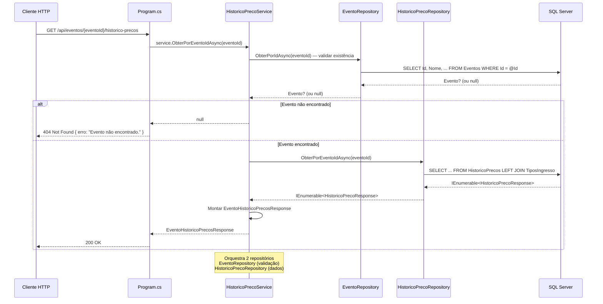
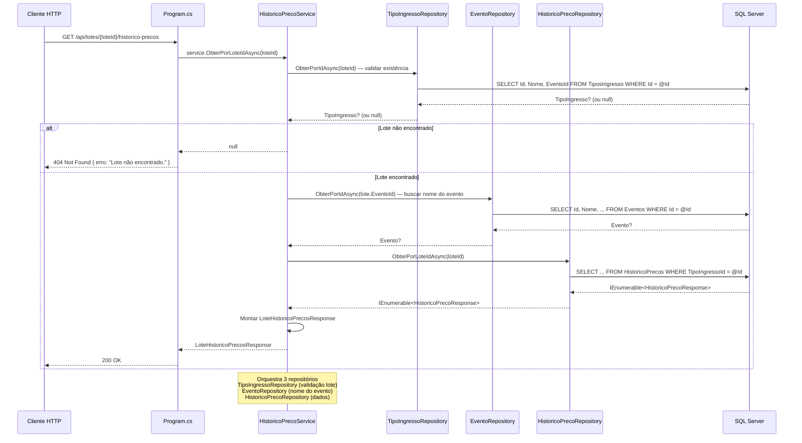

# Planejamento — Etapa 6: Migrar Domínio Histórico de Preços (Complemento)

**Projeto:** TicketPrime — Fase 2: Separação de Camadas e Redução do Acoplamento
**Data:** 2026-06-03
**Risco:** Baixo
**Correção:** C6 (convenção `IDbTransaction? transaction = null` — já estabelecida na Etapa 2)
**Revisão V4:** 2026-06-03 — SRP corrigido. `HistoricoPrecoRepository` agora consulta APENAS a tabela `HistoricoPrecos`. Validação de existência de evento/lote delegada a `IEventoRepository` e `ITipoIngressoRepository` respectivamente.

---

## 1. Objetivo da Etapa 6

Complementar o [`IHistoricoPrecoRepository`](src/TicketPrime.Api/Repositories/IHistoricoPrecoRepository.cs) e o [`HistoricoPrecoRepository`](src/TicketPrime.Api/Repositories/HistoricoPrecoRepository.cs) — criados na **Etapa 5** com apenas o método de escrita `InserirPrecoInicialAsync` — adicionando **2 métodos de consulta** restritos à tabela `HistoricoPrecos`, e extrair do [`Program.cs`](src/TicketPrime.Api/Program.cs) os **2 endpoints** do domínio Histórico de Preços (RF05) movendo-os para um novo [`HistoricoPrecoService`](src/TicketPrime.Api/Services/HistoricoPrecoService.cs).

**Novo:** Criar [`ITipoIngressoRepository`](src/TicketPrime.Api/Repositories/ITipoIngressoRepository.cs) + [`TipoIngressoRepository`](src/TicketPrime.Api/Repositories/TipoIngressoRepository.cs) **apenas** com o método mínimo `ObterPorIdAsync` para validação de existência de lote — sem migrar o domínio TipoIngresso nesta etapa.

### Resumo do escopo

| Endpoint | Linhas (antes) | Linhas (depois) | Redução |
|----------|:--------------:|:----------------:|:-------:|
| `GET /api/eventos/{eventoId}/historico-precos` ([`Program.cs`](src/TicketPrime.Api/Program.cs:1806)) | **~28** (SQL + validação inline) | **~4** (delega ao service) | **-24** |
| `GET /api/lotes/{loteId}/historico-precos` ([`Program.cs`](src/TicketPrime.Api/Program.cs:1836)) | **~32** (SQL + validação inline) | **~4** (delega ao service) | **-28** |
| **Total** | **60** | **8** | **-52** |

---

## 2. Relação com o `HistoricoPrecoRepository` criado na Etapa 5

### 2.1. Estado atual (pós Etapa 5)

| Artefato | Métodos | Status |
|----------|---------|:------:|
| [`IHistoricoPrecoRepository`](src/TicketPrime.Api/Repositories/IHistoricoPrecoRepository.cs) | `InserirPrecoInicialAsync(...)` | ✅ Criado na Etapa 5 |
| [`HistoricoPrecoRepository`](src/TicketPrime.Api/Repositories/HistoricoPrecoRepository.cs) | Implementação do método acima | ✅ Criado na Etapa 5 |
| [`HistoricoPrecoService`](src/TicketPrime.Api/Services/HistoricoPrecoService.cs) | **Não existe** | ❌ Será criado |
| [`ITipoIngressoRepository`](src/TicketPrime.Api/Repositories/ITipoIngressoRepository.cs) | **Não existe** | ❌ Será criado (mínimo) |
| [`TipoIngressoRepository`](src/TicketPrime.Api/Repositories/TipoIngressoRepository.cs) | **Não existe** | ❌ Será criado (mínimo) |
| Registro DI (`IHistoricoPrecoRepository`) | `builder.Services.AddScoped<IHistoricoPrecoRepository, HistoricoPrecoRepository>()` | ✅ Já registrado na Etapa 5 |
| Endpoints inline no [`Program.cs`](src/TicketPrime.Api/Program.cs:1806) | `GET /api/eventos/{eventoId}/historico-precos` e `GET /api/lotes/{loteId}/historico-precos` | ❌ Ainda inline |

### 2.2. O que será complementado no `HistoricoPrecoRepository`

```diff
// IHistoricoPrecoRepository.cs (ESTADO ATUAL — Etapa 5)
public interface IHistoricoPrecoRepository
{
     Task InserirPrecoInicialAsync(int eventoId, decimal precoNovo,
         IDbTransaction? transaction = null);

+    // NOVOS métodos de consulta (Etapa 6) — APENAS HistoricoPrecos
+    Task<IEnumerable<HistoricoPrecoResponse>> ObterPorEventoIdAsync(int eventoId,
+        IDbTransaction? transaction = null);
+
+    Task<IEnumerable<HistoricoPrecoResponse>> ObterPorLoteIdAsync(int loteId,
+        IDbTransaction? transaction = null);
}
```

> **Correção V4:** Os métodos `ObterEventoBasicoAsync` e `ObterLoteBasicoAsync` foram **removidos** do plano original — eles consultavam as tabelas `Eventos` e `TiposIngresso` dentro do `HistoricoPrecoRepository`, violando SRP. A validação de existência agora é feita pelo service usando os repositórios de seus respectivos domínios.

### 2.3. Separação de responsabilidades (SRP) — validada pelo V4

```
HistoricoPrecoRepository:
  InserirPrecoInicialAsync()       ← INSERT na tabela HistoricoPrecos (Etapa 5)
  ObterPorEventoIdAsync()          ← SELECT na tabela HistoricoPrecos (Etapa 6)
  ObterPorLoteIdAsync()            ← SELECT na tabela HistoricoPrecos (Etapa 6)
  └── NENHUMA consulta a Eventos ou TiposIngresso

EventoRepository (existente):
  ObterPorIdAsync()                ← usado pelo HistoricoPrecoService para validar evento

TipoIngressoRepository (NOVO — mínimo):
  ObterPorIdAsync()                ← usado pelo HistoricoPrecoService para validar lote

HistoricoPrecoService (NOVO):
  Injeta: IHistoricoPrecoRepository + IEventoRepository + ITipoIngressoRepository
  ObterPorEventoIdAsync(): valida evento → busca histórico → monta response
  ObterPorLoteIdAsync():   valida lote → busca evento do lote → busca histórico → monta response
```

O [`EventoService`](src/TicketPrime.Api/Services/EventoService.cs) criado na Etapa 5 **não é alterado**.

---

## 3. Arquivos que serão alterados

| Arquivo | Tipo de Alteração | Descrição |
|---------|:-----------------:|-----------|
| [`src/TicketPrime.Api/Repositories/IHistoricoPrecoRepository.cs`](src/TicketPrime.Api/Repositories/IHistoricoPrecoRepository.cs) | Modificação | Adicionar 2 métodos de consulta: `ObterPorEventoIdAsync` e `ObterPorLoteIdAsync` (C6) |
| [`src/TicketPrime.Api/Repositories/HistoricoPrecoRepository.cs`](src/TicketPrime.Api/Repositories/HistoricoPrecoRepository.cs) | Modificação | Implementar os 2 novos métodos com SQL restrito à tabela `HistoricoPrecos` |
| [`src/TicketPrime.Api/Program.cs`](src/TicketPrime.Api/Program.cs) | Modificação | Substituir 2 endpoints inline por delegação ao service; adicionar registros DI |
| Nenhum outro arquivo existente será alterado | — | — |

### 3.1. Modificações no [`IHistoricoPrecoRepository`](src/TicketPrime.Api/Repositories/IHistoricoPrecoRepository.cs)

```csharp
// ADICIONAR após o método InserirPrecoInicialAsync existente:

/// <summary>
/// Retorna o histórico completo de preços de um evento,
/// incluindo nome do lote via LEFT JOIN (apenas para exibição).
/// A consulta principal é na tabela HistoricoPrecos.
/// </summary>
Task<IEnumerable<HistoricoPrecoResponse>> ObterPorEventoIdAsync(int eventoId,
    IDbTransaction? transaction = null);                                            // C6

/// <summary>
/// Retorna o histórico de preços de um lote/tipo-ingresso específico.
/// Consulta APENAS a tabela HistoricoPrecos.
/// </summary>
Task<IEnumerable<HistoricoPrecoResponse>> ObterPorLoteIdAsync(int loteId,
    IDbTransaction? transaction = null);                                            // C6
```

### 3.2. Modificações no [`HistoricoPrecoRepository`](src/TicketPrime.Api/Repositories/HistoricoPrecoRepository.cs)

```csharp
// ADICIONAR após o método InserirPrecoInicialAsync existente:

public async Task<IEnumerable<HistoricoPrecoResponse>> ObterPorEventoIdAsync(
    int eventoId, IDbTransaction? transaction = null)  // C6
{
    var sql = @"
        SELECT hp.Id, hp.PrecoAnterior, hp.PrecoNovo, hp.DataAlteracao, hp.Motivo,
               hp.TipoIngressoId, ti.Nome AS NomeLote
        FROM HistoricoPrecos hp
        LEFT JOIN TiposIngresso ti ON ti.Id = hp.TipoIngressoId
        WHERE hp.EventoId = @EventoId
        ORDER BY hp.DataAlteracao DESC";

    return await _db.QueryAsync<HistoricoPrecoResponse>(sql,
        new { EventoId = eventoId },
        transaction: transaction);
}

public async Task<IEnumerable<HistoricoPrecoResponse>> ObterPorLoteIdAsync(
    int loteId, IDbTransaction? transaction = null)  // C6
{
    var sql = @"
        SELECT Id, PrecoAnterior, PrecoNovo, DataAlteracao, Motivo
        FROM HistoricoPrecos
        WHERE TipoIngressoId = @TipoIngressoId
        ORDER BY DataAlteracao DESC";

    return await _db.QueryAsync<HistoricoPrecoResponse>(sql,
        new { TipoIngressoId = loteId },
        transaction: transaction);
}
```

> **Nota SRP:** O método `ObterPorEventoIdAsync` contém um `LEFT JOIN TiposIngresso` **apenas para obter o nome de exibição** (`NomeLote`). Isso não viola SRP porque:
> 1. A tabela primária da consulta é `HistoricoPrecos` (domínio do repositório)
> 2. O JOIN é somente para enriquecer a resposta com um campo de exibição
> 3. Não há validação de negócio, filtro ou condição sobre `TiposIngresso`
> 4. A validação de existência do evento/lote é feita no service, via seus respectivos repositórios

### 3.3. Criação do [`ITipoIngressoRepository`](src/TicketPrime.Api/Repositories/ITipoIngressoRepository.cs)

```csharp
using System.Data;
using TicketPrime.Api.Models;

namespace TicketPrime.Api.Repositories;

/// <summary>
/// Interface mínima para consulta de TiposIngresso/Lotes.
/// Criada na Etapa 6 apenas para validação de existência.
/// Será complementada na Etapa 7 (Migrar Domínio Lotes/TiposIngresso).
/// </summary>
public interface ITipoIngressoRepository
{
    /// <summary>
    /// Retorna dados básicos do lote para validação de existência.
    /// Retorna null se não encontrado.
    /// </summary>
    Task<TipoIngresso?> ObterPorIdAsync(int id,
        IDbTransaction? transaction = null);                                        // C6
}
```

### 3.4. Criação do [`TipoIngressoRepository`](src/TicketPrime.Api/Repositories/TipoIngressoRepository.cs)

```csharp
using Dapper;
using System.Data;
using TicketPrime.Api.Models;

namespace TicketPrime.Api.Repositories;

/// <summary>
/// Repositório mínimo para TiposIngresso/Lotes.
/// Criado na Etapa 6 apenas com o método necessário para validação.
/// Será complementado na Etapa 7 com os demais métodos CRUD.
/// </summary>
public class TipoIngressoRepository : ITipoIngressoRepository
{
    private readonly IDbConnection _db;

    public TipoIngressoRepository(IDbConnection db)
    {
        _db = db;
    }

    public async Task<TipoIngresso?> ObterPorIdAsync(int id,
        IDbTransaction? transaction = null)  // C6
    {
        return await _db.QuerySingleOrDefaultAsync<TipoIngresso>(
            "SELECT Id, Nome, EventoId FROM TiposIngresso WHERE Id = @Id",
            new { Id = id },
            transaction: transaction);
    }
}
```

> **Escopo mínimo:** A interface contém **apenas** `ObterPorIdAsync`. Não há métodos de inserção, atualização, exclusão ou listagem. Estes serão adicionados na **Etapa 7** (Migrar Domínio Lotes/TiposIngresso). O SELECT retorna apenas `Id, Nome, EventoId` — campos necessários para validar existência e montar o response do histórico.

### 3.5. Substituição no endpoint `GET /api/eventos/{eventoId}/historico-precos` (linhas 1805-1833)

**ANTES** (~28 linhas):
```csharp
app.MapGet("/api/eventos/{eventoId}/historico-precos", async (IDbConnection db, int eventoId) =>
{
    var evento = await db.QuerySingleOrDefaultAsync<Evento>(
        "SELECT Id, Nome FROM Eventos WHERE Id = @Id",
        new { Id = eventoId });

    if (evento is null)
        return Results.NotFound(new { erro = "Evento não encontrado." });

    var sql = @"
        SELECT hp.Id, hp.PrecoAnterior, hp.PrecoNovo, hp.DataAlteracao, hp.Motivo,
               hp.TipoIngressoId, ti.Nome AS NomeLote
        FROM HistoricoPrecos hp
        LEFT JOIN TiposIngresso ti ON ti.Id = hp.TipoIngressoId
        WHERE hp.EventoId = @EventoId
        ORDER BY hp.DataAlteracao DESC";

    var historico = await db.QueryAsync<HistoricoPrecoResponse>(sql, new { EventoId = eventoId });

    var response = new EventoHistoricoPrecosResponse
    {
        EventoId = eventoId,
        NomeEvento = evento.Nome,
        Historico = historico.AsList()
    };

    return Results.Ok(response);
});
```

**DEPOIS** (~4 linhas):
```csharp
app.MapGet("/api/eventos/{eventoId}/historico-precos",
    async (HistoricoPrecoService service, int eventoId) =>
{
    var resultado = await service.ObterPorEventoIdAsync(eventoId);
    return resultado is null
        ? Results.NotFound(new { erro = "Evento não encontrado." })
        : Results.Ok(resultado);
});
```

### 3.6. Substituição no endpoint `GET /api/lotes/{loteId}/historico-precos` (linhas 1835-1867)

**ANTES** (~32 linhas):
```csharp
app.MapGet("/api/lotes/{loteId}/historico-precos", async (IDbConnection db, int loteId) =>
{
    var lote = await db.QuerySingleOrDefaultAsync<TipoIngresso>(
        "SELECT Id, Nome, EventoId FROM TiposIngresso WHERE Id = @Id",
        new { Id = loteId });

    if (lote is null)
        return Results.NotFound(new { erro = "Lote não encontrado." });

    var evento = await db.QuerySingleOrDefaultAsync<Evento>(
        "SELECT Id, Nome FROM Eventos WHERE Id = @Id",
        new { Id = lote.EventoId });

    var sql = @"
        SELECT Id, PrecoAnterior, PrecoNovo, DataAlteracao, Motivo
        FROM HistoricoPrecos
        WHERE TipoIngressoId = @TipoIngressoId
        ORDER BY DataAlteracao DESC";

    var historico = await db.QueryAsync<HistoricoPrecoResponse>(sql, new { TipoIngressoId = loteId });

    var response = new LoteHistoricoPrecosResponse
    {
        LoteId = loteId,
        NomeLote = lote.Nome,
        EventoId = lote.EventoId,
        NomeEvento = evento?.Nome ?? "",
        Historico = historico.AsList()
    };

    return Results.Ok(response);
});
```

**DEPOIS** (~4 linhas):
```csharp
app.MapGet("/api/lotes/{loteId}/historico-precos",
    async (HistoricoPrecoService service, int loteId) =>
{
    var resultado = await service.ObterPorLoteIdAsync(loteId);
    return resultado is null
        ? Results.NotFound(new { erro = "Lote não encontrado." })
        : Results.Ok(resultado);
});
```

### 3.7. Registro DI adicionado em [`Program.cs`](src/TicketPrime.Api/Program.cs)

Após a linha 26 (`builder.Services.AddScoped<EventoService>()`):
```csharp
builder.Services.AddScoped<ITipoIngressoRepository, TipoIngressoRepository>();
builder.Services.AddScoped<HistoricoPrecoService>();
```

Total: **2 linhas adicionadas** no bloco de DI.

> **Nota:** O registro `IHistoricoPrecoRepository`/`HistoricoPrecoRepository` já foi adicionado na Etapa 5 (linha 25). O registro `IEventoRepository`/`EventoRepository` já existe (linha 24). Nenhum deles é duplicado.

---

## 4. Arquivos que serão criados

| Arquivo | Descrição |
|---------|-----------|
| [`src/TicketPrime.Api/Services/HistoricoPrecoService.cs`](src/TicketPrime.Api/Services/HistoricoPrecoService.cs) | Service que orquestra validação de existência + consulta ao histórico, injetando `IHistoricoPrecoRepository`, `IEventoRepository` e `ITipoIngressoRepository` |
| [`src/TicketPrime.Api/Repositories/ITipoIngressoRepository.cs`](src/TicketPrime.Api/Repositories/ITipoIngressoRepository.cs) | Interface mínima com apenas `ObterPorIdAsync` (C6). Será complementada na Etapa 7. |
| [`src/TicketPrime.Api/Repositories/TipoIngressoRepository.cs`](src/TicketPrime.Api/Repositories/TipoIngressoRepository.cs) | Implementação concreta com SQL restrito a `SELECT Id, Nome, EventoId FROM TiposIngresso` |

### 4.1. Estrutura do [`HistoricoPrecoService`](src/TicketPrime.Api/Services/HistoricoPrecoService.cs)

```csharp
namespace TicketPrime.Api.Services;

public class HistoricoPrecoService
{
    private readonly IHistoricoPrecoRepository _historicoPrecoRepository;
    private readonly IEventoRepository _eventoRepository;
    private readonly ITipoIngressoRepository _tipoIngressoRepository;

    public HistoricoPrecoService(
        IHistoricoPrecoRepository historicoPrecoRepository,
        IEventoRepository eventoRepository,
        ITipoIngressoRepository tipoIngressoRepository)
    {
        _historicoPrecoRepository = historicoPrecoRepository;
        _eventoRepository = eventoRepository;
        _tipoIngressoRepository = tipoIngressoRepository;
    }

    /// <summary>
    /// Retorna o histórico de preços de um evento.
    /// Valida existência do evento via IEventoRepository.
    /// Retorna null se o evento não existir.
    /// </summary>
    public async Task<EventoHistoricoPrecosResponse?> ObterPorEventoIdAsync(int eventoId)
    {
        // 1. Validar existência do evento via EventoRepository (SRP)
        var evento = await _eventoRepository.ObterPorIdAsync(eventoId);
        if (evento is null)
            return null;

        // 2. Buscar histórico via HistoricoPrecoRepository (SRP)
        var historico = await _historicoPrecoRepository.ObterPorEventoIdAsync(eventoId);

        // 3. Montar response
        return new EventoHistoricoPrecosResponse
        {
            EventoId = eventoId,
            NomeEvento = evento.Nome,
            Historico = historico.AsList()
        };
    }

    /// <summary>
    /// Retorna o histórico de preços de um lote/tipo-ingresso.
    /// Valida existência do lote via ITipoIngressoRepository.
    /// Busca nome do evento via IEventoRepository.
    /// Retorna null se o lote não existir.
    /// </summary>
    public async Task<LoteHistoricoPrecosResponse?> ObterPorLoteIdAsync(int loteId)
    {
        // 1. Validar existência do lote via TipoIngressoRepository (SRP)
        var lote = await _tipoIngressoRepository.ObterPorIdAsync(loteId);
        if (lote is null)
            return null;

        // 2. Buscar nome do evento via EventoRepository (SRP)
        var evento = await _eventoRepository.ObterPorIdAsync(lote.EventoId);

        // 3. Buscar histórico via HistoricoPrecoRepository (SRP)
        var historico = await _historicoPrecoRepository.ObterPorLoteIdAsync(loteId);

        // 4. Montar response
        return new LoteHistoricoPrecosResponse
        {
            LoteId = loteId,
            NomeLote = lote.Nome,
            EventoId = lote.EventoId,
            NomeEvento = evento?.Nome ?? "",
            Historico = historico.AsList()
        };
    }
}
```

### 4.2. Decisões arquiteturais

| Decisão | Justificativa |
|---------|---------------|
| **Service injeta 3 repositórios** | Cada repositório é responsável por seu próprio domínio (SRP). O service orquestra as chamadas. |
| **`IEventoRepository.ObterPorIdAsync` usado para validar evento** | Método já existe, retorna `Evento?`. O service usa `evento.Nome` para montar o response. |
| **`ITipoIngressoRepository.ObterPorIdAsync` criado com SELECT mínimo** | Apenas `Id, Nome, EventoId` — campos necessários para validação. Não antecipa escopo da Etapa 7. |
| **Sem transação** | Operações somente leitura (SELECT). Nenhuma transação necessária. |
| **Service sem `IDbConnection`** | Service não gerencia conexão — apenas orquestra repositórios. |

---

## 5. Dependências da etapa

### 5.1. Pré-requisitos (já atendidos)

- [x] **Etapa 1 concluída:** `HistoricoPrecoResponse`, `EventoHistoricoPrecosResponse` e `LoteHistoricoPrecosResponse` extraídos em [`Models/`](src/TicketPrime.Api/Models/)
- [x] **Etapa 2 concluída:** Padrão Repository + convenção C6 estabelecidos
- [x] **Etapa 5 concluída:** [`IHistoricoPrecoRepository`](src/TicketPrime.Api/Repositories/IHistoricoPrecoRepository.cs) e [`HistoricoPrecoRepository`](src/TicketPrime.Api/Repositories/HistoricoPrecoRepository.cs) criados com `InserirPrecoInicialAsync`; [`IEventoRepository`](src/TicketPrime.Api/Repositories/IEventoRepository.cs) e [`EventoService`](src/TicketPrime.Api/Services/EventoService.cs) criados
- [x] **Build OK:** `dotnet build` compila sem erros
- [x] **Testes OK:** `dotnet test` passa 103/103
- [x] **Checkpoint Git:** estado conhecido antes da Etapa 6

### 5.2. Nenhuma dependência externa

- Nenhum pacote NuGet novo (Dapper e Microsoft.Data.SqlClient já estão no csproj)
- Nenhuma dependência de banco de dados
- Nenhuma dependência de infraestrutura externa

---

## 6. Riscos

| # | Risco | Probabilidade | Impacto | Mitigação |
|:-:|-------|:-------------:|:-------:|-----------|
| R6.1 | **SQL de consulta diferente do original** — campos, filtros ou ordenação divergentes | Muito Baixa | Médio | Inspeção visual: as queries SELECT são transcrição direta do [`Program.cs`](src/TicketPrime.Api/Program.cs:1815-1821, 1849-1853). Comparar caractere por caractere |
| R6.2 | **Response montado incorretamente** — `EventoHistoricoPrecosResponse` ou `LoteHistoricoPrecosResponse` com campos trocados ou ausentes | Muito Baixa | Alto | Comparar a construção do response no service vs. o código inline original. Os campos são idênticos |
| R6.3 | **Esquecer de registrar DI** para `HistoricoPrecoService` ou `ITipoIngressoRepository` | Baixa | Médio | Checklist pós-implementação incluir verificação de `builder.Services.AddScoped<>()` para ambos |
| R6.4 | **Quebra do contrato da API** — response HTTP diferente do original | Muito Baixa | Alto | Ambos os endpoints retornam `200 OK` com objeto response ou `404 Not Found` com `{ erro: "..." }`. Comportamento preservado |
| R6.5 | **`IEventoRepository.ObterPorIdAsync` retornar `null` para evento válido** | Muito Baixa | Alto | Método já testado indiretamente. O SELECT inclui `CapacidadeTotal, DataEvento, PrecoPadrao` (mais campos que o necessário), mas Dapper ignora colunas não mapeadas — o service usa apenas `evento.Nome` |
| R6.6 | **Convenção C6 não respeitada** nos novos métodos | Média | Alto (futuro) | Revisão de código obrigatória; verificar C6 em `ITipoIngressoRepository.ObterPorIdAsync` e nos 2 novos métodos de `IHistoricoPrecoRepository` |
| R6.7 | **Testes `IncrementoServiceTests` quebrados** — 11 testes referentes a RF05 (Histórico) | Muito Baixa | Alto | Os 11 testes de RF05 testam o [`IncrementoService`](src/TicketPrime.Api/Services/IncrementoService.cs), que não é alterado. Nenhum teste referencia os endpoints de histórico ou o novo service |
| R6.8 | **`ITipoIngressoRepository` criado com escopo maior que o necessário** — antecipar métodos da Etapa 7 | Média | Médio | A interface contém **apenas** `ObterPorIdAsync`. Qualquer método adicional é considerado violação de escopo e deve ser rejeitado em code review |
| R6.9 | **Nome do tipo `ITipoIngressoRepository` conflitar com nomenclatura futura** | Baixa | Baixo | O nome segue o padrão do projeto (`I{Entidade}Repository`). A Etapa 7 complementará esta mesma interface, não a substituirá |

---

## 7. Critérios de aceite

### 7.1. Obrigatórios

- [ ] **CA6.1:** [`IHistoricoPrecoRepository`](src/TicketPrime.Api/Repositories/IHistoricoPrecoRepository.cs) complementado com **apenas** 2 novos métodos — `ObterPorEventoIdAsync` e `ObterPorLoteIdAsync`, ambos com `IDbTransaction? transaction = null` (C6). NENHUM método de consulta a `Eventos` ou `TiposIngresso`.
- [ ] **CA6.2:** [`HistoricoPrecoRepository`](src/TicketPrime.Api/Repositories/HistoricoPrecoRepository.cs) implementa os 2 novos métodos com SQL cuja tabela primária é `HistoricoPrecos`. O `LEFT JOIN TiposIngresso` é permitido **apenas** para campo de exibição `NomeLote`.
- [ ] **CA6.3:** [`ITipoIngressoRepository`](src/TicketPrime.Api/Repositories/ITipoIngressoRepository.cs) criado **apenas** com `Task<TipoIngresso?> ObterPorIdAsync(int id, IDbTransaction? transaction = null)` — C6. NENHUM outro método.
- [ ] **CA6.4:** [`TipoIngressoRepository`](src/TicketPrime.Api/Repositories/TipoIngressoRepository.cs) criado com SELECT mínimo: `Id, Nome, EventoId`. NENHUM SQL de INSERT, UPDATE, DELETE ou listagem.
- [ ] **CA6.5:** [`HistoricoPrecoService`](src/TicketPrime.Api/Services/HistoricoPrecoService.cs) injeta **3 repositórios**: `IHistoricoPrecoRepository`, `IEventoRepository` e `ITipoIngressoRepository`. Sem `IDbConnection`.
- [ ] **CA6.6:** O endpoint `GET /api/eventos/{eventoId}/historico-precos` permanece funcional com o mesmo contrato:
  - `200 OK` com `EventoHistoricoPrecosResponse { eventoId, nomeEvento, historico: [...] }`
  - `404 Not Found` com `{ erro: "Evento não encontrado." }` se evento não existir
- [ ] **CA6.7:** O endpoint `GET /api/lotes/{loteId}/historico-precos` permanece funcional com o mesmo contrato:
  - `200 OK` com `LoteHistoricoPrecosResponse { loteId, nomeLote, eventoId, nomeEvento, historico: [...] }`
  - `404 Not Found` com `{ erro: "Lote não encontrado." }` se lote não existir
- [ ] **CA6.8:** SQL executado é idêntico ao original (SELECT com LEFT JOIN, ORDER BY DataAlteracao DESC)
- [ ] **CA6.9:** Nenhum SQL permanece inline em [`Program.cs`](src/TicketPrime.Api/Program.cs) para os endpoints de histórico
- [ ] **CA6.10:** [`ITipoIngressoRepository`](src/TicketPrime.Api/Repositories/ITipoIngressoRepository.cs), [`TipoIngressoRepository`](src/TicketPrime.Api/Repositories/TipoIngressoRepository.cs) e [`HistoricoPrecoService`](src/TicketPrime.Api/Services/HistoricoPrecoService.cs) registrados no DI em [`Program.cs`](src/TicketPrime.Api/Program.cs)
- [ ] **CA6.11:** `dotnet build` compila com zero erros
- [ ] **CA6.12:** `dotnet test` passa 103/103 **sem modificações** nos testes
- [ ] **CA6.13:** Nenhum arquivo de teste foi alterado
- [ ] **CA6.14:** Nenhum outro endpoint existente foi alterado
- [ ] **CA6.15:** Nenhum arquivo de [`Models/`](src/TicketPrime.Api/Models/) foi alterado
- [ ] **CA6.16:** Nenhum arquivo de repositório ou service existente (fora os dois sendo complementados) foi alterado
- [ ] **CA6.17:** [`EventoService`](src/TicketPrime.Api/Services/EventoService.cs) **não foi alterado** — zero linhas modificadas
- [ ] **CA6.18:** `InserirPrecoInicialAsync` no [`IHistoricoPrecoRepository`](src/TicketPrime.Api/Repositories/IHistoricoPrecoRepository.cs) e [`HistoricoPrecoRepository`](src/TicketPrime.Api/Repositories/HistoricoPrecoRepository.cs) não foi modificado

### 7.2. Verificações de qualidade

- [ ] **CA6.19:** Convenção C6 verificada nos 2 novos métodos de `IHistoricoPrecoRepository` e em `ITipoIngressoRepository.ObterPorIdAsync`
- [ ] **CA6.20:** Nomes de métodos seguem padrão do projeto (PascalCase, Async suffix)
- [ ] **CA6.21:** Nenhum warning novo de compilação (exceto possíveis nullability warnings pré-existentes)
- [ ] **CA6.22:** O endpoint `GET /api/eventos/{eventoId}/historico-precos` em [`Program.cs`](src/TicketPrime.Api/Program.cs) tem no máximo ~4 linhas
- [ ] **CA6.23:** O endpoint `GET /api/lotes/{loteId}/historico-precos` em [`Program.cs`](src/TicketPrime.Api/Program.cs) tem no máximo ~4 linhas
- [ ] **CA6.24:** [`ITipoIngressoRepository`](src/TicketPrime.Api/Repositories/ITipoIngressoRepository.cs) contém **exatamente 1 método** — nem mais, nem menos
- [ ] **CA6.25:** [`TipoIngressoRepository`](src/TicketPrime.Api/Repositories/TipoIngressoRepository.cs) contém **exatamente 1 método público** — `ObterPorIdAsync`

---

## 8. Estratégia de rollback

### 8.1. Procedimento

```bash
# Opção 1 — Reverter commit (recomendado)
git revert HEAD --no-edit

# Opção 2 — Checkout manual (se houver checkpoint)
git checkout HEAD~1
```

### 8.2. Passos manuais (caso rollback automático não seja possível)

| Passo | Ação | Tempo |
|:-----:|------|:-----:|
| 1 | Remover [`src/TicketPrime.Api/Services/HistoricoPrecoService.cs`](src/TicketPrime.Api/Services/HistoricoPrecoService.cs) | ~1 min |
| 2 | Remover [`src/TicketPrime.Api/Repositories/ITipoIngressoRepository.cs`](src/TicketPrime.Api/Repositories/ITipoIngressoRepository.cs) | ~1 min |
| 3 | Remover [`src/TicketPrime.Api/Repositories/TipoIngressoRepository.cs`](src/TicketPrime.Api/Repositories/TipoIngressoRepository.cs) | ~1 min |
| 4 | Reverter [`IHistoricoPrecoRepository.cs`](src/TicketPrime.Api/Repositories/IHistoricoPrecoRepository.cs) ao estado da Etapa 5 (apenas `InserirPrecoInicialAsync`) | ~2 min |
| 5 | Reverter [`HistoricoPrecoRepository.cs`](src/TicketPrime.Api/Repositories/HistoricoPrecoRepository.cs) ao estado da Etapa 5 (apenas `InserirPrecoInicialAsync`) | ~2 min |
| 6 | Restaurar os 2 endpoints inline em [`Program.cs`](src/TicketPrime.Api/Program.cs:1806-1867) ao original (~60 linhas) | ~3 min |
| 7 | Remover `builder.Services.AddScoped<ITipoIngressoRepository, TipoIngressoRepository>()` e `builder.Services.AddScoped<HistoricoPrecoService>()` de [`Program.cs`](src/TicketPrime.Api/Program.cs) | ~1 min |
| 8 | Executar `dotnet build` e `dotnet test` | ~2 min |
| | **Total** | **~13 min** |

### 8.3. Verificação pós-rollback

```bash
dotnet build    # zero erros
dotnet test     # 103/103
```

---

## 9. Impacto esperado no Program.cs

### 9.1. Linhas alteradas

| Região | Antes | Depois | Diferença |
|--------|:-----:|:------:|:---------:|
| Endpoint `GET /api/eventos/{eventoId}/historico-precos` (linhas 1805-1833) | **~28 linhas** (SQL + validação inline) | **~4 linhas** (delega ao service) | **-24 linhas** |
| Endpoint `GET /api/lotes/{loteId}/historico-precos` (linhas 1835-1867) | **~32 linhas** (SQL + validação inline) | **~4 linhas** (delega ao service) | **-28 linhas** |
| Registro DI (após linha 26) | — | + `ITipoIngressoRepository`/`TipoIngressoRepository` + `HistoricoPrecoService` | **+2 linhas** |
| **Saldo líquido** | | | **-50 linhas** |

### 9.2. Estado esperado após a Etapa 6

- [`Program.cs`](src/TicketPrime.Api/Program.cs) reduz de aproximadamente ~2127 para ~2077 linhas
- Nenhuma configuração de middleware, CORS, auth ou JSON é alterada
- Nenhum SQL permanece nos endpoints de histórico de preços
- Bloco de DI contém registros para:
  - `IUsuarioRepository`/`UsuarioRepository`, `UsuarioService`
  - `ICupomRepository`/`CupomRepository`, `CupomService`
  - `IEventoRepository`/`EventoRepository`, `EventoService`
  - `IHistoricoPrecoRepository`/`HistoricoPrecoRepository` (criado na Etapa 5)
  - `ITipoIngressoRepository`/`TipoIngressoRepository` **(novo — mínimo)**
  - `HistoricoPrecoService` **(novo)**

### 9.3. Fluxo arquitetural — `GET /api/eventos/{eventoId}/historico-precos`



### 9.4. Fluxo arquitetural — `GET /api/lotes/{loteId}/historico-precos`



---

## 10. O que NÃO será alterado

### 🚫 Blindado (não tocar)

| Item | Motivo |
|------|--------|
| **Contratos da API** (rotas, request/response bodies) | CA3 — contrato deve permanecer idêntico |
| **Banco de Dados** (tabelas, colunas, constraints, índices, VIEWs) | CA5 — SQL permanece idêntico ao atual |
| **Regras de Negócio** (filtro por evento/lote, ordenação por data) | CA4 — são movidas, não alteradas |
| **Autenticação e Autorização** | CA6 — nenhuma alteração |
| **CORS** | CA7 — nenhuma alteração |
| **Testes existentes** (103/103) | CA2 — nenhuma linha de teste é alterada |
| **Models** ([`HistoricoPreco.cs`](src/TicketPrime.Api/Models/HistoricoPreco.cs), [`HistoricoPrecoResponse.cs`](src/TicketPrime.Api/Models/HistoricoPrecoResponse.cs), [`EventoHistoricoPrecosResponse.cs`](src/TicketPrime.Api/Models/EventoHistoricoPrecosResponse.cs), [`LoteHistoricoPrecosResponse.cs`](src/TicketPrime.Api/Models/LoteHistoricoPrecosResponse.cs), [`TipoIngresso.cs`](src/TicketPrime.Api/Models/TipoIngresso.cs)) | Já extraídos na Etapa 1, permanecem inalterados |
| **Repositórios existentes** ([`IUsuarioRepository`](src/TicketPrime.Api/Repositories/IUsuarioRepository.cs), [`UsuarioRepository`](src/TicketPrime.Api/Repositories/UsuarioRepository.cs), [`ICupomRepository`](src/TicketPrime.Api/Repositories/ICupomRepository.cs), [`CupomRepository`](src/TicketPrime.Api/Repositories/CupomRepository.cs), [`IEventoRepository`](src/TicketPrime.Api/Repositories/IEventoRepository.cs), [`EventoRepository`](src/TicketPrime.Api/Repositories/EventoRepository.cs)) | Criados nas Etapas 2-5, permanecem inalterados |
| **Services existentes** ([`UsuarioService`](src/TicketPrime.Api/Services/UsuarioService.cs), [`CupomService`](src/TicketPrime.Api/Services/CupomService.cs), [`EventoService`](src/TicketPrime.Api/Services/EventoService.cs), [`ReservaService`](src/TicketPrime.Api/Services/ReservaService.cs), [`IncrementoService`](src/TicketPrime.Api/Services/IncrementoService.cs)) | **Nenhum** é alterado |
| **`InserirPrecoInicialAsync`** no [`IHistoricoPrecoRepository`](src/TicketPrime.Api/Repositories/IHistoricoPrecoRepository.cs) e [`HistoricoPrecoRepository`](src/TicketPrime.Api/Repositories/HistoricoPrecoRepository.cs) | Método existente da Etapa 5 não é modificado |
| **Middleware** ([`ExceptionHandlingMiddleware`](src/TicketPrime.Api/Middleware/ExceptionHandlingMiddleware.cs)) | Sem alterações |
| **Authentication** ([`ApiKeyAuthenticationHandler`](src/TicketPrime.Api/Authentication/ApiKeyAuthenticationHandler.cs)) | Sem alterações |
| **Demais endpoints** (Reservas, Ingressos, CheckIn, Lotes, Carrinho, Dashboard) | Nenhum outro endpoint é alterado |
| **INSERTs em `HistoricoPrecos`** feitos por endpoints de Lotes (Etapa 7) | Permanecem usando `IDbConnection` diretamente |

### ✅ O que é alterado (apenas)

1. **Complemento** de [`src/TicketPrime.Api/Repositories/IHistoricoPrecoRepository.cs`](src/TicketPrime.Api/Repositories/IHistoricoPrecoRepository.cs) com **2** novos métodos de consulta (não 4 como no plano anterior)
2. **Complemento** de [`src/TicketPrime.Api/Repositories/HistoricoPrecoRepository.cs`](src/TicketPrime.Api/Repositories/HistoricoPrecoRepository.cs) com implementação dos **2** novos métodos
3. **Criação** de [`src/TicketPrime.Api/Services/HistoricoPrecoService.cs`](src/TicketPrime.Api/Services/HistoricoPrecoService.cs)
4. **Criação** de [`src/TicketPrime.Api/Repositories/ITipoIngressoRepository.cs`](src/TicketPrime.Api/Repositories/ITipoIngressoRepository.cs) (mínimo — 1 método)
5. **Criação** de [`src/TicketPrime.Api/Repositories/TipoIngressoRepository.cs`](src/TicketPrime.Api/Repositories/TipoIngressoRepository.cs) (mínimo — 1 método)
6. **Modificação** do endpoint `GET /api/eventos/{eventoId}/historico-precos` em [`Program.cs`](src/TicketPrime.Api/Program.cs:1805) (~28 → ~4 linhas)
7. **Modificação** do endpoint `GET /api/lotes/{loteId}/historico-precos` em [`Program.cs`](src/TicketPrime.Api/Program.cs:1835) (~32 → ~4 linhas)
8. **Adição** de 2 linhas de DI em [`Program.cs`](src/TicketPrime.Api/Program.cs): `ITipoIngressoRepository`/`TipoIngressoRepository` e `HistoricoPrecoService`

---

## 11. Impacto esperado nos testes

### 11.1. Testes existentes (103/103)

Nenhum teste existente será alterado, removido ou modificado.

| Arquivo de teste | Testes | Impacto |
|-----------------|:------:|:-------:|
| [`IncrementoServiceTests.cs`](tests/TicketPrime.Tests/IncrementoServiceTests.cs) | 64 (11 deles de RF05 — Histórico) | **Nenhum** — testam o [`IncrementoService`](src/TicketPrime.Api/Services/IncrementoService.cs), que não é alterado |
| [`ReservaServiceTests.cs`](tests/TicketPrime.Tests/ReservaServiceTests.cs) | 26 | Nenhum |
| [`UsuarioValidationTests.cs`](tests/TicketPrime.Tests/UsuarioValidationTests.cs) | 5 | Nenhum |
| [`CupomValidationTests.cs`](tests/TicketPrime.Tests/CupomValidationTests.cs) | 5 | Nenhum |
| [`EventoValidationTests.cs`](tests/TicketPrime.Tests/EventoValidationTests.cs) | 3 | Nenhum |
| **Total** | **103** | **Zero regressões** |

---

## 12. Nova estratégia de validação de evento e lote

### 12.1. Validação de evento

| Onde | Como |
|------|------|
| **Antes (plano original — reprovado)** | `HistoricoPrecoRepository.ObterEventoBasicoAsync()` — consultava `Eventos` dentro do repositório de histórico (violação SRP) |
| **Agora (corrigido — validado pelo V4)** | `IEventoRepository.ObterPorIdAsync(eventoId)` — método já existente na interface criada na Etapa 5. Retorna `Evento?`. O service usa `evento.Nome` para montar o response. |

### 12.2. Validação de lote

| Onde | Como |
|------|------|
| **Antes (plano original — reprovado)** | `HistoricoPrecoRepository.ObterLoteBasicoAsync()` — consultava `TiposIngresso` dentro do repositório de histórico (violação SRP) |
| **Agora (corrigido — validado pelo V4)** | `ITipoIngressoRepository.ObterPorIdAsync(loteId)` — novo repositório mínimo, criado **exclusivamente** para este fim. SELECT limitado a `Id, Nome, EventoId`. |

### 12.3. Nome do evento no response de lote

| Onde | Como |
|------|------|
| **Antes (plano original — reprovado)** | Busca seria feita dentro de `HistoricoPrecoRepository` |
| **Agora (corrigido)** | `IEventoRepository.ObterPorIdAsync(lote.EventoId)` — chamado pelo service após validar existência do lote |

---

## 13. Impacto na futura etapa de TipoIngresso (Etapa 7)

| Aspecto | Impacto |
|---------|---------|
| **Interface `ITipoIngressoRepository`** | Já existirá com `ObterPorIdAsync`. A Etapa 7 **complementará** a mesma interface com métodos adicionais (CRUD). |
| **Implementação `TipoIngressoRepository`** | Já existirá com `ObterPorIdAsync`. A Etapa 7 **complementará** com os demais métodos. |
| **Registro DI** | Já estará registrado. A Etapa 7 não precisará adicionar nova linha de DI. |
| **Risco de retrabalho** | **Nenhum.** A interface mínima não conflita com o escopo futuro — `ObterPorIdAsync` é necessário em ambas as etapas. |
| **Métodos que NÃO serão adicionados agora** | `InserirAsync`, `AtualizarAsync`, `RemoverAsync`, `ObterPorEventoIdAsync`, `ObterTodosPorEventoIdAsync` — todos serão adicionados na Etapa 7. |
| **SQL adicionado na Etapa 7** | `INSERT INTO TiposIngresso`, `UPDATE TiposIngresso`, `DELETE FROM TiposIngresso`, `SELECT ... FROM TiposIngresso WHERE EventoId = @EventoId` |

---

## 14. Resumo das mudanças em relação ao plano anterior (reprovado)

| O que mudou | Antes (reprovado V4) | Agora (corrigido) |
|-------------|:---------------------:|:------------------:|
| Métodos em `IHistoricoPrecoRepository` | 4 novos (`ObterPorEventoIdAsync`, `ObterPorLoteIdAsync`, `ObterEventoBasicoAsync`, `ObterLoteBasicoAsync`) | **2 novos** (apenas `ObterPorEventoIdAsync` e `ObterPorLoteIdAsync`) |
| `HistoricoPrecoRepository` consulta `Eventos`? | Sim (`ObterEventoBasicoAsync`) | **Não** ❌ — violação SRP removida |
| `HistoricoPrecoRepository` consulta `TiposIngresso`? | Sim (`ObterLoteBasicoAsync`) | **Não** ❌ — violação SRP removida |
| `ITipoIngressoRepository` | Não existia | ✅ **Criado** com 1 método mínimo |
| `TipoIngressoRepository` | Não existia | ✅ **Criado** com 1 método mínimo |
| Service injeta `IEventoRepository` | Não (validação era no repositório de histórico) | ✅ **Sim** — validação via repositório de domínio correto |
| Service injeta `ITipoIngressoRepository` | Não | ✅ **Sim** — validação via repositório de domínio correto |
| `HistoricoPrecoService` sem `IDbConnection` | Sim | ✅ **Mantido** |
| Registros DI adicionados | 1 (`HistoricoPrecoService`) | **2** (`ITipoIngressoRepository`/`TipoIngressoRepository` + `HistoricoPrecoService`) |
| Arquivos criados | 1 (`HistoricoPrecoService`) | **3** (+ `ITipoIngressoRepository` + `TipoIngressoRepository`) |
| SRP respeitado | ❌ Não (`HistoricoPrecoRepository` consultava 3 tabelas) | ✅ **Sim** (cada repositório consulta apenas sua tabela) |
