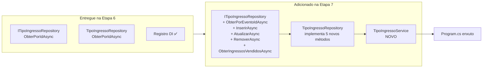
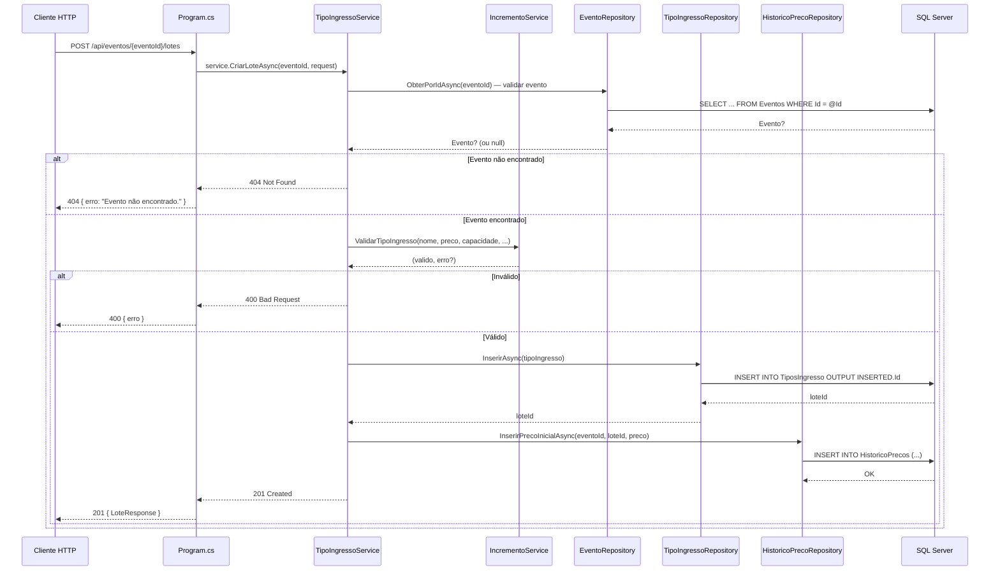
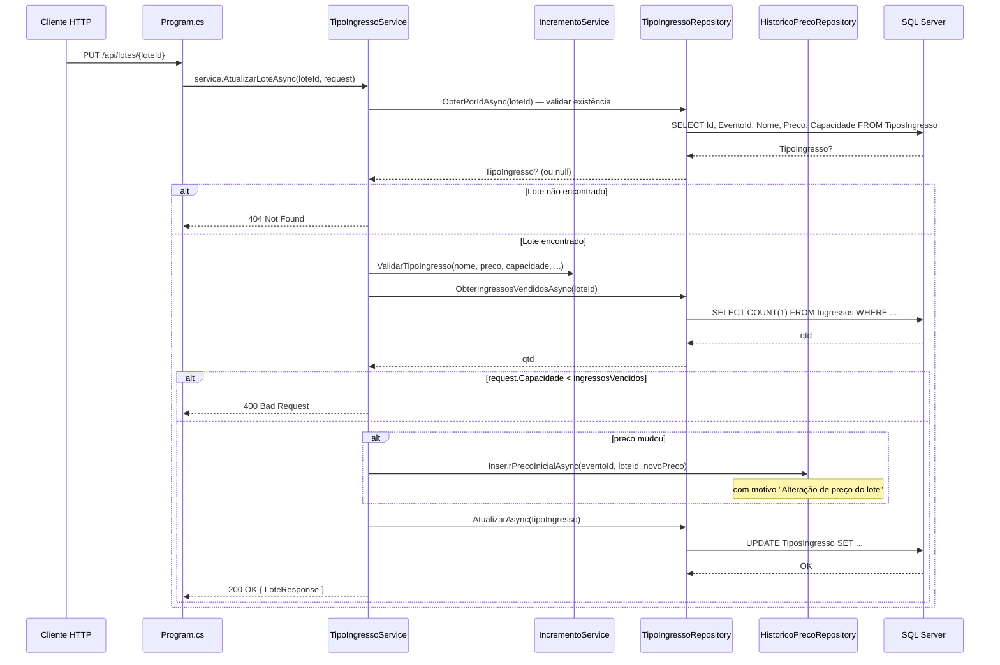

# Planejamento — Etapa 7: Migrar Domínio Lotes/TiposIngresso

**Projeto:** TicketPrime — Fase 2: Separação de Camadas e Redução do Acoplamento
**Data:** 2026-06-03
**Risco:** Médio
**Correção:** C6 (convenção `IDbTransaction? transaction = null` — já estabelecida na Etapa 2)
**Base:** Etapa 6 concluída (Build OK, 103/103 testes aprovados)

---

## 1. Objetivo da Etapa 7

Extrair do [`Program.cs`](src/TicketPrime.Api/Program.cs) os **7 endpoints** do domínio Lotes/TiposIngresso, migrando todo o SQL inline, validação e regras para:

- **Complemento** do [`ITipoIngressoRepository`](src/TicketPrime.Api/Repositories/ITipoIngressoRepository.cs) e [`TipoIngressoRepository`](src/TicketPrime.Api/Repositories/TipoIngressoRepository.cs) — criados com **apenas** `ObterPorIdAsync` na Etapa 6 — adicionando os métodos CRUD completos.
- **Criação** do [`TipoIngressoService`](src/TicketPrime.Api/Services/TipoIngressoService.cs) — orquestra validação, repositórios e regras puras do [`IncrementoService`](src/TicketPrime.Api/Services/IncrementoService.cs) (RF03).

### Resumo do escopo

| Endpoint | Linhas (antes) | Linhas (depois) | Redução |
|----------|:--------------:|:----------------:|:-------:|
| `POST /api/eventos/{eventoId}/lotes` ([`Program.cs`](src/TicketPrime.Api/Program.cs:1023)) | **~69** | **~4** | **-65** |
| `GET /api/eventos/{eventoId}/lotes` ([`Program.cs`](src/TicketPrime.Api/Program.cs:1094)) | **~26** | **~4** | **-22** |
| `GET /api/lotes/{loteId}` ([`Program.cs`](src/TicketPrime.Api/Program.cs:1121)) | **~13** | **~4** | **-9** |
| `PUT /api/lotes/{loteId}` ([`Program.cs`](src/TicketPrime.Api/Program.cs:1135)) | **~85** | **~4** | **-81** |
| `DELETE /api/lotes/{loteId}` ([`Program.cs`](src/TicketPrime.Api/Program.cs:1221)) | **~24** | **~4** | **-20** |
| `POST /api/tipos-ingresso` ([`Program.cs`](src/TicketPrime.Api/Program.cs:1250)) | **~73** | **~4** | **-69** |
| `GET /api/eventos/{eventoId}/tipos-ingresso` ([`Program.cs`](src/TicketPrime.Api/Program.cs:1324)) | **~20** | **~4** | **-16** |
| **Total** | **~310** | **~28** | **-282** |

---

## 2. Relação com o `TipoIngressoRepository` mínimo criado na Etapa 6

### 2.1. O que a Etapa 6 entregou

| Artefato | Métodos | Status |
|----------|---------|:------:|
| [`ITipoIngressoRepository`](src/TicketPrime.Api/Repositories/ITipoIngressoRepository.cs) | `ObterPorIdAsync(int id, IDbTransaction? transaction = null)` | ✅ Criado na Etapa 6 |
| [`TipoIngressoRepository`](src/TicketPrime.Api/Repositories/TipoIngressoRepository.cs) | Implementação com `SELECT Id, Nome, EventoId FROM TiposIngresso WHERE Id = @Id` | ✅ Criado na Etapa 6 |
| Registro DI | `builder.Services.AddScoped<ITipoIngressoRepository, TipoIngressoRepository>()` | ✅ Já registrado na Etapa 6 |

### 2.2. O que a Etapa 7 complementa

```diff
// ITipoIngressoRepository.cs (ESTADO ATUAL — Etapa 6)
public interface ITipoIngressoRepository
{
     Task<TipoIngresso?> ObterPorIdAsync(int id,
         IDbTransaction? transaction = null);

+    // NOVOS métodos (Etapa 7) — CRUD completo
+    Task<IEnumerable<TipoIngresso>> ObterPorEventoIdAsync(int eventoId,
+        IDbTransaction? transaction = null);
+
+    Task<int> InserirAsync(TipoIngresso tipoIngresso,
+        IDbTransaction? transaction = null);
+
+    Task<bool> AtualizarAsync(TipoIngresso tipoIngresso,
+        IDbTransaction? transaction = null);
+
+    Task<bool> RemoverAsync(int id,
+        IDbTransaction? transaction = null);
+
+    Task<int> ObterIngressosVendidosAsync(int tipoIngressoId,
+        IDbTransaction? transaction = null);
}
```

### 2.3. Métodos existentes que são REAPROVEITADOS

| Método | Origem | Uso na Etapa 7 |
|--------|:------:|----------------|
| [`IEventoRepository.ObterPorIdAsync`](src/TicketPrime.Api/Repositories/IEventoRepository.cs:8) | Etapa 5 | Validar existência do evento em `POST`/`GET` de lotes |
| [`IHistoricoPrecoRepository.InserirPrecoInicialAsync`](src/TicketPrime.Api/Repositories/IHistoricoPrecoRepository.cs) | Etapa 5 | Registrar preço inicial ao criar lote/tipo-ingresso |
| [`IncrementoService.ValidarTipoIngresso`](src/TicketPrime.Api/Services/IncrementoService.cs:137) | Fase 1 | Regra pura de validação (RF03) |
| [`IncrementoService.VerificarDisponibilidadeLote`](src/TicketPrime.Api/Services/IncrementoService.cs:162) | Fase 1 | Regra pura de verificação de capacidade (RF03) |

### 2.4. Diagrama da relação



---

## 3. Arquivos que serão alterados

| Arquivo | Tipo de Alteração | Descrição |
|---------|:-----------------:|-----------|
| [`src/TicketPrime.Api/Repositories/ITipoIngressoRepository.cs`](src/TicketPrime.Api/Repositories/ITipoIngressoRepository.cs) | **Modificação** | Adicionar 5 novos métodos: `ObterPorEventoIdAsync`, `InserirAsync`, `AtualizarAsync`, `RemoverAsync`, `ObterIngressosVendidosAsync` — todos com `IDbTransaction? transaction = null` (C6) |
| [`src/TicketPrime.Api/Repositories/TipoIngressoRepository.cs`](src/TicketPrime.Api/Repositories/TipoIngressoRepository.cs) | **Modificação** | Implementar os 5 novos métodos com SQL |
| [`src/TicketPrime.Api/Program.cs`](src/TicketPrime.Api/Program.cs) | **Modificação** | Substituir 7 endpoints inline por delegação ao service; **nenhum novo registro DI** (já registrado na Etapa 6) |

### 3.1. Modificações no [`ITipoIngressoRepository`](src/TicketPrime.Api/Repositories/ITipoIngressoRepository.cs)

```csharp
// ADICIONAR após o método ObterPorIdAsync existente:

/// <summary>
/// Retorna todos os tipos-ingresso/lotes de um evento.
/// </summary>
Task<IEnumerable<TipoIngresso>> ObterPorEventoIdAsync(int eventoId,
    IDbTransaction? transaction = null);                                            // C6

/// <summary>
/// Insere um novo tipo-ingresso/lote.
/// Retorna o Id gerado.
/// </summary>
Task<int> InserirAsync(TipoIngresso tipoIngresso,
    IDbTransaction? transaction = null);                                            // C6

/// <summary>
/// Atualiza os dados de um tipo-ingresso/lote.
/// Retorna true se alguma linha foi afetada.
/// </summary>
Task<bool> AtualizarAsync(TipoIngresso tipoIngresso,
    IDbTransaction? transaction = null);                                            // C6

/// <summary>
/// Remove um tipo-ingresso/lote pelo Id.
/// Retorna true se alguma linha foi afetada.
/// </summary>
Task<bool> RemoverAsync(int id,
    IDbTransaction? transaction = null);                                            // C6

/// <summary>
/// Retorna a quantidade de ingressos vendidos (status Confirmada ou Utilizada)
/// para um determinado tipo-ingresso/lote.
/// </summary>
Task<int> ObterIngressosVendidosAsync(int tipoIngressoId,
    IDbTransaction? transaction = null);                                            // C6
```

### 3.2. Modificações no [`TipoIngressoRepository`](src/TicketPrime.Api/Repositories/TipoIngressoRepository.cs)

```csharp
// ADICIONAR após o método ObterPorIdAsync existente:

public async Task<IEnumerable<TipoIngresso>> ObterPorEventoIdAsync(
    int eventoId, IDbTransaction? transaction = null)  // C6
{
    var sql = @"
        SELECT Id, EventoId, Nome, Preco, Capacidade, TaxaServico,
               DataInicioVenda, DataFimVenda, Lote
        FROM TiposIngresso
        WHERE EventoId = @EventoId
        ORDER BY Id";

    return await _db.QueryAsync<TipoIngresso>(sql,
        new { EventoId = eventoId },
        transaction: transaction);
}

public async Task<int> InserirAsync(
    TipoIngresso tipoIngresso, IDbTransaction? transaction = null)  // C6
{
    var sql = @"
        INSERT INTO TiposIngresso (EventoId, Nome, Preco, Capacidade, TaxaServico,
                                   DataInicioVenda, DataFimVenda, Lote)
        OUTPUT INSERTED.Id
        VALUES (@EventoId, @Nome, @Preco, @Capacidade, @TaxaServico,
                @DataInicioVenda, @DataFimVenda, @Lote)";

    return await _db.QuerySingleAsync<int>(sql, new
    {
        tipoIngresso.EventoId,
        tipoIngresso.Nome,
        tipoIngresso.Preco,
        Capacidade = tipoIngresso.Capacidade,
        tipoIngresso.TaxaServico,
        tipoIngresso.DataInicioVenda,
        tipoIngresso.DataFimVenda,
        Lote = tipoIngresso.Lote ?? (object)DBNull.Value
    }, transaction: transaction);
}

public async Task<bool> AtualizarAsync(
    TipoIngresso tipoIngresso, IDbTransaction? transaction = null)  // C6
{
    var sql = @"
        UPDATE TiposIngresso
        SET Nome = @Nome, Preco = @Preco, Capacidade = @Capacidade,
            TaxaServico = @TaxaServico, DataInicioVenda = @DataInicioVenda,
            DataFimVenda = @DataFimVenda
        WHERE Id = @Id";

    var linhas = await _db.ExecuteAsync(sql, new
    {
        tipoIngresso.Id,
        tipoIngresso.Nome,
        tipoIngresso.Preco,
        tipoIngresso.Capacidade,
        tipoIngresso.TaxaServico,
        tipoIngresso.DataInicioVenda,
        tipoIngresso.DataFimVenda
    }, transaction: transaction);

    return linhas > 0;
}

public async Task<bool> RemoverAsync(
    int id, IDbTransaction? transaction = null)  // C6
{
    var sql = "DELETE FROM TiposIngresso WHERE Id = @Id";
    var linhas = await _db.ExecuteAsync(sql,
        new { Id = id },
        transaction: transaction);
    return linhas > 0;
}

public async Task<int> ObterIngressosVendidosAsync(
    int tipoIngressoId, IDbTransaction? transaction = null)  // C6
{
    var sql = @"
        SELECT COUNT(1)
        FROM Ingressos
        WHERE TipoIngressoId = @TipoIngressoId
          AND Status IN ('Confirmada', 'Utilizada')";

    return await _db.ExecuteScalarAsync<int>(sql,
        new { TipoIngressoId = tipoIngressoId },
        transaction: transaction);
}
```

### 3.3. Mapeamento SQL — Código Original vs Repositório

| Método do Repository | SQL | Endpoint Origem |
|----------------------|:---:|:----------------:|
| `ObterPorIdAsync` (existente) | `SELECT Id, Nome, EventoId FROM TiposIngresso WHERE Id = @Id` | Reutilizado |
| `ObterPorEventoIdAsync` | `SELECT Id, EventoId, Nome, Preco, Capacidade, ... WHERE EventoId = @EventoId ORDER BY Id` | `GET /api/eventos/{eventoId}/tipos-ingresso` |
| `InserirAsync` | `INSERT INTO TiposIngresso (...) OUTPUT INSERTED.Id VALUES (...)` | `POST /api/eventos/{eventoId}/lotes`, `POST /api/tipos-ingresso` |
| `AtualizarAsync` | `UPDATE TiposIngresso SET ... WHERE Id = @Id` | `PUT /api/lotes/{loteId}` |
| `RemoverAsync` | `DELETE FROM TiposIngresso WHERE Id = @Id` | `DELETE /api/lotes/{loteId}` |
| `ObterIngressosVendidosAsync` | `SELECT COUNT(1) FROM Ingressos WHERE TipoIngressoId = @Id AND Status IN ('Confirmada', 'Utilizada')` | `PUT /api/lotes/{loteId}` (validação), `DELETE /api/lotes/{loteId}` (validação) |

---

## 4. Arquivos que serão criados

| Arquivo | Descrição |
|---------|-----------|
| [`src/TicketPrime.Api/Services/TipoIngressoService.cs`](src/TicketPrime.Api/Services/TipoIngressoService.cs) | Service que orquestra validação, regras de negócio (RF03 do [`IncrementoService`](src/TicketPrime.Api/Services/IncrementoService.cs)) e chamadas aos repositórios |

### 4.1. Estrutura do [`TipoIngressoService`](src/TicketPrime.Api/Services/TipoIngressoService.cs)

```csharp
namespace TicketPrime.Api.Services;

public class TipoIngressoService
{
    private readonly ITipoIngressoRepository _tipoIngressoRepository;
    private readonly IEventoRepository _eventoRepository;
    private readonly IHistoricoPrecoRepository _historicoPrecoRepository;
    private readonly IncrementoService _incrementoService;

    public TipoIngressoService(
        ITipoIngressoRepository tipoIngressoRepository,
        IEventoRepository eventoRepository,
        IHistoricoPrecoRepository historicoPrecoRepository,
        IncrementoService incrementoService)
    {
        _tipoIngressoRepository = tipoIngressoRepository;
        _eventoRepository = eventoRepository;
        _historicoPrecoRepository = historicoPrecoRepository;
        _incrementoService = incrementoService;
    }

    // Métodos do service:
    // 1. CriarLoteAsync(int eventoId, CriarLoteRequest request)
    // 2. ListarLotesAsync(int eventoId)
    // 3. ObterLoteAsync(int loteId)
    // 4. AtualizarLoteAsync(int loteId, CriarLoteRequest request)
    // 5. RemoverLoteAsync(int loteId)
    // 6. CriarTipoIngressoAsync(CriarTipoIngressoRequest request)
    // 7. ListarTiposIngressoAsync(int eventoId)
}
```

### 4.2. Decisões arquiteturais

| Decisão | Justificativa |
|---------|---------------|
| **Service injeta `IncrementoService`** | As regras puras `ValidarTipoIngresso` e `VerificarDisponibilidadeLote` (RF03) estão no [`IncrementoService`](src/TicketPrime.Api/Services/IncrementoService.cs). O novo service delega a ele as validações, sem duplicar regras. |
| **Service injeta `IHistoricoPrecoRepository`** | Os endpoints `POST /api/eventos/{eventoId}/lotes`, `PUT /api/lotes/{loteId}` e `POST /api/tipos-ingresso` registram no histórico de preços. O service usa o repository existente da Etapa 5. |
| **Service injeta `IEventoRepository`** | Necessário para validar existência do evento antes de criar/listar lotes. |
| **`DELETE` também remove `HistoricoPrecos`** | O endpoint original deleta registros de `HistoricoPrecos` antes de deletar o lote. Isso será encapsulado no service, não no repositório — o repositório de TipoIngresso não deve ter conhecimento de `HistoricoPrecos`. |
| **Service sem `IDbConnection`** | Service não gerencia conexão — apenas orquestra repositórios. |
| **Sem transação** | Nenhum endpoint desta etapa opera com múltiplos repositórios que exijam atomicidade transacional. Cada operação é independente. |

### 4.3. Exemplo — método `CriarLoteAsync`

```csharp
public async Task<IResult> CriarLoteAsync(int eventoId, CriarLoteRequest request)
{
    // 1. Validar existência do evento
    var evento = await _eventoRepository.ObterPorIdAsync(eventoId);
    if (evento is null)
        return Results.NotFound(new { erro = "Evento não encontrado." });

    // 2. Validar regras de negócio (RF03 — IncrementoService)
    var (valido, erro) = _incrementoService.ValidarTipoIngresso(
        request.Nome, request.Preco, request.Capacidade,
        request.DataInicioVenda, request.DataFimVenda);
    if (!valido)
        return Results.BadRequest(new { erro });

    // 3. Validar campos específicos (não cobertos pelo incremento)
    if (request.TaxaServico < 0)
        return Results.BadRequest(new { erro = "Taxa de serviço não pode ser negativa." });

    // 4. Inserir no banco
    var tipoIngresso = new TipoIngresso
    {
        EventoId = eventoId,
        Nome = request.Nome,
        Preco = request.Preco,
        Capacidade = request.Capacidade,
        TaxaServico = request.TaxaServico,
        DataInicioVenda = request.DataInicioVenda,
        DataFimVenda = request.DataFimVenda
    };

    var loteId = await _tipoIngressoRepository.InserirAsync(tipoIngresso);

    // 5. Registrar preço inicial no histórico
    await _historicoPrecoRepository.InserirPrecoInicialAsync(
        eventoId, loteId, request.Preco);

    // 6. Montar response
    var response = new LoteResponse { ... };
    return Results.Created($"/api/lotes/{loteId}", response);
}
```

> **Nota:** O método `InserirPrecoInicialAsync` existente no [`IHistoricoPrecoRepository`](src/TicketPrime.Api/Repositories/IHistoricoPrecoRepository.cs) atual aceita `(int eventoId, decimal precoNovo, ...)`. Será necessário verificar se a assinatura precisa ser ajustada para também aceitar `TipoIngressoId`, ou criar uma sobrecarga. Isso será detalhado na implementação.

---

## 5. Dependências da etapa

### 5.1. Pré-requisitos (já atendidos)

- [x] **Etapa 1 concluída:** `CriarLoteRequest`, `CriarTipoIngressoRequest`, `LoteResponse`, `LoteListaResponse`, `TipoIngressoResponse` extraídos em [`Models/`](src/TicketPrime.Api/Models/)
- [x] **Etapa 2 concluída:** Padrão Repository + convenção C6 estabelecidos
- [x] **Etapa 5 concluída:** [`IEventoRepository`](src/TicketPrime.Api/Repositories/IEventoRepository.cs) (com `ObterPorIdAsync`) e [`IHistoricoPrecoRepository`](src/TicketPrime.Api/Repositories/IHistoricoPrecoRepository.cs) (com `InserirPrecoInicialAsync`) criados
- [x] **Etapa 6 concluída:** [`ITipoIngressoRepository`](src/TicketPrime.Api/Repositories/ITipoIngressoRepository.cs) e [`TipoIngressoRepository`](src/TicketPrime.Api/Repositories/TipoIngressoRepository.cs) criados com `ObterPorIdAsync`; já registrados no DI
- [x] **Build OK:** `dotnet build` compila sem erros
- [x] **Testes OK:** `dotnet test` passa 103/103
- [x] **Checkpoint Git:** estado conhecido antes da Etapa 7

### 5.2. Dependências de runtime

| Dependência | Tipo | Origem |
|-------------|:----:|--------|
| `ITipoIngressoRepository` / `TipoIngressoRepository` | Repository | Etapa 6 (complementado agora) |
| `IEventoRepository` / `EventoRepository` | Repository | Etapa 5 |
| `IHistoricoPrecoRepository` / `HistoricoPrecoRepository` | Repository | Etapa 5 |
| `IncrementoService` | Service | Fase 1 (regras RF03) |
| `TipoIngressoService` | Service | **Novo** (criado nesta etapa) |

### 5.3. Nenhuma dependência externa

- Nenhum pacote NuGet novo (Dapper e Microsoft.Data.SqlClient já estão no csproj)
- Nenhuma dependência de banco de dados
- Nenhuma dependência de infraestrutura externa

---

## 6. Riscos

| # | Risco | Probabilidade | Impacto | Mitigação |
|:-:|-------|:-------------:|:-------:|-----------|
| R7.1 | **SQL de consulta diferente do original** — campos, filtros ou ordenação divergentes nos 7 endpoints | Baixa | Médio | Inspeção visual: as queries SELECT/INSERT/UPDATE/DELETE são transcrição direta do [`Program.cs`](src/TicketPrime.Api/Program.cs:1022-1342). Comparar caractere por caractere |
| R7.2 | **Response montado incorretamente** — `LoteResponse`, `LoteListaResponse` ou `TipoIngressoResponse` com campos trocados ou ausentes | Baixa | Alto | Comparar a construção do response no service vs. o código inline original. Os campos e propriedades devem ser idênticos |
| R7.3 | **Esquecer de registrar DI** para `TipoIngressoService` | Baixa | Médio | **Não se aplica** — o `ITipoIngressoRepository` já está registrado (Etapa 6). Apenas `TipoIngressoService` precisa de registro |
| R7.4 | **Quebra do contrato da API** — response HTTP diferente do original em algum dos 7 endpoints | Muito Baixa | Alto | Todos os endpoints retornam `200 OK`, `201 Created`, `204 NoContent`, `400 BadRequest`, `404 NotFound` ou `409 Conflict` conforme o original |
| R7.5 | **`InserirPrecoInicialAsync` não aceitar `TipoIngressoId`** — assinatura atual do [`IHistoricoPrecoRepository`](src/TicketPrime.Api/Repositories/IHistoricoPrecoRepository.cs) pode não suportar o parâmetro | Média | Médio | Verificar assinatura atual do método. Se necessário, criar sobrecarga ou ajustar parâmetros — sem quebrar chamadas existentes |
| R7.6 | **Regra de `DELETE` com `HistoricoPrecos`** — o endpoint original deleta registros de histórico antes de deletar o lote. Se o service chamar `IHistoricoPrecoRepository` para isso, precisamos de um método `RemoverPorTipoIngressoIdAsync` | Média | Médio | Adicionar método `RemoverPorTipoIngressoIdAsync` ao `IHistoricoPrecoRepository` (apenas 1 método), ou executar o SQL de deleção diretamente no service (menos recomendado) |
| R7.7 | **Convenção C6 não respeitada** nos novos métodos | Média | Alto (futuro) | Revisão de código obrigatória; verificar C6 em todos os 5 novos métodos de `ITipoIngressoRepository` |
| R7.8 | **Testes `IncrementoServiceTests` quebrados** — 14 testes referentes a RF03 | Muito Baixa | Alto | Os 14 testes de RF03 testam o [`IncrementoService`](src/TicketPrime.Api/Services/IncrementoService.cs), que **não é alterado**. Apenas delegamos chamadas a ele |
| R7.9 | **Dois endpoints de criação distintos** — `POST /api/eventos/{eventoId}/lotes` e `POST /api/tipos-ingresso` têm validação e INSERT diferentes (um usa `CriarLoteRequest`, outro usa `CriarTipoIngressoRequest`; um insere `TaxaServico`, `DataInicioVenda`, `DataFimVenda`, o outro insere `Lote`). Misturá-los causaria regressão | Média | Alto | **Manter dois métodos separados no service** (`CriarLoteAsync` e `CriarTipoIngressoAsync`). Não unificar a lógica |
| R7.10 | **`PUT /api/lotes/{loteId}` verifica capacidade vs ingressos vendidos** — usa `ObterIngressosVendidosAsync` | Muito Baixa | Médio | Método dedicado no repositório. A lógica de comparação (`request.Capacidade < ingressosVendidos`) fica no service |
| R7.11 | **Remoção de registros `HistoricoPrecos` no `DELETE`** — o endpoint atual executa `DELETE FROM HistoricoPrecos WHERE TipoIngressoId = @Id` antes de remover o lote | Baixa | Médio | Esta lógica de deleção em cascata manual deve ficar no service, ou criar método dedicado no `IHistoricoPrecoRepository` |

---

## 7. Critérios de aceite

### 7.1. Obrigatórios

- [ ] **CA7.1:** [`ITipoIngressoRepository`](src/TicketPrime.Api/Repositories/ITipoIngressoRepository.cs) complementado com **exatamente 5 novos métodos**: `ObterPorEventoIdAsync`, `InserirAsync`, `AtualizarAsync`, `RemoverAsync`, `ObterIngressosVendidosAsync` — todos com `IDbTransaction? transaction = null` (C6)
- [ ] **CA7.2:** [`TipoIngressoRepository`](src/TicketPrime.Api/Repositories/TipoIngressoRepository.cs) implementa os 5 novos métodos. O método `ObterPorIdAsync` existente **não é alterado**
- [ ] **CA7.3:** [`TipoIngressoService`](src/TicketPrime.Api/Services/TipoIngressoService.cs) criado com **7 métodos públicos** — um para cada endpoint. Nenhum método a mais, nenhum a menos
- [ ] **CA7.4:** O service **não contém SQL inline** — todo SQL está nos repositórios
- [ ] **CA7.5:** O service injeta **apenas** `ITipoIngressoRepository`, `IEventoRepository`, `IHistoricoPrecoRepository` e `IncrementoService`. Sem `IDbConnection`
- [ ] **CA7.6:** Cada um dos 7 endpoints em [`Program.cs`](src/TicketPrime.Api/Program.cs) tem no máximo ~4 linhas, delegando ao service
- [ ] **CA7.7:** Nenhum SQL permanece inline em [`Program.cs`](src/TicketPrime.Api/Program.cs) para os 7 endpoints de lotes/tipos-ingresso
- [ ] **CA7.8:** `TipoIngressoService` registrado no DI em [`Program.cs`](src/TicketPrime.Api/Program.cs)
- [ ] **CA7.9:** Contratos da API preservados para todos os 7 endpoints (mesmas rotas, métodos HTTP, request bodies, response bodies, status codes)
- [ ] **CA7.10:** `dotnet build` compila com zero erros
- [ ] **CA7.11:** `dotnet test` passa 103/103 **sem modificações** nos testes
- [ ] **CA7.12:** Nenhum arquivo de teste foi alterado
- [ ] **CA7.13:** Nenhum outro endpoint existente foi alterado
- [ ] **CA7.14:** Nenhum arquivo de [`Models/`](src/TicketPrime.Api/Models/) foi alterado
- [ ] **CA7.15:** [`IncrementoService`](src/TicketPrime.Api/Services/IncrementoService.cs) **não foi alterado** — zero linhas modificadas
- [ ] **CA7.16:** [`IEventoRepository`](src/TicketPrime.Api/Repositories/IEventoRepository.cs) e [`EventoRepository`](src/TicketPrime.Api/Repositories/EventoRepository.cs) **não foram alterados**
- [ ] **CA7.17:** [`HistoricoPrecoService`](src/TicketPrime.Api/Services/HistoricoPrecoService.cs) **não foi alterado**
- [ ] **CA7.18:** [`IHistoricoPrecoRepository`](src/TicketPrime.Api/Repositories/IHistoricoPrecoRepository.cs) e [`HistoricoPrecoRepository`](src/TicketPrime.Api/Repositories/HistoricoPrecoRepository.cs) **não foram alterados** (exceto possível adição de `RemoverPorTipoIngressoIdAsync` se necessário — item R7.6)

### 7.2. Verificações de qualidade

- [ ] **CA7.19:** Convenção C6 verificada em todos os 5 novos métodos de `ITipoIngressoRepository`
- [ ] **CA7.20:** Nomes de métodos seguem padrão do projeto (PascalCase, Async suffix)
- [ ] **CA7.21:** Nenhum warning novo de compilação (exceto possíveis nullability warnings pré-existentes)
- [ ] **CA7.22:** `ObterPorIdAsync` existente permanece inalterado (mesma assinatura, mesmo SQL)
- [ ] **CA7.23:** `POST /api/eventos/{eventoId}/lotes` e `POST /api/tipos-ingresso` são implementados como **dois métodos separados** no service — não unificados
- [ ] **CA7.24:** O registro de DI existente `builder.Services.AddScoped<ITipoIngressoRepository, TipoIngressoRepository>()` não é duplicado

---

## 8. Estratégia de rollback

### 8.1. Procedimento

```bash
# Opção 1 — Reverter commit (recomendado)
git revert HEAD --no-edit

# Opção 2 — Checkout manual (se houver checkpoint)
git checkout HEAD~1
```

### 8.2. Passos manuais (caso rollback automático não seja possível)

| Passo | Ação | Tempo |
|:-----:|------|:-----:|
| 1 | Remover [`src/TicketPrime.Api/Services/TipoIngressoService.cs`](src/TicketPrime.Api/Services/TipoIngressoService.cs) | ~1 min |
| 2 | Reverter [`ITipoIngressoRepository.cs`](src/TicketPrime.Api/Repositories/ITipoIngressoRepository.cs) ao estado da Etapa 6 (apenas `ObterPorIdAsync`) | ~2 min |
| 3 | Reverter [`TipoIngressoRepository.cs`](src/TicketPrime.Api/Repositories/TipoIngressoRepository.cs) ao estado da Etapa 6 (apenas `ObterPorIdAsync`) | ~2 min |
| 4 | Restaurar os 7 endpoints inline em [`Program.cs`](src/TicketPrime.Api/Program.cs:1022-1342) ao original (~310 linhas) | ~5 min |
| 5 | Remover `builder.Services.AddScoped<TipoIngressoService>()` do [`Program.cs`](src/TicketPrime.Api/Program.cs) | ~1 min |
| 6 | Reverter qualquer alteração acidental em `IHistoricoPrecoRepository` (se `RemoverPorTipoIngressoIdAsync` foi adicionado) | ~2 min |
| 7 | Executar `dotnet build` e `dotnet test` | ~2 min |
| | **Total** | **~15 min** |

### 8.3. Verificação pós-rollback

```bash
dotnet build    # zero erros
dotnet test     # 103/103
```

---

## 9. Impacto esperado no Program.cs

### 9.1. Linhas alteradas

| Região | Antes | Depois | Diferença |
|--------|:-----:|:------:|:---------:|
| Endpoint `POST /api/eventos/{eventoId}/lotes` (linhas 1023-1091) | **~69 linhas** | **~4 linhas** | **-65** |
| Endpoint `GET /api/eventos/{eventoId}/lotes` (linhas 1094-1118) | **~26 linhas** | **~4 linhas** | **-22** |
| Endpoint `GET /api/lotes/{loteId}` (linhas 1121-1132) | **~13 linhas** | **~4 linhas** | **-9** |
| Endpoint `PUT /api/lotes/{loteId}` (linhas 1135-1218) | **~85 linhas** | **~4 linhas** | **-81** |
| Endpoint `DELETE /api/lotes/{loteId}` (linhas 1221-1243) | **~24 linhas** | **~4 linhas** | **-20** |
| Endpoint `POST /api/tipos-ingresso` (linhas 1250-1321) | **~73 linhas** | **~4 linhas** | **-69** |
| Endpoint `GET /api/eventos/{eventoId}/tipos-ingresso` (linhas 1324-1342) | **~20 linhas** | **~4 linhas** | **-16** |
| Registro DI (após linha 28) | — | + `TipoIngressoService` | **+1 linha** |
| **Saldo líquido** | | | **-281 linhas** |

### 9.2. Estado esperado após a Etapa 7

- [`Program.cs`](src/TicketPrime.Api/Program.cs) reduz de aproximadamente ~2077 para ~1796 linhas
- Nenhuma configuração de middleware, CORS, auth ou JSON é alterada
- Nenhum SQL permanece nos 7 endpoints de lotes/tipos-ingresso
- Bloco de DI mantém os registros existentes e adiciona `TipoIngressoService`

### 9.3. Fluxo arquitetural — `POST /api/eventos/{eventoId}/lotes`



### 9.4. Fluxo arquitetural — `PUT /api/lotes/{loteId}` (o mais complexo)



---

## 10. O que NÃO será alterado

### 🚫 Blindado (não tocar)

| Item | Motivo |
|------|--------|
| **Contratos da API** (rotas, request/response bodies) | CA3 — contrato deve permanecer idêntico |
| **Banco de Dados** (tabelas, colunas, constraints, índices, VIEWs) | CA5 — SQL permanece idêntico ao atual |
| **Regras de Negócio** (validações, cálculos, condições) | CA4 — são movidas, não alteradas |
| **Autenticação e Autorização** | CA6 — nenhuma alteração |
| **CORS** | CA7 — nenhuma alteração |
| **Testes existentes** (103/103) | CA2 — nenhuma linha de teste é alterada |
| **Models** ([`TipoIngresso.cs`](src/TicketPrime.Api/Models/TipoIngresso.cs), [`CriarLoteRequest.cs`](src/TicketPrime.Api/Models/CriarLoteRequest.cs), [`CriarTipoIngressoRequest.cs`](src/TicketPrime.Api/Models/CriarTipoIngressoRequest.cs), [`LoteResponse.cs`](src/TicketPrime.Api/Models/LoteResponse.cs), [`LoteListaResponse.cs`](src/TicketPrime.Api/Models/LoteListaResponse.cs), [`TipoIngressoResponse.cs`](src/TicketPrime.Api/Models/TipoIngressoResponse.cs)) | Já extraídos na Etapa 1, permanecem inalterados |
| **`ObterPorIdAsync`** no [`ITipoIngressoRepository`](src/TicketPrime.Api/Repositories/ITipoIngressoRepository.cs) e [`TipoIngressoRepository`](src/TicketPrime.Api/Repositories/TipoIngressoRepository.cs) | Método existente da Etapa 6 — **não é modificado** |
| **Repositórios de outros domínios** ([`IUsuarioRepository`](src/TicketPrime.Api/Repositories/IUsuarioRepository.cs), [`UsuarioRepository`](src/TicketPrime.Api/Repositories/UsuarioRepository.cs), [`ICupomRepository`](src/TicketPrime.Api/Repositories/ICupomRepository.cs), [`CupomRepository`](src/TicketPrime.Api/Repositories/CupomRepository.cs), [`IEventoRepository`](src/TicketPrime.Api/Repositories/IEventoRepository.cs), [`EventoRepository`](src/TicketPrime.Api/Repositories/EventoRepository.cs)) | Criados nas Etapas 2-5, permanecem inalterados |
| **Services existentes** ([`UsuarioService`](src/TicketPrime.Api/Services/UsuarioService.cs), [`CupomService`](src/TicketPrime.Api/Services/CupomService.cs), [`EventoService`](src/TicketPrime.Api/Services/EventoService.cs), [`ReservaService`](src/TicketPrime.Api/Services/ReservaService.cs), [`HistoricoPrecoService`](src/TicketPrime.Api/Services/HistoricoPrecoService.cs), [`IncrementoService`](src/TicketPrime.Api/Services/IncrementoService.cs)) | **Nenhum é alterado** (apenas chamado) |
| **Middleware** ([`ExceptionHandlingMiddleware`](src/TicketPrime.Api/Middleware/ExceptionHandlingMiddleware.cs)) | Sem alterações |
| **Authentication** ([`ApiKeyAuthenticationHandler`](src/TicketPrime.Api/Authentication/ApiKeyAuthenticationHandler.cs)) | Sem alterações |
| **Demais endpoints** (Usuários, Cupons, Eventos, Reservas, Ingressos, CheckIn, Carrinho, Dashboard, Histórico) | Nenhum outro endpoint é alterado |

### ✅ O que é alterado (apenas)

1. **Complemento** de [`src/TicketPrime.Api/Repositories/ITipoIngressoRepository.cs`](src/TicketPrime.Api/Repositories/ITipoIngressoRepository.cs) com **5** novos métodos CRUD
2. **Complemento** de [`src/TicketPrime.Api/Repositories/TipoIngressoRepository.cs`](src/TicketPrime.Api/Repositories/TipoIngressoRepository.cs) com implementação dos **5** novos métodos
3. **Criação** de [`src/TicketPrime.Api/Services/TipoIngressoService.cs`](src/TicketPrime.Api/Services/TipoIngressoService.cs) com **7** métodos públicos
4. **Modificação** de **7 endpoints** em [`Program.cs`](src/TicketPrime.Api/Program.cs:1022-1342) (~310 → ~28 linhas)
5. **Adição** de **1 linha** de DI em [`Program.cs`](src/TicketPrime.Api/Program.cs): `TipoIngressoService`

---

## 11. Impacto esperado nos testes

### 11.1. Testes existentes (103/103)

Nenhum teste existente será alterado, removido ou modificado.

| Arquivo de teste | Testes | Impacto |
|-----------------|:------:|:-------:|
| [`IncrementoServiceTests.cs`](tests/TicketPrime.Tests/IncrementoServiceTests.cs) | 64 (14 deles de RF03 — Lotes/TiposIngresso) | **Nenhum** — testam o [`IncrementoService`](src/TicketPrime.Api/Services/IncrementoService.cs), que **não é alterado** |
| [`ReservaServiceTests.cs`](tests/TicketPrime.Tests/ReservaServiceTests.cs) | 26 | Nenhum |
| [`UsuarioValidationTests.cs`](tests/TicketPrime.Tests/UsuarioValidationTests.cs) | 5 | Nenhum |
| [`CupomValidationTests.cs`](tests/TicketPrime.Tests/CupomValidationTests.cs) | 5 | Nenhum |
| [`EventoValidationTests.cs`](tests/TicketPrime.Tests/EventoValidationTests.cs) | 3 | Nenhum |
| **Total** | **103** | **Zero regressões** |

### 11.2. Por que não há risco de regressão

1. **Os 14 testes de RF03** testam métodos puros do [`IncrementoService`](src/TicketPrime.Api/Services/IncrementoService.cs) (`ValidarTipoIngresso`, `VerificarDisponibilidadeLote`). Estes métodos **não são alterados** — apenas chamados pelo novo `TipoIngressoService`.
2. **Nenhum teste** referencia diretamente os endpoints de [`Program.cs`](src/TicketPrime.Api/Program.cs) — todos os 103 testes são unitários, testando services e regras puras.
3. **Nenhum arquivo de teste** é modificado nesta etapa.

### 11.3. Testes manuais recomendados (após implementação)

Embora não sejam critério de aceite obrigatório, recomenda-se testar manualmente os 7 endpoints via curl ou Postman para verificar:

- `POST /api/eventos/{eventoId}/lotes` — criar lote com dados válidos e inválidos
- `GET /api/eventos/{eventoId}/lotes` — listar lotes de evento existente e inexistente
- `GET /api/lotes/{loteId}` — obter lote específico
- `PUT /api/lotes/{loteId}` — atualizar lote com e sem alteração de preço
- `DELETE /api/lotes/{loteId}` — remover lote sem e com ingressos vendidos
- `POST /api/tipos-ingresso` — criar tipo ingresso (via nova rota)
- `GET /api/eventos/{eventoId}/tipos-ingresso` — listar tipos ingresso

---

## 12. Resumo das mudanças

| Métrica | Valor |
|---------|:-----:|
| **Arquivos criados** | 1 (`TipoIngressoService.cs`) |
| **Arquivos modificados** | 3 (`ITipoIngressoRepository.cs`, `TipoIngressoRepository.cs`, `Program.cs`) |
| **Arquivos inalterados** | Todos os demais (~40+ arquivos) |
| **Endpoints migrados** | 7 (de 33 totais) |
| **Endpoints restantes pós Etapa 7** | 24 (ainda inline em `Program.cs`) |
| **Linhas removidas de `Program.cs`** | ~282 |
| **Métodos adicionados ao repositório** | 5 (todos com C6) |
| **Métodos no service** | 7 (1 por endpoint) |
| **Registros DI adicionados** | 1 (`TipoIngressoService`) |
| **Risco** | Médio |
| **Testes quebrados esperados** | Zero |

---

## 13. Checklist de implementação

- [ ] Complementar [`ITipoIngressoRepository`](src/TicketPrime.Api/Repositories/ITipoIngressoRepository.cs) com 5 novos métodos (C6)
- [ ] Implementar os 5 novos métodos em [`TipoIngressoRepository`](src/TicketPrime.Api/Repositories/TipoIngressoRepository.cs)
- [ ] Criar [`TipoIngressoService`](src/TicketPrime.Api/Services/TipoIngressoService.cs) com 7 métodos públicos
- [ ] Registrar `TipoIngressoService` no DI em [`Program.cs`](src/TicketPrime.Api/Program.cs)
- [ ] Substituir `POST /api/eventos/{eventoId}/lotes` por delegação ao service
- [ ] Substituir `GET /api/eventos/{eventoId}/lotes` por delegação ao service
- [ ] Substituir `GET /api/lotes/{loteId}` por delegação ao service
- [ ] Substituir `PUT /api/lotes/{loteId}` por delegação ao service
- [ ] Substituir `DELETE /api/lotes/{loteId}` por delegação ao service
- [ ] Substituir `POST /api/tipos-ingresso` por delegação ao service
- [ ] Substituir `GET /api/eventos/{eventoId}/tipos-ingresso` por delegação ao service
- [ ] Verificar C6 em todos os novos métodos de repositório
- [ ] Executar `dotnet build` (zero erros)
- [ ] Executar `dotnet test` (103/103 aprovados)
- [ ] Testar endpoints manualmente (curl ou Postman)
- [ ] Fazer commit com mensagem descritiva

---

## 14. Observação importante sobre o `IHistoricoPrecoRepository`

O método `InserirPrecoInicialAsync` atual — criado na Etapa 5 — tem a seguinte assinatura:

```csharp
Task InserirPrecoInicialAsync(int eventoId, decimal precoNovo,
    IDbTransaction? transaction = null);
```

**Verificar durante a implementação se este método aceita `TipoIngressoId`.** Se não aceitar, pode ser necessário:

1. **Opção A:** Adicionar uma sobrecarga:
   ```csharp
   Task InserirPrecoInicialAsync(int eventoId, int tipoIngressoId,
       decimal precoNovo, IDbTransaction? transaction = null);
   ```
2. **Opção B:** Modificar o método existente para aceitar `int? tipoIngressoId = null` (parâmetro opcional).

**Recomendação:** Opção A (sobrecarga), pois não quebra chamadas existentes e respeita SRP.

Igualmente, o método de `DELETE` que remove `HistoricoPrecos` pode exigir um novo método:
```csharp
Task RemoverPorTipoIngressoIdAsync(int tipoIngressoId,
    IDbTransaction? transaction = null);
```
