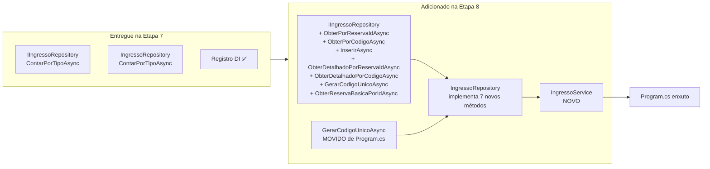
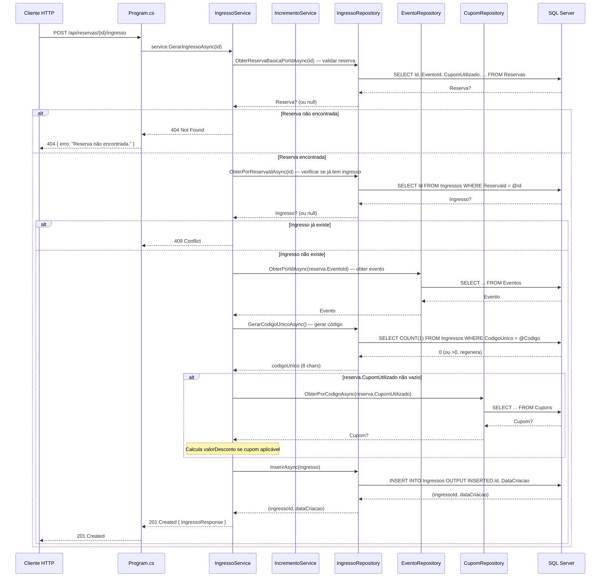

# Planejamento — Etapa 8: Migrar Domínio Ingressos

**Projeto:** TicketPrime — Fase 2: Separação de Camadas e Redução do Acoplamento
**Data:** 2026-06-03
**Risco:** Médio
**Correção:** C6 (convenção `IDbTransaction? transaction = null` — já estabelecida na Etapa 2)
**Base:** Etapa 7 concluída (Build OK, 103/103 testes aprovados)

---

## 1. Objetivo da Etapa 8

Extrair do [`Program.cs`](src/TicketPrime.Api/Program.cs) os **3 endpoints** do domínio Ingressos, migrando todo o SQL inline, validação e regras para:

- **Expansão** do [`IIngressoRepository`](src/TicketPrime.Api/Repositories/IIngressoRepository.cs) e [`IngressoRepository`](src/TicketPrime.Api/Repositories/IngressoRepository.cs) — atualmente contêm **apenas** `ContarPorTipoAsync` (mínimo criado na Etapa 7 para uso do `TipoIngressoRepository`).
- **Criação** do [`IngressoService`](src/TicketPrime.Api/Services/IngressoService.cs) — orquestra validação, repositórios e a lógica de geração de código único.
- **Movimentação** do método [`GerarCodigoUnicoAsync`](src/TicketPrime.Api/Program.cs:1840) do [`Program.cs`](src/TicketPrime.Api/Program.cs) para o [`IngressoRepository`](src/TicketPrime.Api/Repositories/IngressoRepository.cs).

### Resumo do escopo

| Endpoint | Linhas (antes) | Linhas (depois) | Redução |
|----------|:--------------:|:----------------:|:-------:|
| `POST /api/reservas/{id}/ingresso` ([`Program.cs`](src/TicketPrime.Api/Program.cs:654)) | **~84** | **~4** | **-80** |
| `GET /api/ingressos/{param}` ([`Program.cs`](src/TicketPrime.Api/Program.cs:741)) | **~69** | **~4** | **-65** |
| `GET /api/reservas/{id}/ingresso` ([`Program.cs`](src/TicketPrime.Api/Program.cs:813)) | **~18** | **~4** | **-14** |
| **Total** | **~171** | **~12** | **-159** |

---

## 2. Relação com o `IIngressoRepository` mínimo criado na Etapa 7

### 2.1. O que a Etapa 7 entregou

| Artefato | Métodos | Status |
|----------|---------|:------:|
| [`IIngressoRepository`](src/TicketPrime.Api/Repositories/IIngressoRepository.cs) | `ContarPorTipoAsync(int tipoIngressoId, IDbTransaction? transaction = null)` | ✅ Criado na Etapa 7 |
| [`IngressoRepository`](src/TicketPrime.Api/Repositories/IngressoRepository.cs) | Implementação com `SELECT COUNT(1) FROM Ingressos WHERE TipoIngressoId = @TipoIngressoId AND Status IN ('Confirmada', 'Utilizada')` | ✅ Criado na Etapa 7 |
| Registro DI | `builder.Services.AddScoped<IIngressoRepository, IngressoRepository>()` | ✅ Já registrado na Etapa 7 (linha 29 do [`Program.cs`](src/TicketPrime.Api/Program.cs:29)) |

### 2.2. O que a Etapa 8 complementa

```diff
// IIngressoRepository.cs (ESTADO ATUAL — Etapa 7)
public interface IIngressoRepository
{
     Task<int> ContarPorTipoAsync(int tipoIngressoId,
         IDbTransaction? transaction = null);

+    // NOVOS métodos (Etapa 8) — CRUD + consultas complexas
+
+    /// <summary>
+    /// Retorna um ingresso pelo ID da reserva.
+    /// Usado para verificar se a reserva já possui ingresso (POST) e para
+    /// o endpoint GET /api/reservas/{id}/ingresso.
+    /// </summary>
+    Task<Ingresso?> ObterPorReservaIdAsync(int reservaId,
+        IDbTransaction? transaction = null);
+
+    /// <summary>
+    /// Retorna um ingresso pelo código único de 8 caracteres.
+    /// Usado para validar existência no POST (indiretamente via consulta de
+    /// código já existente em GerarCodigoUnicoAsync).
+    /// </summary>
+    Task<Ingresso?> ObterPorCodigoAsync(string codigo,
+        IDbTransaction? transaction = null);
+
+    /// <summary>
+    /// Insere um novo ingresso e retorna o Id gerado + DataCriacao.
+    /// </summary>
+    Task<(int Id, DateTime DataCriacao)> InserirAsync(Ingresso ingresso,
+        IDbTransaction? transaction = null);
+
+    /// <summary>
+    /// Consulta detalhada de ingresso por ReservaId com dados do evento
+    /// (JOIN com Reservas e Eventos). Retorna IngressoPorReservaResponse.
+    /// Usado pelo GET /api/ingressos/{param} quando param é numérico.
+    /// </summary>
+    Task<IngressoPorReservaResponse?> ObterDetalhadoPorReservaIdAsync(
+        int reservaId, IDbTransaction? transaction = null);
+
+    /// <summary>
+    /// Consulta detalhada de ingresso por código único com dados do
+    /// tipo-ingresso, evento e usuário (multi-mapping JOIN com 4 tabelas).
+    /// Retorna IngressoDetalhadoResponse.
+    /// Usado pelo GET /api/ingressos/{param} quando param é string de 8 chars.
+    /// </summary>
+    Task<IEnumerable<IngressoDetalhadoResponse>> ObterDetalhadoPorCodigoAsync(
+        string codigo, IDbTransaction? transaction = null);
+
+    /// <summary>
+    /// Gera um código único de 8 caracteres (A-Z, 2-9, sem caracteres
+    /// ambíguos como I, O, 0, 1) verificando colisões no banco.
+    /// MOVIDO de Program.cs (era um método estático).
+    /// </summary>
+    Task<string> GerarCodigoUnicoAsync(IDbTransaction? transaction = null,
+        int? commandTimeout = 30);
+
+    /// <summary>
+    /// Retorna dados resumidos de uma reserva para validação no POST.
+    /// Método temporário — IReservaRepository será criado na Etapa 10b.
+    /// </summary>
+    Task<Reserva?> ObterReservaBasicaPorIdAsync(int reservaId,
+        IDbTransaction? transaction = null);
}
```

### 2.3. Métodos existentes que são REAPROVEITADOS

| Método | Origem | Uso na Etapa 8 |
|--------|:------:|----------------|
| [`IEventoRepository.ObterPorIdAsync`](src/TicketPrime.Api/Repositories/IEventoRepository.cs) | Etapa 5 | Obter dados do evento para calcular valor do ingresso no `POST /api/reservas/{id}/ingresso` |
| [`ICupomRepository.ObterPorCodigoAsync`](src/TicketPrime.Api/Repositories/ICupomRepository.cs) | Etapa 4 | Obter cupom para calcular desconto no `POST /api/reservas/{id}/ingresso` |
| [`IncrementoService.CriarIngressoDigital`](src/TicketPrime.Api/Services/IncrementoService.cs:38) | Fase 1 | Regra pura de criação de ingresso (RF01) |
| [`IncrementoService.ValidarCodigoUnico`](src/TicketPrime.Api/Services/IncrementoService.cs:64) | Fase 1 | Validação de formato do código único (RF01) |

### 2.4. Diagrama da relação



---

## 3. Arquivos que serão alterados

| Arquivo | Tipo de Alteração | Descrição |
|---------|:-----------------:|-----------|
| [`src/TicketPrime.Api/Repositories/IIngressoRepository.cs`](src/TicketPrime.Api/Repositories/IIngressoRepository.cs) | **Modificação** | Adicionar 7 novos métodos: `ObterPorReservaIdAsync`, `ObterPorCodigoAsync`, `InserirAsync`, `ObterDetalhadoPorReservaIdAsync`, `ObterDetalhadoPorCodigoAsync`, `GerarCodigoUnicoAsync`, `ObterReservaBasicaPorIdAsync` — todos com `IDbTransaction? transaction = null` (C6) |
| [`src/TicketPrime.Api/Repositories/IngressoRepository.cs`](src/TicketPrime.Api/Repositories/IngressoRepository.cs) | **Modificação** | Implementar os 7 novos métodos com SQL. O método `ContarPorTipoAsync` existente **não é alterado** |
| [`src/TicketPrime.Api/Program.cs`](src/TicketPrime.Api/Program.cs) | **Modificação** | Substituir 3 endpoints inline por delegação ao service; **remover** o método estático `GerarCodigoUnicoAsync` (linhas 1840-1856); **nenhum novo registro DI** necessário (`IIngressoRepository` já registrado na Etapa 7) |

---

## 4. Arquivos que serão criados

| Arquivo | Descrição |
|---------|-----------|
| [`src/TicketPrime.Api/Services/IngressoService.cs`](src/TicketPrime.Api/Services/IngressoService.cs) | Service que orquestra validação, regras de negócio (RF01 do [`IncrementoService`](src/TicketPrime.Api/Services/IncrementoService.cs)) e chamadas aos repositórios |

### 4.1. Estrutura do [`IngressoService`](src/TicketPrime.Api/Services/IngressoService.cs)

```csharp
namespace TicketPrime.Api.Services;

public class IngressoService
{
    private readonly IIngressoRepository _ingressoRepository;
    private readonly IEventoRepository _eventoRepository;
    private readonly ICupomRepository _cupomRepository;
    private readonly IncrementoService _incrementoService;

    public IngressoService(
        IIngressoRepository ingressoRepository,
        IEventoRepository eventoRepository,
        ICupomRepository cupomRepository,
        IncrementoService incrementoService)
    {
        _ingressoRepository = ingressoRepository;
        _eventoRepository = eventoRepository;
        _cupomRepository = cupomRepository;
        _incrementoService = incrementoService;
    }

    // Métodos públicos:
    // 1. GerarIngressoAsync(int reservaId)
    //    → POST /api/reservas/{id}/ingresso
    //
    // 2. ConsultarIngressoAsync(string param)
    //    → GET /api/ingressos/{param} (se numérico: busca por reserva;
    //       se 8 chars: busca por código único)
    //
    // 3. ObterPorReservaAsync(int reservaId)
    //    → GET /api/reservas/{id}/ingresso
}
```

### 4.2. Decisões arquiteturais

| Decisão | Justificativa |
|---------|---------------|
| **Service injeta `IEventoRepository`** | Necessário para obter dados do evento (`PrecoPadrao`) e calcular valor bruto/desconto no `POST /api/reservas/{id}/ingresso` |
| **Service injeta `ICupomRepository`** | Necessário para consultar cupom quando a reserva foi criada com cupom, e calcular o desconto no ingresso |
| **Service injeta `IncrementoService`** | As regras puras `CriarIngressoDigital` e `ValidarCodigoUnico` (RF01) estão no [`IncrementoService`](src/TicketPrime.Api/Services/IncrementoService.cs). Não duplicar regras. |
| **`ObterReservaBasicaPorIdAsync` no `IngressoRepository`** | **Medida temporária.** O `IReservaRepository` será criado apenas na Etapa 10b. Até lá, o `IngressoService` precisa validar a existência da reserva e obter `EventoId`, `CupomUtilizado`, `ValorFinalPago`. Em vez de injetar `IDbConnection` no service, criamos um método dedicado no `IngressoRepository` que consulta a tabela `Reservas`. Este método será removido na Etapa 10b quando `IReservaRepository` estiver disponível. |
| **`GerarCodigoUnicoAsync` movido para `IngressoRepository`** | O método precisa de acesso ao banco para verificar colisões (`SELECT COUNT(1) FROM Ingressos WHERE CodigoUnico = @Codigo`). Pertence ao repositório de Ingressos, não ao [`Program.cs`](src/TicketPrime.Api/Program.cs). A lógica de geração (alfabeto, tamanho) permanece idêntica. |
| **Impacto no Carrinho (Etapa 11b)** | O fluxo de confirmação de carrinho em [`Program.cs`](src/TicketPrime.Api/Program.cs:1510) chama `GerarCodigoUnicoAsync`. Após a movimentação, este endpoint precisará injetar `IIngressoRepository` para chamar o método. Isso é um **risco controlado** e será implementado (ver seção 6). |
| **Service sem `IDbConnection`** | Service não gerencia conexão — apenas orquestra repositórios |
| **Sem transação** | Nenhum endpoint do domínio Ingressos exige atomicidade multi-domínio nesta etapa. Transação será necessária apenas na Etapa 11b (confirmação do carrinho) |

---

## 5. Dependências da etapa

### 5.1. Pré-requisitos (já atendidos)

- [x] **Etapa 1 concluída:** Models de request/response de Ingresso (`IngressoResponse`, `IngressoDetalhadoResponse`, `IngressoPorReservaResponse`) já extraídos em [`Models/`](src/TicketPrime.Api/Models/)
- [x] **Etapa 2 concluída:** Padrão Repository + convenção C6 estabelecidos
- [x] **Etapa 4 concluída:** [`ICupomRepository`](src/TicketPrime.Api/Repositories/ICupomRepository.cs) (com `ObterPorCodigoAsync`) criado
- [x] **Etapa 5 concluída:** [`IEventoRepository`](src/TicketPrime.Api/Repositories/IEventoRepository.cs) (com `ObterPorIdAsync`) criado
- [x] **Etapa 7 concluída:** [`IIngressoRepository`](src/TicketPrime.Api/Repositories/IIngressoRepository.cs) e [`IngressoRepository`](src/TicketPrime.Api/Repositories/IngressoRepository.cs) criados com `ContarPorTipoAsync`; já registrados no DI
- [x] **Build OK:** `dotnet build` compila sem erros
- [x] **Testes OK:** `dotnet test` passa 103/103
- [x] **Checkpoint Git:** estado conhecido antes da Etapa 8

### 5.2. Dependências de runtime

| Dependência | Tipo | Origem |
|-------------|:----:|--------|
| `IIngressoRepository` / `IngressoRepository` | Repository | Etapa 7 (expandido agora) |
| `IEventoRepository` / `EventoRepository` | Repository | Etapa 5 |
| `ICupomRepository` / `CupomRepository` | Repository | Etapa 4 |
| `IncrementoService` | Service | Fase 1 (regras RF01) |
| `IngressoService` | Service | **Novo** (criado nesta etapa) |

### 5.3. O que NÃO é dependência

| Item | Motivo |
|------|--------|
| `IReservaRepository` | **Não existe ainda** — será criado na Etapa 10b. Usamos método temporário em `IngressoRepository` para consultar a tabela Reservas. |
| `ReservaService` | O service atual é puro (sem DB) e não será utilizado. As validações de ingresso são independentes. |
| `ITipoIngressoRepository` | Embora exista um LEFT JOIN com TiposIngresso na consulta detalhada, o JOIN é feito dentro do `IngressoRepository` via SQL, não via chamada a outro repository. |
| `HistoricoPrecoRepository` | Nenhum endpoint de ingresso registra no histórico de preços. |
| `CarrinhoService` | O carrinho não é afetado por esta etapa — o fluxo de confirmação (Etapa 11b) continuará funcionando com a assinatura modificada de `GerarCodigoUnicoAsync`. |

### 5.4. Nenhuma dependência externa

- Nenhum pacote NuGet novo (Dapper e Microsoft.Data.SqlClient já estão no csproj)
- Nenhuma dependência de banco de dados
- Nenhuma dependência de infraestrutura externa

---

## 6. Riscos

| # | Risco | Probabilidade | Impacto | Mitigação |
|:-:|-------|:-------------:|:-------:|-----------|
| R8.1 | **`GerarCodigoUnicoAsync` movido — quebra o endpoint de confirmação de carrinho** (ainda inline em [`Program.cs`](src/TicketPrime.Api/Program.cs:1510) — Etapa 11b) | **Alta** | **Alto** | O endpoint `POST /api/carrinho/{cpf}/confirmar` (linha 1510) chama `GerarCodigoUnicoAsync(db, transaction, 30)`. Após a movimentação, este método **não existe mais** como método estático em [`Program.cs`](src/TicketPrime.Api/Program.cs). **Solução:** Modificar a assinatura do endpoint para receber `IIngressoRepository` via DI e chamar `ingressoRepository.GerarCodigoUnicoAsync(transaction, 30)` no lugar. Isso é uma alteração localizada em 1 linha do [`Program.cs`](src/TicketPrime.Api/Program.cs). |
| R8.2 | **SQL de consulta diferente do original** — campos, filtros ou ordenação divergentes nos 3 endpoints | Baixa | Médio | Inspeção visual: as queries SELECT/INSERT são transcrição direta do [`Program.cs`](src/TicketPrime.Api/Program.cs:654-831). Comparar caractere por caractere, especialmente os multi-mapping JOINs com `splitOn`. |
| R8.3 | **Multi-mapping Dapper (`QueryAsync` com 4 tipos) incorreto** no método `ObterDetalhadoPorCodigoAsync` | Média | Alto | O Dapper multi-mapping com `splitOn: "Id,Id,Cpf"` é frágil. Erro na ordem dos parâmetros ou no `splitOn` pode resultar em dados incorretos ou exceptions em runtime. **Mitigação:** Testar manualmente o endpoint `GET /api/ingressos/{codigo}` após a migração. |
| R8.4 | **Response montado incorretamente** — `IngressoResponse`, `IngressoDetalhadoResponse` ou `IngressoPorReservaResponse` com campos trocados ou ausentes | Baixa | Alto | Comparar a construção do response no service vs. o código inline original. Os campos e propriedades devem ser idênticos. |
| R8.5 | **Quebra do contrato da API** — response HTTP diferente do original em algum dos 3 endpoints | Muito Baixa | Alto | Todos os endpoints retornam `200 OK`, `201 Created`, `400 BadRequest`, `404 NotFound` ou `409 Conflict` conforme o original. |
| R8.6 | **Convenção C6 não respeitada** nos novos métodos do `IngressoRepository` | Média | Alto (futuro) | Revisão de código obrigatória; verificar C6 em todos os 7 novos métodos (`IDbTransaction? transaction = null` como último parâmetro). Crítico para Etapa 11b (transação do carrinho). |
| R8.7 | **Testes `IncrementoServiceTests` quebrados** — 16 testes referentes a RF01 | Muito Baixa | Alto | Os 16 testes de RF01 testam o [`IncrementoService`](src/TicketPrime.Api/Services/IncrementoService.cs), que **não é alterado**. Apenas delegamos chamadas a ele. |
| R8.8 | **`ObterReservaBasicaPorIdAsync` — método temporário que pode ser esquecido** e não removido quando `IReservaRepository` for criado na Etapa 10b | Média | Baixo | Incluir no checklist da Etapa 10b a tarefa de **remover** este método do `IngressoRepository` e substituir pelo uso de `IReservaRepository`. |
| R8.9 | **`GerarCodigoUnicoAsync` — assinatura diferente** entre a versão estática (em [`Program.cs`](src/TicketPrime.Api/Program.cs:1840)) e a versão no repository. A versão atual aceita `(IDbConnection db, IDbTransaction? transaction = null, int? commandTimeout = 30)`. A versão no repositório será `(IDbTransaction? transaction = null, int? commandTimeout = 30)` pois `IDbConnection` já é injetado no construtor. A chamada no Carrinho precisa ser ajustada. | Média | Médio | Ajuste localizado de 1 linha no endpoint do Carrinho (linha 1510 do [`Program.cs`](src/TicketPrime.Api/Program.cs)). |
| R8.10 | **Lógica de cálculo de valor no POST duplicada** — o `IncrementoService.CriarIngressoDigital` cria um `Ingresso` com valores, mas o endpoint atual calcula `valorDesconto` manualmente consultando o cupom. Pode haver divergência se o método do `IncrementoService` não for usado corretamente. | Média | Médio | O `IngressoService.GerarIngressoAsync` deve usar `IncrementoService.CriarIngressoDigital` **apenas para gerar o código**, mantendo o cálculo de desconto inline (como no original) até que a regra seja unificada em etapa futura. |

---

## 7. Critérios de aceite

### 7.1. Obrigatórios

- [ ] **CA8.1:** [`IIngressoRepository`](src/TicketPrime.Api/Repositories/IIngressoRepository.cs) expandido com **exatamente 7 novos métodos**: `ObterPorReservaIdAsync`, `ObterPorCodigoAsync`, `InserirAsync`, `ObterDetalhadoPorReservaIdAsync`, `ObterDetalhadoPorCodigoAsync`, `GerarCodigoUnicoAsync`, `ObterReservaBasicaPorIdAsync` — todos com `IDbTransaction? transaction = null` (C6)
- [ ] **CA8.2:** [`IngressoRepository`](src/TicketPrime.Api/Repositories/IngressoRepository.cs) implementa os 7 novos métodos. O método `ContarPorTipoAsync` existente **não é alterado**
- [ ] **CA8.3:** [`IngressoService`](src/TicketPrime.Api/Services/IngressoService.cs) criado com **3 métodos públicos** — um para cada endpoint. Nenhum método a mais, nenhum a menos
- [ ] **CA8.4:** O service **não contém SQL inline** — todo SQL está nos repositórios
- [ ] **CA8.5:** O service injeta **apenas** `IIngressoRepository`, `IEventoRepository`, `ICupomRepository` e `IncrementoService`. Sem `IDbConnection`
- [ ] **CA8.6:** Cada um dos 3 endpoints em [`Program.cs`](src/TicketPrime.Api/Program.cs) tem no máximo ~4 linhas, delegando ao service
- [ ] **CA8.7:** Nenhum SQL permanece inline em [`Program.cs`](src/TicketPrime.Api/Program.cs) para os 3 endpoints de ingressos
- [ ] **CA8.8:** `IngressoService` registrado no DI em [`Program.cs`](src/TicketPrime.Api/Program.cs)
- [ ] **CA8.9:** O método estático `GerarCodigoUnicoAsync` (linhas 1840-1856) é **removido** de [`Program.cs`](src/TicketPrime.Api/Program.cs)
- [ ] **CA8.10:** O endpoint `POST /api/carrinho/{cpf}/confirmar` (linha 1510) é atualizado para injetar `IIngressoRepository` e chamar `ingressoRepository.GerarCodigoUnicoAsync(transaction, 30)` em vez do método estático removido
- [ ] **CA8.11:** Contratos da API preservados para todos os 3 endpoints (mesmas rotas, métodos HTTP, request bodies, response bodies, status codes)
- [ ] **CA8.12:** `dotnet build` compila com zero erros
- [ ] **CA8.13:** `dotnet test` passa 103/103 **sem modificações** nos testes
- [ ] **CA8.14:** Nenhum arquivo de teste foi alterado
- [ ] **CA8.15:** Nenhum outro endpoint existente foi alterado (exceto o do Carrinho, linha 1510 — ver R8.1)
- [ ] **CA8.16:** Nenhum arquivo de [`Models/`](src/TicketPrime.Api/Models/) foi alterado
- [ ] **CA8.17:** [`IncrementoService`](src/TicketPrime.Api/Services/IncrementoService.cs) **não foi alterado** — zero linhas modificadas
- [ ] **CA8.18:** [`ITipoIngressoRepository`](src/TicketPrime.Api/Repositories/ITipoIngressoRepository.cs) e [`TipoIngressoRepository`](src/TicketPrime.Api/Repositories/TipoIngressoRepository.cs) **não foram alterados**
- [ ] **CA8.19:** [`IEventoRepository`](src/TicketPrime.Api/Repositories/IEventoRepository.cs) e [`EventoRepository`](src/TicketPrime.Api/Repositories/EventoRepository.cs) **não foram alterados**
- [ ] **CA8.20:** [`ICupomRepository`](src/TicketPrime.Api/Repositories/ICupomRepository.cs) e [`CupomRepository`](src/TicketPrime.Api/Repositories/CupomRepository.cs) **não foram alterados**

### 7.2. Verificações de qualidade

- [ ] **CA8.21:** Convenção C6 verificada em todos os 7 novos métodos de `IIngressoRepository`
- [ ] **CA8.22:** Nomes de métodos seguem padrão do projeto (PascalCase, Async suffix)
- [ ] **CA8.23:** Nenhum warning novo de compilação (exceto possíveis nullability warnings pré-existentes)
- [ ] **CA8.24:** `ContarPorTipoAsync` existente permanece inalterado (mesma assinatura, mesmo SQL)
- [ ] **CA8.25:** O registro de DI existente `builder.Services.AddScoped<IIngressoRepository, IngressoRepository>()` não é duplicado
- [ ] **CA8.26:** O multi-mapping Dapper (`QueryAsync` com 4 tipos + `splitOn: "Id,Id,Cpf"`) em `ObterDetalhadoPorCodigoAsync` preserva a ordem e o split exatos do código original

---

## 8. Estratégia de rollback

### 8.1. Procedimento

```bash
# Opção 1 — Reverter commit (recomendado)
git revert HEAD --no-edit

# Opção 2 — Checkout manual (se houver checkpoint)
git checkout HEAD~1
```

### 8.2. Passos manuais (caso rollback automático não seja possível)

| Passo | Ação | Tempo |
|:-----:|------|:-----:|
| 1 | Remover [`src/TicketPrime.Api/Services/IngressoService.cs`](src/TicketPrime.Api/Services/IngressoService.cs) | ~1 min |
| 2 | Reverter [`IIngressoRepository.cs`](src/TicketPrime.Api/Repositories/IIngressoRepository.cs) ao estado da Etapa 7 (apenas `ContarPorTipoAsync`) | ~2 min |
| 3 | Reverter [`IngressoRepository.cs`](src/TicketPrime.Api/Repositories/IngressoRepository.cs) ao estado da Etapa 7 (apenas `ContarPorTipoAsync`) | ~2 min |
| 4 | Restaurar os 3 endpoints inline em [`Program.cs`](src/TicketPrime.Api/Program.cs:654-831) ao original (~171 linhas) | ~5 min |
| 5 | Restaurar o método estático `GerarCodigoUnicoAsync` em [`Program.cs`](src/TicketPrime.Api/Program.cs:1840-1856) | ~2 min |
| 6 | Reverter a chamada no endpoint do Carrinho (linha 1510) para usar o método estático novamente | ~1 min |
| 7 | Remover `builder.Services.AddScoped<IngressoService>()` do [`Program.cs`](src/TicketPrime.Api/Program.cs) | ~1 min |
| 8 | Executar `dotnet build` e `dotnet test` | ~2 min |
| | **Total** | **~16 min** |

### 8.3. Verificação pós-rollback

```bash
dotnet build    # zero erros
dotnet test     # 103/103
```

---

## 9. Impacto esperado no Program.cs

### 9.1. Linhas alteradas

| Região | Antes | Depois | Diferença |
|--------|:-----:|:------:|:---------:|
| Endpoint `POST /api/reservas/{id}/ingresso` (linhas 654-738) | **~84 linhas** | **~4 linhas** | **-80** |
| Endpoint `GET /api/ingressos/{param}` (linhas 741-810) | **~69 linhas** | **~4 linhas** | **-65** |
| Endpoint `GET /api/reservas/{id}/ingresso` (linhas 813-831) | **~18 linhas** | **~4 linhas** | **-14** |
| Método `GerarCodigoUnicoAsync` (linhas 1840-1856) | **~17 linhas** | **0 linhas** | **-17** |
| Chamada no Carrinho (linha 1510) `GerarCodigoUnicoAsync(db, transaction, 30)` → `ingressoRepository.GerarCodigoUnicoAsync(transaction, 30)` | 1 linha | 1 linha | **0** (substituição) |
| Registro DI (após linha 30) | — | + `IngressoService` | **+1 linha** |
| **Saldo líquido** | | | **-175 linhas** |

### 9.2. Estado esperado após a Etapa 8

- [`Program.cs`](src/TicketPrime.Api/Program.cs) reduz de aproximadamente ~1859 para ~1684 linhas
- Nenhuma configuração de middleware, CORS, auth ou JSON é alterada
- Nenhum SQL permanece nos 3 endpoints de ingressos
- Método `GerarCodigoUnicoAsync` removido — agora é parte do `IngressoRepository`
- Bloco de DI mantém os registros existentes e adiciona `IngressoService`

### 9.3. Fluxo arquitetural — `POST /api/reservas/{id}/ingresso`



---

## 10. O que NÃO será alterado

### 🚫 Blindado (não tocar)

| Item | Motivo |
|------|--------|
| **Contratos da API** (rotas, request/response bodies) | CA3 — contrato deve permanecer idêntico |
| **Banco de Dados** (tabelas, colunas, constraints, índices, VIEWs) | CA5 — SQL permanece idêntico ao atual |
| **Regras de Negócio** (validações, cálculos, condições) | CA4 — são movidas, não alteradas |
| **Autenticação e Autorização** | CA6 — nenhuma alteração |
| **CORS** | CA7 — nenhuma alteração |
| **Testes existentes** (103/103) | CA2 — nenhuma linha de teste é alterada |
| **Models** ([`Ingresso.cs`](src/TicketPrime.Api/Models/Ingresso.cs), [`IngressoResponse.cs`](src/TicketPrime.Api/Models/IngressoResponse.cs), [`IngressoDetalhadoResponse.cs`](src/TicketPrime.Api/Models/IngressoDetalhadoResponse.cs), [`IngressoPorReservaResponse.cs`](src/TicketPrime.Api/Models/IngressoPorReservaResponse.cs)) | Já extraídos na Etapa 1, permanecem inalterados |
| **`ContarPorTipoAsync`** no [`IIngressoRepository`](src/TicketPrime.Api/Repositories/IIngressoRepository.cs) e [`IngressoRepository`](src/TicketPrime.Api/Repositories/IngressoRepository.cs) | Método existente da Etapa 7 — **não é modificado** |
| **Repositórios de outros domínios** ([`IUsuarioRepository`](src/TicketPrime.Api/Repositories/IUsuarioRepository.cs), [`UsuarioRepository`](src/TicketPrime.Api/Repositories/UsuarioRepository.cs), [`ICupomRepository`](src/TicketPrime.Api/Repositories/ICupomRepository.cs), [`CupomRepository`](src/TicketPrime.Api/Repositories/CupomRepository.cs), [`IEventoRepository`](src/TicketPrime.Api/Repositories/IEventoRepository.cs), [`EventoRepository`](src/TicketPrime.Api/Repositories/EventoRepository.cs), [`IHistoricoPrecoRepository`](src/TicketPrime.Api/Repositories/IHistoricoPrecoRepository.cs), [`HistoricoPrecoRepository`](src/TicketPrime.Api/Repositories/HistoricoPrecoRepository.cs), [`ITipoIngressoRepository`](src/TicketPrime.Api/Repositories/ITipoIngressoRepository.cs), [`TipoIngressoRepository`](src/TicketPrime.Api/Repositories/TipoIngressoRepository.cs)) | Criados nas Etapas 2-7, permanecem inalterados |
| **Services existentes** ([`UsuarioService`](src/TicketPrime.Api/Services/UsuarioService.cs), [`CupomService`](src/TicketPrime.Api/Services/CupomService.cs), [`EventoService`](src/TicketPrime.Api/Services/EventoService.cs), [`ReservaService`](src/TicketPrime.Api/Services/ReservaService.cs), [`HistoricoPrecoService`](src/TicketPrime.Api/Services/HistoricoPrecoService.cs), [`TipoIngressoService`](src/TicketPrime.Api/Services/TipoIngressoService.cs), [`IncrementoService`](src/TicketPrime.Api/Services/IncrementoService.cs)) | **Nenhum é alterado** (apenas chamado) |
| **Middleware** ([`ExceptionHandlingMiddleware`](src/TicketPrime.Api/Middleware/ExceptionHandlingMiddleware.cs)) | Sem alterações |
| **Authentication** ([`ApiKeyAuthenticationHandler`](src/TicketPrime.Api/Authentication/ApiKeyAuthenticationHandler.cs)) | Sem alterações |
| **Demais endpoints** (Usuários, Cupons, Eventos, Reservas, Lotes, CheckIn, Carrinho, Dashboard, Histórico) | Nenhum outro endpoint é alterado **(exceto 1 linha no Carrinho — risco R8.1)** |

### ✅ O que é alterado (apenas)

1. **Expansão** de [`src/TicketPrime.Api/Repositories/IIngressoRepository.cs`](src/TicketPrime.Api/Repositories/IIngressoRepository.cs) com **7** novos métodos
2. **Expansão** de [`src/TicketPrime.Api/Repositories/IngressoRepository.cs`](src/TicketPrime.Api/Repositories/IngressoRepository.cs) com implementação dos **7** novos métodos
3. **Criação** de [`src/TicketPrime.Api/Services/IngressoService.cs`](src/TicketPrime.Api/Services/IngressoService.cs) com **3** métodos públicos
4. **Modificação** de **3 endpoints** em [`Program.cs`](src/TicketPrime.Api/Program.cs:654-831) (~171 → ~12 linhas)
5. **Remoção** do método estático `GerarCodigoUnicoAsync` de [`Program.cs`](src/TicketPrime.Api/Program.cs:1840-1856)
6. **Ajuste de 1 linha** no endpoint `POST /api/carrinho/{cpf}/confirmar` (linha 1510) para usar `IIngressoRepository.GerarCodigoUnicoAsync` em vez do método estático
7. **Adição** de **1 linha** de DI em [`Program.cs`](src/TicketPrime.Api/Program.cs): `IngressoService`

---

## 11. Impacto esperado nos testes

### 11.1. Testes existentes (103/103)

Nenhum teste existente será alterado, removido ou modificado.

| Arquivo de teste | Testes | Impacto |
|-----------------|:------:|:-------:|
| [`IncrementoServiceTests.cs`](tests/TicketPrime.Tests/IncrementoServiceTests.cs) | 64 (16 deles de RF01 — Ingressos) | **Nenhum** — testam o [`IncrementoService`](src/TicketPrime.Api/Services/IncrementoService.cs), que **não é alterado** |
| [`ReservaServiceTests.cs`](tests/TicketPrime.Tests/ReservaServiceTests.cs) | 26 | Nenhum |
| [`UsuarioValidationTests.cs`](tests/TicketPrime.Tests/UsuarioValidationTests.cs) | 5 | Nenhum |
| [`CupomValidationTests.cs`](tests/TicketPrime.Tests/CupomValidationTests.cs) | 5 | Nenhum |
| [`EventoValidationTests.cs`](tests/TicketPrime.Tests/EventoValidationTests.cs) | 3 | Nenhum |
| **Total** | **103** | **Zero regressões** |

### 11.2. Por que não há risco de regressão

1. **Os 16 testes de RF01** testam métodos puros do [`IncrementoService`](src/TicketPrime.Api/Services/IncrementoService.cs) (`GerarCodigoUnico`, `CriarIngressoDigital`, `ValidarCodigoUnico`). Estes métodos **não são alterados** — apenas chamados pelo novo `IngressoService`.
2. **Nenhum teste** referencia diretamente os endpoints de [`Program.cs`](src/TicketPrime.Api/Program.cs) — todos os 103 testes são unitários, testando services e regras puras.
3. **Nenhum arquivo de teste** é modificado nesta etapa.

### 11.3. Testes manuais recomendados (após implementação)

Embora não sejam critério de aceite obrigatório, recomenda-se testar manualmente os 3 endpoints via curl ou Postman:

- `POST /api/reservas/{id}/ingresso` — gerar ingresso para reserva válida; tentar gerar novamente (409); tentar com reserva inexistente (404)
- `GET /api/ingressos/{param}` — consultar por código numérico (ReservaId) e por código alfanumérico de 8 caracteres; testar código inválido (400) e inexistente (404)
- `GET /api/reservas/{id}/ingresso` — consultar ingresso por reserva; testar reserva inexistente (404) e sem ingresso (404)

---

## 12. Relações específicas solicitadas

### 12.1. [`TipoIngressoRepository`](src/TicketPrime.Api/Repositories/TipoIngressoRepository.cs)

**Não é alterado** na Etapa 8. O [`IngressoDetalhadoResponse`](src/TicketPrime.Api/Models/IngressoDetalhadoResponse.cs) possui uma propriedade `TipoIngresso?` do tipo [`TipoIngressoResumo`](src/TicketPrime.Api/Models/IngressoDetalhadoResponse.cs:19), que é populada via **LEFT JOIN** direto no SQL do método `ObterDetalhadoPorCodigoAsync` do [`IngressoRepository`](src/TicketPrime.Api/Repositories/IngressoRepository.cs). O repositório de Ingressos acessa a tabela `TiposIngresso` via SQL, não via chamada a `ITipoIngressoRepository`. Isso é uma decisão intencional: o Dapper multi-mapping mapeia o resultado do JOIN diretamente para o DTO, sem necessidade de um repositório intermediário.

**Relação:** `IngressoRepository.ObterDetalhadoPorCodigoAsync` → SQL `LEFT JOIN TiposIngresso` → `TipoIngressoResumo`. Sem dependência de interface.

### 12.2. [`IIngressoRepository`](src/TicketPrime.Api/Repositories/IIngressoRepository.cs)

É o **repositório central** desta etapa. Atualmente contém apenas `ContarPorTipoAsync(int tipoIngressoId, IDbTransaction? transaction = null)`, criado na Etapa 7 exclusivamente para atender o [`TipoIngressoService`](src/TicketPrime.Api/Services/TipoIngressoService.cs) (que precisa contar ingressos vendidos por lote para validar remoção/atualização).

Na Etapa 8, este repositório é **expandido** para ser o repositório completo do domínio Ingressos:

| Método | Origem | Finalidade |
|--------|:------:|:----------:|
| `ContarPorTipoAsync` | Etapa 7 (mantido) | Contar ingressos vendidos por lote |
| `ObterPorReservaIdAsync` | **Novo** | Verificar se reserva já tem ingresso; retornar ingresso da reserva |
| `ObterPorCodigoAsync` | **Novo** | Consultar ingresso por código único |
| `InserirAsync` | **Novo** | Inserir novo ingresso (com OUTPUT) |
| `ObterDetalhadoPorReservaIdAsync` | **Novo** | Consulta JOIN para `GET /api/ingressos/{param}` (numérico) |
| `ObterDetalhadoPorCodigoAsync` | **Novo** | Consulta multi-mapping JOIN para `GET /api/ingressos/{codigo}` |
| `GerarCodigoUnicoAsync` | **Movido** de [`Program.cs`](src/TicketPrime.Api/Program.cs:1840) | Gerar código único de 8 chars com verificação de colisão |
| `ObterReservaBasicaPorIdAsync` | **Novo (temporário)** | Validar existência de reserva — será removido na Etapa 10b |

**Impacto futuro:** Na Etapa 11b (confirmação de carrinho), o [`CarrinhoService`](src/TicketPrime.Api/Services/CarrinhoService.cs) usará `IIngressoRepository.InserirAsync` e `GerarCodigoUnicoAsync` dentro de uma transação. Ambos os métodos já suportam `IDbTransaction?` (C6).

### 12.3. [`HistoricoPrecoRepository`](src/TicketPrime.Api/Repositories/HistoricoPrecoRepository.cs)

**Não é alterado** e **não é utilizado** na Etapa 8. Nenhum endpoint de ingresso registra no histórico de preços. O histórico é atualizado apenas quando:
- Um evento é criado (Etapa 5)
- Um lote/tipo-ingresso é criado ou alterado (Etapa 7)

### 12.4. [`ReservaService`](src/TicketPrime.Api/Services/ReservaService.cs)

**Não é alterado** na Etapa 8. O [`ReservaService`](src/TicketPrime.Api/Services/ReservaService.cs) atual é um service puro (sem dependência de banco) com 4 métodos testados por 26 casos. O `IngressoService` não o utiliza porque:

1. As regras de `ValidarReserva`, `CalcularValorFinal`, `CupomPodeSerAplicado` e `ConstruirReservaResponse` são específicas do fluxo de **criação de reservas** (Etapas 10a/10b), não de geração de ingressos.
2. O `POST /api/reservas/{id}/ingresso` precisa apenas verificar se a reserva existe e consultar o `CupomUtilizado` — não precisa revalidar a reserva.
3. O cálculo de desconto no ingresso é uma regra simples (copiada do fluxo de reserva), que será unificada futuramente.

**Relação futura:** Na Etapa 10b, quando `ReservaService` for refatorado para injetar repositórios, e na Etapa 11b (confirmação de carrinho), a geração de ingressos fará parte de um fluxo maior que inclui criação de reservas.

### 12.5. [`Carrinho`](src/TicketPrime.Api/Models/Carrinho.cs)

**Não é alterado** na Etapa 8. No entanto, o Carrinho é o **consumidor crítico** das mudanças desta etapa por duas razões:

1. **`GerarCodigoUnicoAsync`:** O fluxo de confirmação do carrinho em [`Program.cs`](src/TicketPrime.Api/Program.cs:1510) chama `GerarCodigoUnicoAsync(db, transaction, 30)`. Quando este método for movido para `IngressoRepository`, o endpoint precisará ser atualizado para usar `IIngressoRepository.GerarCodigoUnicoAsync(transaction, 30)`. Sem esta atualização, o build quebra.

2. **`InserirAsync`:** O mesmo fluxo (linhas 1514-1528) insere ingressos diretamente via SQL. Na Etapa 11b, quando o Carrinho for migrado, ele usará `IIngressoRepository.InserirAsync` dentro da transação gerenciada pelo `CarrinhoService`. A convenção C6 garante que `InserirAsync` aceite `IDbTransaction?` como parâmetro.

**Impacto futuro:** A Etapa 11b dependerá de `IIngressoRepository` com todos os métodos que esta etapa está criando — especialmente `InserirAsync` e `GerarCodigoUnicoAsync`, ambos com suporte a transação (C6).

---

## 13. Resumo das mudanças

| Métrica | Valor |
|---------|:-----:|
| **Arquivos criados** | 1 (`IngressoService.cs`) |
| **Arquivos modificados** | 3 (`IIngressoRepository.cs`, `IngressoRepository.cs`, `Program.cs`) |
| **Arquivos inalterados** | Todos os demais (~40+ arquivos) |
| **Endpoints migrados** | 3 (de 33 totais) |
| **Endpoints restantes pós Etapa 8** | 21 (ainda inline em `Program.cs`) |
| **Linhas removidas de `Program.cs`** | ~175 |
| **Métodos adicionados ao repositório** | 7 (todos com C6) |
| **Métodos no service** | 3 (1 por endpoint) |
| **Registros DI adicionados** | 1 (`IngressoService`) |
| **Método movido** | `GerarCodigoUnicoAsync` (de `Program.cs` para `IngressoRepository`) |
| **Método temporário** | `ObterReservaBasicaPorIdAsync` (a ser removido na Etapa 10b) |
| **Risco** | Médio |
| **Testes quebrados esperados** | Zero |

---

## 14. Checklist de implementação

- [ ] Expandir [`IIngressoRepository`](src/TicketPrime.Api/Repositories/IIngressoRepository.cs) com 7 novos métodos (C6)
- [ ] Implementar os 7 novos métodos em [`IngressoRepository`](src/TicketPrime.Api/Repositories/IngressoRepository.cs)
- [ ] Mover `GerarCodigoUnicoAsync` de [`Program.cs`](src/TicketPrime.Api/Program.cs:1840) para [`IngressoRepository`](src/TicketPrime.Api/Repositories/IngressoRepository.cs)
- [ ] Criar [`IngressoService`](src/TicketPrime.Api/Services/IngressoService.cs) com 3 métodos públicos
- [ ] Registrar `IngressoService` no DI em [`Program.cs`](src/TicketPrime.Api/Program.cs)
- [ ] Substituir `POST /api/reservas/{id}/ingresso` por delegação ao service
- [ ] Substituir `GET /api/ingressos/{param}` por delegação ao service
- [ ] Substituir `GET /api/reservas/{id}/ingresso` por delegação ao service
- [ ] Atualizar linha 1510 do Carrinho para usar `IIngressoRepository.GerarCodigoUnicoAsync`
- [ ] Remover método `GerarCodigoUnicoAsync` estático de [`Program.cs`](src/TicketPrime.Api/Program.cs)
- [ ] Verificar C6 em todos os novos métodos de repositório
- [ ] Executar `dotnet build` (zero erros)
- [ ] Executar `dotnet test` (103/103 aprovados)
- [ ] Testar endpoints manualmente (curl ou Postman)
- [ ] Fazer commit com mensagem descritiva
