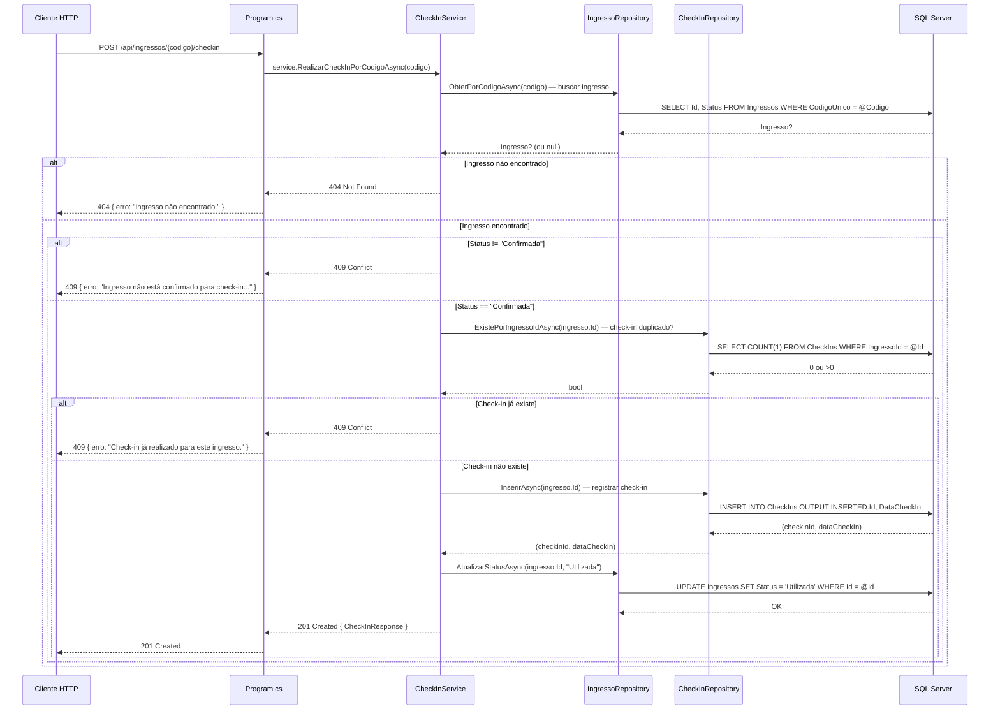
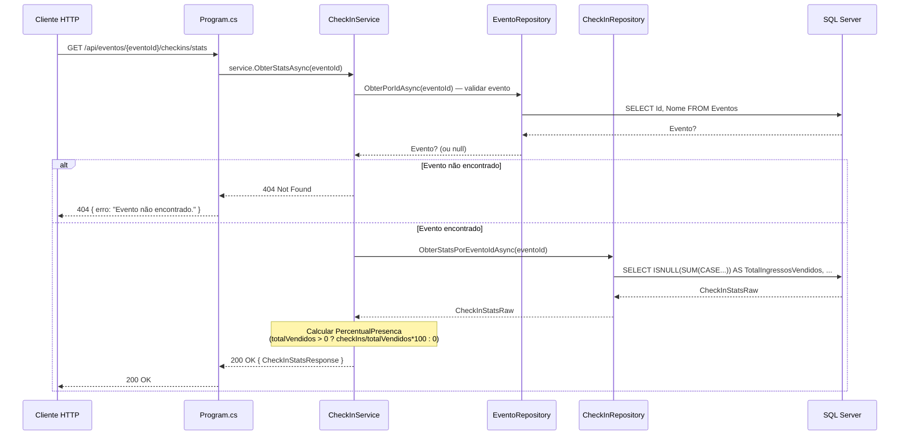

# Planejamento — Etapa 9: Migrar Domínio CheckIn

**Projeto:** TicketPrime — Fase 2: Separação de Camadas e Redução do Acoplamento
**Data:** 2026-06-04
**Risco:** Médio
**Correção:** C6 (convenção `IDbTransaction? transaction = null` — já estabelecida na Etapa 2)
**Base:** Etapa 8 concluída (Build OK, 103/103 testes aprovados)

---

## 1. Objetivo da Etapa 9

Extrair do [`Program.cs`](src/TicketPrime.Api/Program.cs:693) os **4 endpoints** do domínio CheckIn, migrando todo o SQL inline, validação e regras para:

- **Criação** de [`ICheckInRepository`](src/TicketPrime.Api/Repositories/) e [`CheckInRepository`](src/TicketPrime.Api/Repositories/) — novo repositório para operações CRUD e consultas na tabela `CheckIns`.
- **Criação** de [`CheckInService`](src/TicketPrime.Api/Services/CheckInService.cs) — orquestra validação, regras de negócio e chamadas aos repositórios.
- **Adição** de 1 método no [`IIngressoRepository`](src/TicketPrime.Api/Repositories/IIngressoRepository.cs) — `AtualizarStatusAsync` para atualizar o status do ingresso para `"Utilizada"` durante o check-in.
- **Reuso** do [`IEventoRepository`](src/TicketPrime.Api/Repositories/IEventoRepository.cs) existente (Etapa 5) — validação de existência do evento nas consultas de listagem e stats.
- **Reuso** do [`IIngressoRepository`](src/TicketPrime.Api/Repositories/IIngressoRepository.cs) existente (Etapas 7+8) — consulta de ingresso por código único.

### Resumo do escopo

| Endpoint | Linhas (antes) | Linhas (depois) | Redução |
|----------|:--------------:|:----------------:|:-------:|
| `POST /api/ingressos/{codigo}/checkin` ([`Program.cs`](src/TicketPrime.Api/Program.cs:694)) | **~48** | **~4** | **-44** |
| `GET /api/eventos/{eventoId}/checkins` ([`Program.cs`](src/TicketPrime.Api/Program.cs:744)) | **~32** | **~4** | **-28** |
| `GET /api/eventos/{eventoId}/checkins/stats` ([`Program.cs`](src/TicketPrime.Api/Program.cs:778)) | **~40** | **~4** | **-36** |
| `POST /api/checkin` ([`Program.cs`](src/TicketPrime.Api/Program.cs:823)) | **~50** | **~4** | **-46** |
| **Total** | **~170** | **~16** | **-154** |

---

## 2. Arquivos que serão alterados

| Arquivo | Tipo de Alteração | Descrição |
|---------|:-----------------:|-----------|
| [`src/TicketPrime.Api/Repositories/IIngressoRepository.cs`](src/TicketPrime.Api/Repositories/IIngressoRepository.cs) | **Modificação** | Adicionar 1 novo método: `AtualizarStatusAsync(int id, string status, IDbTransaction? transaction = null)` — permite ao fluxo de check-in atualizar o status do ingresso para `"Utilizada"` |
| [`src/TicketPrime.Api/Repositories/IngressoRepository.cs`](src/TicketPrime.Api/Repositories/IngressoRepository.cs) | **Modificação** | Implementar o método `AtualizarStatusAsync` com SQL `UPDATE Ingressos SET Status = @Status WHERE Id = @Id`. Nenhum método existente é alterado. |
| [`src/TicketPrime.Api/Program.cs`](src/TicketPrime.Api/Program.cs:693) | **Modificação** | Substituir 4 endpoints inline por delegação ao service; adicionar registro DI do `ICheckInRepository`/`CheckInRepository` e `CheckInService` |

**Importante:** Diferente da Etapa 8, **não há necessidade de criar `ObterReservaBasicaPorIdAsync` temporário** porque o `IReservaRepository` já foi criado na Etapa 8. O [`IReservaRepository`](src/TicketPrime.Api/Repositories/IReservaRepository.cs) com `ObterPorIdAsync` está disponível e registrado no DI.

---

## 3. Arquivos que serão criados

| Arquivo | Descrição |
|---------|-----------|
| [`src/TicketPrime.Api/Repositories/ICheckInRepository.cs`](src/TicketPrime.Api/Repositories/ICheckInRepository.cs) | Interface do repositório de CheckIn |
| [`src/TicketPrime.Api/Repositories/CheckInRepository.cs`](src/TicketPrime.Api/Repositories/CheckInRepository.cs) | Implementação do repositório de CheckIn |
| [`src/TicketPrime.Api/Services/CheckInService.cs`](src/TicketPrime.Api/Services/CheckInService.cs) | Service que orquestra validação, regras de negócio (RF02) e chamadas aos repositórios |

### 3.1. Estrutura do [`ICheckInRepository`](src/TicketPrime.Api/Repositories/ICheckInRepository.cs)

```csharp
namespace TicketPrime.Api.Repositories;

public interface ICheckInRepository
{
    /// <summary>
    /// Insere um novo check-in e retorna o Id gerado + DataCheckIn.
    /// Usado por POST /api/ingressos/{codigo}/checkin e POST /api/checkin.
    /// </summary>
    Task<(int Id, DateTime DataCheckIn)> InserirAsync(int ingressoId,
        IDbTransaction? transaction = null);                           // C6

    /// <summary>
    /// Verifica se já existe check-in para um ingresso.
    /// Usado para bloquear check-in duplicado.
    /// </summary>
    Task<bool> ExistePorIngressoIdAsync(int ingressoId,
        IDbTransaction? transaction = null);                           // C6

    /// <summary>
    /// Lista todos os check-ins de um evento, com dados do ingresso,
    /// usuário e tipo-ingresso (JOINs múltiplos).
    /// Usado por GET /api/eventos/{eventoId}/checkins.
    /// </summary>
    Task<IEnumerable<CheckInItemResponse>> ListarPorEventoIdAsync(int eventoId,
        IDbTransaction? transaction = null);                           // C6

    /// <summary>
    /// Retorna estatísticas de check-in de um evento:
    /// total vendidos, total check-ins, pendentes, percentual.
    /// Usado por GET /api/eventos/{eventoId}/checkins/stats.
    /// </summary>
    Task<CheckInStatsRaw> ObterStatsPorEventoIdAsync(int eventoId,
        IDbTransaction? transaction = null);                           // C6
}
```

### 3.2. Estrutura do [`CheckInService`](src/TicketPrime.Api/Services/CheckInService.cs)

```csharp
namespace TicketPrime.Api.Services;

public class CheckInService
{
    private readonly ICheckInRepository _checkInRepository;
    private readonly IIngressoRepository _ingressoRepository;
    private readonly IEventoRepository _eventoRepository;

    public CheckInService(
        ICheckInRepository checkInRepository,
        IIngressoRepository ingressoRepository,
        IEventoRepository eventoRepository)
    {
        _checkInRepository = checkInRepository;
        _ingressoRepository = ingressoRepository;
        _eventoRepository = eventoRepository;
    }

    // Métodos públicos:
    // 1. RealizarCheckInPorCodigoAsync(string codigo)
    //    → POST /api/ingressos/{codigo}/checkin
    //
    // 2. RealizarCheckInPorRequestAsync(CheckInRequest request)
    //    → POST /api/checkin
    //
    // 3. ListarCheckInsAsync(int eventoId)
    //    → GET /api/eventos/{eventoId}/checkins
    //
    // 4. ObterStatsAsync(int eventoId)
    //    → GET /api/eventos/{eventoId}/checkins/stats
}
```

### 3.3. Decisões arquiteturais

| Decisão | Justificativa |
|---------|---------------|
| **CheckInService injeta `IIngressoRepository`** | Necessário para (a) consultar ingresso por código único via `ObterPorCodigoAsync`, (b) atualizar status do ingresso para `"Utilizada"` via novo método `AtualizarStatusAsync` |
| **CheckInService injeta `IEventoRepository`** | Necessário para validar existência do evento nos endpoints de listagem e stats |
| **Stats retorna via `CheckInStatsRaw` (DTO intermediário)** | O Dapper retorna campos calculados (SUM, COUNT) que não se encaixam perfeitamente em `CheckInStatsResponse`. `CheckInStatsRaw` é uma classe auxiliar (`internal`) para o mapeamento Dapper, definida como classe interna em [`CheckInRepository.cs`](src/TicketPrime.Api/Repositories/CheckInRepository.cs). |
| **Service sem `IDbConnection`** | Service não gerencia conexão — apenas orquestra repositórios |
| **Sem transação (dívida técnica)** | A transação `INSERT CheckIn + UPDATE Ingresso` **não será adicionada agora** para preservar comportamento original. Registrada como dívida técnica no [`docs/divida-tecnica.md`](docs/divida-tecnica.md) para implementação futura quando houver necessidade de atomicidade entre as duas operações. |
| **`IIngressoRepository` ganha `AtualizarStatusAsync`** | O fluxo de check-in precisa atualizar o status do ingresso para `"Utilizada"`. Este método também será útil na Etapa 11b (confirmação de carrinho poderia gerar ingressos com status já definido) e em fluxos futuros de cancelamento. |

### 3.4. Método adicional: `AtualizarStatusAsync` no `IIngressoRepository`

```diff
// IIngressoRepository.cs (ESTADO ATUAL — Etapa 8)
public interface IIngressoRepository
{
     // ... métodos existentes (ContarPorTipoAsync, ObterPorReservaIdAsync,
     //      ObterPorCodigoAsync, InserirAsync, ObterDetalhadoPorReservaIdAsync,
     //      ObterDetalhadoPorCodigoAsync, GerarCodigoUnicoAsync)

+    /// <summary>
+    /// Atualiza o status de um ingresso.
+    /// Usado pelo fluxo de check-in para alterar de "Confirmada" para "Utilizada".
+    /// </summary>
+    Task AtualizarStatusAsync(int id, string status,
+        IDbTransaction? transaction = null);                          // C6
}
```

### 3.5. Recomendações incorporadas ao plano

#### 3.5.1. Contrato do método privado compartilhado entre os dois POSTs

Os endpoints `POST /api/ingressos/{codigo}/checkin` e `POST /api/checkin` compartilham a mesma lógica de check-in (validar ingresso → verificar status → bloquear duplicidade → inserir → atualizar status). A diferença está apenas na origem do código do ingresso (route parameter vs. body) e nas mensagens de erro/status codes.

**Contrato do método privado:**

```csharp
/// <summary>
/// Executa o fluxo de check-in a partir do ID do ingresso.
/// Compartilhado por RealizarCheckInPorCodigoAsync e RealizarCheckInPorRequestAsync.
/// </summary>
private async Task<CheckInResult> ExecutarCheckInAsync(int ingressoId)
```

O retorno `CheckInResult` será um **enum/resultado estruturado** que permite a cada endpoint público preservar suas mensagens e status codes específicos:

```csharp
internal enum CheckInResultType
{
    Sucesso,
    IngressoNaoEncontrado,      // 404 (ambos os endpoints)
    StatusInvalido,             // 409 (codigo) / 400 (request)
    CheckInDuplicado            // 409 (codigo) / 400 (request)
}

internal record CheckInResult(
    CheckInResultType Type,
    CheckIn? CheckIn = null,
    string? Erro = null);
```

**Mapeamento para status codes e mensagens:**

| ResultType | POST /api/ingressos/{codigo}/checkin | POST /api/checkin |
|------------|--------------------------------------|--------------------|
| `Sucesso` | 201 Created | 201 Created |
| `IngressoNaoEncontrado` | 404 — "Ingresso não encontrado." | 404 — "Ingresso não encontrado." |
| `StatusInvalido` | 409 — "Ingresso não está confirmado para check-in. Status atual: {S}" | 400 — "Ingresso já utilizado. Status atual: {S}" |
| `CheckInDuplicado` | 409 — "Check-in já realizado para este ingresso." | 400 — "Check-in já realizado para este ingresso." |

**Validação do código de entrada:**

As validações `string.IsNullOrWhiteSpace(codigo)` e `codigo.Length != 8` **não** pertencem ao método privado compartilhado. Elas permanecem nos métodos públicos (`RealizarCheckInPorCodigoAsync` e `RealizarCheckInPorRequestAsync`), exatamente como no código atual. O método privado `ExecutarCheckInAsync(int ingressoId)` recebe apenas um `ingressoId` já validado — a responsabilidade de validar o código antes de obter o ID do ingresso é dos métodos públicos.

#### 3.5.2. Definição de `CheckInStatsRaw`

Classe auxiliar para mapeamento Dapper das consultas de stats. Será definida como **classe interna** (`private` ou `internal`) no arquivo [`CheckInRepository.cs`](src/TicketPrime.Api/Repositories/CheckInRepository.cs).

```csharp
// Definição interna no CheckInRepository.cs
internal class CheckInStatsRaw
{
    public int TotalIngressosVendidos { get; set; }
    public int TotalCheckIns { get; set; }
    public int Pendentes { get; set; }
}
```

**Campos:**
- `TotalIngressosVendidos` — total de ingressos vendidos para o evento (SUM/CASE da query)
- `TotalCheckIns` — total de check-ins realizados (COUNT ou SUM)
- `Pendentes` — ingressos vendidos ainda não check-inados (derivado: TotalIngressosVendidos - TotalCheckIns)

O cálculo de `PercentualPresenca` permanece no service (regra de negócio), não no repositório.

#### 3.5.3. Decisão sobre transação

| Decisão | Detalhamento |
|---------|-------------|
| **❌ Não implementar transação agora** | A transação `INSERT CheckIn + UPDATE Ingresso` **não será adicionada nesta etapa**. Motivo: preservar comportamento original do código inline, que executa as duas operações sequencialmente sem transação explícita. |
| **📝 Registrar como dívida técnica** | Adicionar entrada em [`docs/divida-tecnica.md`](docs/divida-tecnica.md) documentando a necessidade futura de atomicidade entre `CheckInRepository.InserirAsync` e `IngressoRepository.AtualizarStatusAsync`. |
| **🔮 Quando implementar** | Quando houver requisito de concorrência ou consistência transacional entre os dois INSERTs. Neste momento, o risco de uma operação falhar após a outra é baixo e aceitável. |
| **⚠️ Parâmetro `transaction` já preparado** | Ambos os métodos (`InserirAsync` e `AtualizarStatusAsync`) já aceitam `IDbTransaction? transaction = null` (C6), facilitando a adoção futura sem quebrar a assinatura. |

#### 3.5.4. Reuso na Etapa 12 (Dashboard)

O método [`ICheckInRepository.ListarPorEventoIdAsync`](src/TicketPrime.Api/Repositories/ICheckInRepository.cs) poderá ser **reutilizado na Etapa 12** para alimentar as consultas de dashboard administrativo que envolvem dados de check-in por evento.

**Impacto:** A Etapa 12 deve:
1. Injetar `ICheckInRepository` no `DashboardRepository` (ou `DashboardService`)
2. Reutilizar `ListarPorEventoIdAsync` para obter check-ins de um evento
3. Reutilizar `ObterStatsPorEventoIdAsync` para obter estatísticas agregadas

Isso evita duplicação de SQL de JOINs entre `CheckIns`, `Ingressos`, `Reservas` e `Usuarios`.

---

## 4. Dependências da etapa

### 4.1. Pré-requisitos (já atendidos)

- [x] **Etapa 1 concluída:** Models de CheckIn (`CheckIn.cs`, `CheckInRequest.cs`, `CheckInResponse.cs`, `CheckInListResponse.cs`, `CheckInItemResponse.cs`, `CheckInStatsResponse.cs`) já extraídos em [`Models/`](src/TicketPrime.Api/Models/)
- [x] **Etapa 2 concluída:** Padrão Repository + convenção C6 estabelecidos
- [x] **Etapa 5 concluída:** [`IEventoRepository`](src/TicketPrime.Api/Repositories/IEventoRepository.cs) (com `ObterPorIdAsync`) criado e registrado no DI
- [x] **Etapa 7+8 concluídas:** [`IIngressoRepository`](src/TicketPrime.Api/Repositories/IIngressoRepository.cs) e [`IngressoRepository`](src/TicketPrime.Api/Repositories/IngressoRepository.cs) completos (Etapa 8 expandiu com 7 métodos), já registrados no DI
- [x] **Etapa 8 concluída:** [`IReservaRepository`](src/TicketPrime.Api/Repositories/IReservaRepository.cs) (com `ObterPorIdAsync`) criado e registrado no DI — disponível como dependência
- [x] **Build OK:** `dotnet build` compila sem erros
- [x] **Testes OK:** `dotnet test` passa 103/103
- [x] **Checkpoint Git:** estado conhecido antes da Etapa 9

### 4.2. Dependências de runtime

| Dependência | Tipo | Origem |
|-------------|:----:|--------|
| `ICheckInRepository` / `CheckInRepository` | Repository | **Novo** (criado nesta etapa) |
| `IIngressoRepository` / `IngressoRepository` | Repository | Etapas 7+8 (expandido agora com `AtualizarStatusAsync`) |
| `IEventoRepository` / `EventoRepository` | Repository | Etapa 5 |
| `CheckInService` | Service | **Novo** (criado nesta etapa) |

### 4.3. O que NÃO é dependência

| Item | Motivo |
|------|--------|
| `IReservaRepository` | Embora exista (Etapa 8), não é necessário para o CheckIn. As consultas de check-in fazem JOIN com a tabela `Reservas` via SQL dentro do `CheckInRepository`, não via chamada ao `IReservaRepository`. |
| `ICupomRepository` | Nenhuma regra de check-in envolve cupons. |
| `IUsuarioRepository` | A consulta de check-ins faz JOIN com `Usuarios` via SQL, não via chamada ao repository. |
| `ITipoIngressoRepository` | A consulta de check-ins faz LEFT JOIN com `TiposIngresso` via SQL, não via chamada ao repository. |
| `HistoricoPrecoRepository` | Nenhum endpoint de check-in registra no histórico de preços. |
| `ReservaService` | O service atual é puro (sem DB) e suas regras (`ValidarReserva`, `CalcularValorFinal`) não são relevantes para check-in. |

### 4.4. Nenhuma dependência externa

- Nenhum pacote NuGet novo (Dapper e Microsoft.Data.SqlClient já estão no csproj)
- Nenhuma dependência de banco de dados
- Nenhuma dependência de infraestrutura externa

---

## 5. Riscos

| # | Risco | Probabilidade | Impacto | Mitigação |
|:-:|-------|:-------------:|:-------:|-----------|
| R9.1 | **`POST /api/ingressos/{codigo}/checkin` e `POST /api/checkin` têm lógica DUPLICADA** no código inline original (~48 linhas vs ~50 linhas, quase idênticas). O service precisa unificar sem alterar comportamento. | **Alta** | **Médio** | Ambos os endpoints fazem a mesma coisa: validar ingresso → verificar status → bloquear duplicidade → inserir check-in → atualizar status → montar response. A diferença é que um recebe `codigo` como route parameter e o outro recebe `CheckInRequest.CodigoIngresso` no body. O `CheckInService` pode ter um método privado compartilhado que aceita o código como string, e os dois métodos públicos delegam a ele. |
| R9.2 | **SQL de stats com `ISNULL` e `SUM(CASE...)` complexo** — o `CheckInStatsRaw` precisa mapear corretamente os campos calculados | Média | Alto | Inspecionar visualmente o mapeamento Dapper. Usar tipo anônimo (`dynamic`) como fallback e converter manualmente para `CheckInStatsResponse`. |
| R9.3 | **`CheckInListResponse` montado incorretamente** — o endpoint atual consulta evento primeiro (404 se não existir), depois consulta check-ins. A ordem deve ser preservada. | Baixa | Médio | O service deve primeiro validar o evento via `IEventoRepository.ObterPorIdAsync`, retornar 404 se não existir, e só então consultar os check-ins. |
| R9.4 | **Convenção C6 não respeitada** nos novos métodos do `CheckInRepository` | Média | Alto (futuro) | Revisão de código obrigatória; verificar C6 em todos os métodos (`IDbTransaction? transaction = null` como último parâmetro). Crítico para Etapa 11b se check-in precisar participar de transação. |
| R9.5 | **Quebra do contrato da API** — response HTTP diferente do original em algum dos 4 endpoints | Muito Baixa | Alto | Comparar a construção do response no service vs. o código inline original. Os campos e mensagens de erro devem ser idênticos. |
| R9.6 | **Testes `IncrementoServiceTests` quebrados** — 10 testes referentes a RF02 | Muito Baixa | Alto | Os 10 testes de RF02 testam métodos puros do [`IncrementoService`](src/TicketPrime.Api/Services/IncrementoService.cs) (`RealizarCheckIn`, `PodeRealizarCheckIn`) que exigem listas completas em memória. O `CheckInService` **não utiliza** o `IncrementoService` — consulta o banco passo a passo. O `IncrementoService` **não é alterado**. |
| R9.7 | **AtualizarStatusAsync precisa existir antes do CheckInService ser implementado** — dependência de IIngressoRepository | Baixa | Alto | Incluir `AtualizarStatusAsync` no `IIngressoRepository`/`IngressoRepository` como PRIMEIRO passo da implementação, antes de criar o `CheckInService`. |
| R9.8 | **Dashboard (Etapa 12) também consulta check-ins** — os endpoints admin de dashboard fazem JOIN com `CheckIns` via SQL inline. Isso não é afetado agora, mas a Etapa 12 precisará de `ICheckInRepository`. | Média | Baixo | A Etapa 12 reutilizará `ICheckInRepository` para as consultas de dashboard. Incluir na checklist da Etapa 12 o uso deste repositório. |
| R9.9 | **Percentual de presença com divisão por zero** — `totalVendidos > 0 ? Math.Round((decimal)totalCheckIns / totalVendidos * 100, 2) : 0` — deve ser preservado exatamente como no original | Baixa | Médio | O cálculo deve ser replicado no service, não no repositório. |
| R9.10 | **O POST /api/checkin atual usa `[FromBody] CheckInRequest`** — o endpoint original usa `[FromBody]`. O novo endpoint delegado deve preservar o binding. | Muito Baixa | Baixo | O `CheckInRequest` já existe como model. O endpoint inline será substituído por `async (CheckInService service, [FromBody] CheckInRequest request) => ...` |

---

## 6. Critérios de aceite

### 6.1. Obrigatórios

- [ ] **CA9.1:** [`ICheckInRepository`](src/TicketPrime.Api/Repositories/ICheckInRepository.cs) e [`CheckInRepository`](src/TicketPrime.Api/Repositories/CheckInRepository.cs) criados com **4 métodos**: `InserirAsync`, `ExistePorIngressoIdAsync`, `ListarPorEventoIdAsync`, `ObterStatsPorEventoIdAsync` — todos com `IDbTransaction? transaction = null` (C6)
- [ ] **CA9.2:** [`IIngressoRepository`](src/TicketPrime.Api/Repositories/IIngressoRepository.cs) expandido com **1 novo método**: `AtualizarStatusAsync(int id, string status, IDbTransaction? transaction = null)` — C6
- [ ] **CA9.3:** [`IngressoRepository`](src/TicketPrime.Api/Repositories/IngressoRepository.cs) implementa `AtualizarStatusAsync`. Nenhum método existente é alterado.
- [ ] **CA9.4:** [`CheckInService`](src/TicketPrime.Api/Services/CheckInService.cs) criado com **4 métodos públicos** — um para cada endpoint. Nenhum método a mais, nenhum a menos.
- [ ] **CA9.5:** O service **não contém SQL inline** — todo SQL está nos repositórios.
- [ ] **CA9.6:** O service injeta **apenas** `ICheckInRepository`, `IIngressoRepository` e `IEventoRepository`. Sem `IDbConnection`.
- [ ] **CA9.7:** Cada um dos 4 endpoints em [`Program.cs`](src/TicketPrime.Api/Program.cs) tem no máximo ~4 linhas, delegando ao service.
- [ ] **CA9.8:** Nenhum SQL permanece inline em [`Program.cs`](src/TicketPrime.Api/Program.cs) para os 4 endpoints de CheckIn.
- [ ] **CA9.9:** `CheckInService`, `ICheckInRepository` e `CheckInRepository` registrados no DI em [`Program.cs`](src/TicketPrime.Api/Program.cs).
- [ ] **CA9.10:** Contratos da API preservados para todos os 4 endpoints — rotas, métodos HTTP, request bodies, response bodies e status codes conforme a tabela de mapeamento em [`§3.5.1`](#351-contrato-do-método-privado-compartilhado-entre-os-dois-posts).
- [ ] **CA9.11:** `dotnet build` compila com zero erros.
- [ ] **CA9.12:** `dotnet test` passa 103/103 **sem modificações** nos testes.
- [ ] **CA9.13:** Nenhum arquivo de teste foi alterado.
- [ ] **CA9.14:** Nenhum outro endpoint existente foi alterado.
- [ ] **CA9.15:** Nenhum arquivo de [`Models/`](src/TicketPrime.Api/Models/) foi alterado.
- [ ] **CA9.16:** [`IncrementoService`](src/TicketPrime.Api/Services/IncrementoService.cs) **não foi alterado** — zero linhas modificadas.
- [ ] **CA9.17:** Os 3 endpoints de Ingresso migrados na Etapa 8 **não foram alterados**.

### 6.2. Verificações de qualidade

- [ ] **CA9.18:** Convenção C6 verificada em todos os métodos de `ICheckInRepository` e em `AtualizarStatusAsync`.
- [ ] **CA9.19:** Nomes de métodos seguem padrão do projeto (PascalCase, Async suffix).
- [ ] **CA9.20:** Nenhum warning novo de compilação (exceto possíveis nullability warnings pré-existentes).
- [ ] **CA9.21:** A lógica duplicada entre `POST /api/ingressos/{codigo}/checkin` e `POST /api/checkin` é unificada em um método privado no service. As validações `string.IsNullOrWhiteSpace(codigo)` e `codigo.Length != 8` permanecem nos métodos públicos — o método privado recebe apenas um `ingressoId` já validado.
- [ ] **CA9.22:** O cálculo de `PercentualPresenca` (divisão por zero) é preservado exatamente como no original.
- [ ] **CA9.23:** As mensagens de erro (status codes e textos) são idênticas ao original em todos os 4 endpoints, conforme a tabela de mapeamento em [`§3.5.1`](#351-contrato-do-método-privado-compartilhado-entre-os-dois-posts).

---

## 7. Estratégia de rollback

### 7.1. Procedimento

```bash
# Opção 1 — Reverter commit (recomendado)
git revert HEAD --no-edit

# Opção 2 — Checkout manual (se houver checkpoint)
git checkout HEAD~1
```

### 7.2. Passos manuais (caso rollback automático não seja possível)

| Passo | Ação | Tempo |
|:-----:|------|:-----:|
| 1 | Remover [`src/TicketPrime.Api/Services/CheckInService.cs`](src/TicketPrime.Api/Services/CheckInService.cs) | ~1 min |
| 2 | Remover [`src/TicketPrime.Api/Repositories/ICheckInRepository.cs`](src/TicketPrime.Api/Repositories/ICheckInRepository.cs) | ~1 min |
| 3 | Remover [`src/TicketPrime.Api/Repositories/CheckInRepository.cs`](src/TicketPrime.Api/Repositories/CheckInRepository.cs) | ~1 min |
| 4 | Reverter [`IIngressoRepository.cs`](src/TicketPrime.Api/Repositories/IIngressoRepository.cs) ao estado da Etapa 8 (remover `AtualizarStatusAsync`) | ~2 min |
| 5 | Reverter [`IngressoRepository.cs`](src/TicketPrime.Api/Repositories/IngressoRepository.cs) ao estado da Etapa 8 (remover implementação de `AtualizarStatusAsync`) | ~2 min |
| 6 | Restaurar os 4 endpoints inline em [`Program.cs`](src/TicketPrime.Api/Program.cs:693-872) ao original (~170 linhas) | ~5 min |
| 7 | Remover registros DI de `ICheckInRepository`, `CheckInRepository` e `CheckInService` do [`Program.cs`](src/TicketPrime.Api/Program.cs) | ~1 min |
| 8 | Executar `dotnet build` e `dotnet test` | ~2 min |
| | **Total** | **~15 min** |

### 7.3. Verificação pós-rollback

```bash
dotnet build    # zero erros
dotnet test     # 103/103
```

---

## 8. Impacto esperado no Program.cs

### 8.1. Linhas alteradas

| Região | Antes | Depois | Diferença |
|--------|:-----:|:------:|:---------:|
| Endpoint `POST /api/ingressos/{codigo}/checkin` (linhas 694-741) | **~48 linhas** | **~4 linhas** | **-44** |
| Endpoint `GET /api/eventos/{eventoId}/checkins` (linhas 744-775) | **~32 linhas** | **~4 linhas** | **-28** |
| Endpoint `GET /api/eventos/{eventoId}/checkins/stats` (linhas 778-817) | **~40 linhas** | **~4 linhas** | **-36** |
| Endpoint `POST /api/checkin` (linhas 823-872) | **~50 linhas** | **~4 linhas** | **-46** |
| Registro DI (após linha 32) | — | + `ICheckInRepository`, `CheckInRepository`, `CheckInService` | **+3 linhas** |
| **Saldo líquido** | | | **-151 linhas** |

### 8.2. Estado esperado após a Etapa 9

- [`Program.cs`](src/TicketPrime.Api/Program.cs) reduz de aproximadamente **1692** para **~1541** linhas
- Nenhuma configuração de middleware, CORS, auth ou JSON é alterada
- Nenhum SQL permanece nos 4 endpoints de CheckIn
- Bloco de DI adiciona `ICheckInRepository`/`CheckInRepository` e `CheckInService`

### 8.3. Estado do Program.cs pós Etapa 9 (linhas por domínio)

| Domínio | Linhas | Status |
|---------|:------:|:------:|
| Configuração (DI, CORS, Auth, JSON) | ~60 | ✅ Mantido |
| Init banco (DDL + Views) | ~336 | 🔒 Pendente (pós Fase 2) |
| Usuários | ~4 | ✅ Migrado (Etapa 3) |
| Cupons | ~4 | ✅ Migrado (Etapa 4) |
| Eventos | ~8 | ✅ Migrado (Etapa 5) |
| Histórico Preços | ~4 | ✅ Migrado (Etapa 6) |
| Lotes/TiposIngresso | ~14 | ✅ Migrado (Etapa 7) |
| Ingressos | ~12 | ✅ Migrado (Etapa 8) |
| **CheckIn** | **~16** | **⬅️ Esta etapa (Etapa 9)** |
| Reservas | ~250 | 🔄 Pendente (Etapas 10a/10b) |
| Carrinho | ~280 | 🔄 Pendente (Etapas 11a/11b) |
| Dashboard | ~200 | 🔄 Pendente (Etapa 12) |
| Admin endpoints | ~300 | 🔄 Pendente (Etapa 12) |
| **Total** | **~1541** | |

### 8.4. Fluxo arquitetural — `POST /api/ingressos/{codigo}/checkin`



### 8.5. Fluxo arquitetural — `GET /api/eventos/{eventoId}/checkins/stats`



---

## 9. O que NÃO será alterado

### 🚫 Blindado (não tocar)

| Item | Motivo |
|------|--------|
| **Contratos da API** (rotas, request/response bodies) | CA3 — contrato deve permanecer idêntico |
| **Banco de Dados** (tabelas, colunas, constraints, índices, VIEWs) | CA5 — SQL permanece idêntico ao atual |
| **Regras de Negócio** (validações, cálculos, condições) | CA4 — são movidas, não alteradas |
| **Autenticação e Autorização** | CA6 — nenhuma alteração |
| **CORS** | CA7 — nenhuma alteração |
| **Testes existentes** (103/103) | CA2 — nenhuma linha de teste é alterada |
| **Models** ([`CheckIn.cs`](src/TicketPrime.Api/Models/CheckIn.cs), [`CheckInResponse.cs`](src/TicketPrime.Api/Models/CheckInResponse.cs), [`CheckInListResponse.cs`](src/TicketPrime.Api/Models/CheckInListResponse.cs), [`CheckInStatsResponse.cs`](src/TicketPrime.Api/Models/CheckInStatsResponse.cs), [`CheckInItemResponse`](src/TicketPrime.Api/Models/CheckInListResponse.cs:12)) | Já extraídos na Etapa 1, permanecem inalterados |
| **[`IncrementoService`](src/TicketPrime.Api/Services/IncrementoService.cs)** | Nenhuma alteração — não é dependência do CheckInService |
| **Repositórios de outros domínios** ([`IUsuarioRepository`](src/TicketPrime.Api/Repositories/IUsuarioRepository.cs), [`UsuarioRepository`](src/TicketPrime.Api/Repositories/UsuarioRepository.cs), [`ICupomRepository`](src/TicketPrime.Api/Repositories/ICupomRepository.cs), [`CupomRepository`](src/TicketPrime.Api/Repositories/CupomRepository.cs), [`IHistoricoPrecoRepository`](src/TicketPrime.Api/Repositories/IHistoricoPrecoRepository.cs), [`HistoricoPrecoRepository`](src/TicketPrime.Api/Repositories/HistoricoPrecoRepository.cs), [`ITipoIngressoRepository`](src/TicketPrime.Api/Repositories/ITipoIngressoRepository.cs), [`TipoIngressoRepository`](src/TicketPrime.Api/Repositories/TipoIngressoRepository.cs), [`IReservaRepository`](src/TicketPrime.Api/Repositories/IReservaRepository.cs), [`ReservaRepository`](src/TicketPrime.Api/Repositories/ReservaRepository.cs)) | Criados nas Etapas 2-8, permanecem inalterados |
| **Services existentes** ([`UsuarioService`](src/TicketPrime.Api/Services/UsuarioService.cs), [`CupomService`](src/TicketPrime.Api/Services/CupomService.cs), [`EventoService`](src/TicketPrime.Api/Services/EventoService.cs), [`ReservaService`](src/TicketPrime.Api/Services/ReservaService.cs), [`HistoricoPrecoService`](src/TicketPrime.Api/Services/HistoricoPrecoService.cs), [`TipoIngressoService`](src/TicketPrime.Api/Services/TipoIngressoService.cs), [`IngressoService`](src/TicketPrime.Api/Services/IngressoService.cs), [`IncrementoService`](src/TicketPrime.Api/Services/IncrementoService.cs)) | **Nenhum é alterado** (apenas chamado) |
| **Middleware** ([`ExceptionHandlingMiddleware`](src/TicketPrime.Api/Middleware/ExceptionHandlingMiddleware.cs)) | Sem alterações |
| **Authentication** ([`ApiKeyAuthenticationHandler`](src/TicketPrime.Api/Authentication/ApiKeyAuthenticationHandler.cs)) | Sem alterações |
| **Demais endpoints** (Usuários, Cupons, Eventos, Reservas, Ingressos, Lotes, Carrinho, Dashboard, Histórico) | Nenhum outro endpoint é alterado |

### ✅ O que é alterado (apenas)

1. **Criação** de [`src/TicketPrime.Api/Repositories/ICheckInRepository.cs`](src/TicketPrime.Api/Repositories/ICheckInRepository.cs) com **4 métodos**
2. **Criação** de [`src/TicketPrime.Api/Repositories/CheckInRepository.cs`](src/TicketPrime.Api/Repositories/CheckInRepository.cs) com implementação dos **4 métodos**
3. **Adição** de **1 método** (`AtualizarStatusAsync`) em [`src/TicketPrime.Api/Repositories/IIngressoRepository.cs`](src/TicketPrime.Api/Repositories/IIngressoRepository.cs)
4. **Adição** de implementação de `AtualizarStatusAsync` em [`src/TicketPrime.Api/Repositories/IngressoRepository.cs`](src/TicketPrime.Api/Repositories/IngressoRepository.cs)
5. **Criação** de [`src/TicketPrime.Api/Services/CheckInService.cs`](src/TicketPrime.Api/Services/CheckInService.cs) com **4 métodos públicos**
6. **Modificação** de **4 endpoints** em [`Program.cs`](src/TicketPrime.Api/Program.cs:693-872) (~170 → ~16 linhas)
7. **Adição** de **3 linhas** de DI em [`Program.cs`](src/TicketPrime.Api/Program.cs): `ICheckInRepository`, `CheckInRepository`, `CheckInService`

---

## 10. Impacto esperado nos testes

### 10.1. Testes existentes (103/103)

Nenhum teste existente será alterado, removido ou modificado.

| Arquivo de teste | Testes | Impacto |
|-----------------|:------:|:-------:|
| [`IncrementoServiceTests.cs`](tests/TicketPrime.Tests/IncrementoServiceTests.cs) | 64 (10 deles de RF02 — CheckIn) | **Nenhum** — testam o [`IncrementoService`](src/TicketPrime.Api/Services/IncrementoService.cs), que **não é dependência do CheckInService** e **não é alterado** |
| [`ReservaServiceTests.cs`](tests/TicketPrime.Tests/ReservaServiceTests.cs) | 26 | Nenhum |
| [`UsuarioValidationTests.cs`](tests/TicketPrime.Tests/UsuarioValidationTests.cs) | 5 | Nenhum |
| [`CupomValidationTests.cs`](tests/TicketPrime.Tests/CupomValidationTests.cs) | 5 | Nenhum |
| [`EventoValidationTests.cs`](tests/TicketPrime.Tests/EventoValidationTests.cs) | 3 | Nenhum |
| **Total** | **103** | **Zero regressões** |

### 10.2. Por que não há risco de regressão

1. **Os 10 testes de RF02** testam métodos puros do [`IncrementoService`](src/TicketPrime.Api/Services/IncrementoService.cs) (`RealizarCheckIn`, `PodeRealizarCheckIn`). Estes métodos exigem listas completas em memória (`List<Ingresso>`, `List<CheckIn>`) e **não são utilizados** pelo novo `CheckInService`, que consulta o banco passo a passo. O `IncrementoService` **não é alterado** nem referenciado.
2. **Nenhum teste** referencia diretamente os endpoints de [`Program.cs`](src/TicketPrime.Api/Program.cs) — todos os 103 testes são unitários, testando services e regras puras.
3. **Nenhum arquivo de teste** é modificado nesta etapa.

### 10.3. Testes manuais recomendados (após implementação)

Embora não sejam critério de aceite obrigatório, recomenda-se testar manualmente os 4 endpoints via curl ou Postman:

- `POST /api/ingressos/{codigo}/checkin` — check-in bem-sucedido; código inválido (400); ingresso não encontrado (404); status não confirmado (409); check-in duplicado (409)
- `POST /api/checkin` — check-in bem-sucedido com request body; código vazio (400); ingresso não encontrado (404); ingresso já utilizado (400); check-in duplicado (400)
- `GET /api/eventos/{eventoId}/checkins` — listar check-ins de evento existente; evento inexistente (404); evento sem check-ins (lista vazia)
- `GET /api/eventos/{eventoId}/checkins/stats` — stats de evento existente; evento inexistente (404); stats com percentual calculado corretamente

---

## 11. Relações específicas solicitadas

### 11.1. [`IngressoRepository`](src/TicketPrime.Api/Repositories/IngressoRepository.cs)

**É expandido** na Etapa 9 com **1 novo método**: `AtualizarStatusAsync(int id, string status, IDbTransaction? transaction = null)`.

Este método é essencial para o fluxo de check-in. Quando o check-in é realizado com sucesso, o status do ingresso deve ser alterado de `"Confirmada"` para `"Utilizada"`. No código inline original (linhas 727-729), isso é feito via:

```sql
UPDATE Ingressos SET Status = 'Utilizada' WHERE Id = @Id
```

O novo método no repositório encapsula este SQL com parâmetro genérico `@Status` (não fixo em `'Utilizada'`), permitindo reuso futuro em outros cenários (ex: cancelamento de ingresso).

**Relação:** `CheckInService.RealizarCheckInPorCodigoAsync` → chama `IngressoRepository.ObterPorCodigoAsync` para buscar o ingresso → chama `CheckInRepository.InserirAsync` para registrar o check-in → chama `IngressoRepository.AtualizarStatusAsync` para marcar o ingresso como utilizado.

**Métodos existentes NÃO alterados:**
- `ContarPorTipoAsync` (Etapa 7) — mantido
- `ObterPorReservaIdAsync` (Etapa 8) — mantido
- `ObterPorCodigoAsync` (Etapa 8) — mantido
- `InserirAsync` (Etapa 8) — mantido
- `ObterDetalhadoPorReservaIdAsync` (Etapa 8) — mantido
- `ObterDetalhadoPorCodigoAsync` (Etapa 8) — mantido
- `GerarCodigoUnicoAsync` (Etapa 8) — mantido

### 11.2. [`IReservaRepository`](src/TicketPrime.Api/Repositories/IReservaRepository.cs)

**Não é alterado** na Etapa 9. Diferente da Etapa 8 (que precisou de `IReservaRepository` para o `IngressoService` validar reservas), o fluxo de CheckIn não consulta a tabela `Reservas` diretamente. As consultas de check-in fazem JOIN com `Reservas` via SQL dentro do `CheckInRepository`, sem chamar `IReservaRepository`.

**Relação indireta:** O repositório `CheckInRepository` acessa `Reservas` via JOIN nas consultas `ListarPorEventoIdAsync` e `ObterStatsPorEventoIdAsync`, mas isso é feito via SQL direto no `CheckInRepository`, não via chamada de interface.

**Impacto futuro (Etapa 12):** O método [`ICheckInRepository.ListarPorEventoIdAsync`](src/TicketPrime.Api/Repositories/ICheckInRepository.cs) poderá ser **reutilizado** pela Etapa 12 (Dashboard) para consultar check-ins por evento, evitando duplicação de SQL com JOINs entre `CheckIns`, `Ingressos`, `Reservas` e `Usuarios`. O método [`ObterStatsPorEventoIdAsync`](src/TicketPrime.Api/Repositories/ICheckInRepository.cs) também poderá ser reutilizado para estatísticas agregadas no dashboard administrativo. Ver [`§3.5.4`](#354-reuso-na-etapa-12-dashboard) para detalhes.

### 11.3. [`ReservaService`](src/TicketPrime.Api/Services/ReservaService.cs)

**Não é alterado** na Etapa 9 e **não é utilizado**. O [`ReservaService`](src/TicketPrime.Api/Services/ReservaService.cs) atual é um service puro com regras de `ValidarReserva`, `CalcularValorFinal`, `CupomPodeSerAplicado` e `ConstruirReservaResponse` — nenhuma destas regras é relevante para o fluxo de check-in.

**Relação futura:** Na Etapa 10a, os 4 métodos puros do `ReservaService` serão extraídos para [`RegrasReserva`](src/TicketPrime.Api/Services/RegrasReserva.cs) (C3). Isto **não afeta** o `CheckInService` de forma alguma.

### 11.4. [`Carrinho`](src/TicketPrime.Api/Models/Carrinho.cs)

**Não é alterado** na Etapa 9 e **não é utilizado**. O Carrinho é um domínio independente que será migrado nas Etapas 11a (CRUD) e 11b (confirmação transacional).

**Relação indireta:** O fluxo de confirmação de carrinho (Etapa 11b) gera ingressos com status `"Confirmada"`. Estes ingressos posteriormente passarão pelo check-in (Etapa 9) para serem utilizados. Em outras palavras:

```
Carrinho (Etapa 11b) → cria Reservas + Ingressos (status "Confirmada")
                                              ↓
                                     CheckIn (Etapa 9) → atualiza status para "Utilizada"
```

**Impacto futuro:** Quando a Etapa 11b for implementada, o fluxo de confirmação de carrinho precisará gerar ingressos. O `IIngressoRepository.InserirAsync` (Etapa 8) e `IIngressoRepository.GerarCodigoUnicoAsync` (Etapa 8) serão usados. O `ICheckInRepository` criado aqui também poderá ser útil se o carrinho precisar verificar status de check-in em relatórios futuros.

### 11.5. Etapa 10a

**A Etapa 10a não tem relação direta com a Etapa 9.** A Etapa 10a trata da extração de [`RegrasReserva`](src/TicketPrime.Api/Services/RegrasReserva.cs) a partir do [`ReservaService`](src/TicketPrime.Api/Services/ReservaService.cs) (C3). É um pré-requisito para a Etapa 10b (refatoração do `ReservaService`).

**Independência:** A Etapa 9 pode ser concluída sem qualquer dependência da Etapa 10a. Elas operam em domínios diferentes (CheckIn vs. Reservas) e não compartilham código.

**Relação temporal:** Após a conclusão da Etapa 9, a ordem de execução determina que a Etapa 10a seja a próxima. Isto significa que as Etapas 9 e 10a são sequenciais mas **não têm acoplamento de código**.

### 11.6. Etapa 10b

**A Etapa 10b não tem relação direta com a Etapa 9.** A Etapa 10b refatora o [`ReservaService`](src/TicketPrime.Api/Services/ReservaService.cs) para injetar repositórios e orquestrar a criação de reservas com acesso ao banco.

**Independência:** O `CheckInService` (Etapa 9) e o `ReservaService` refatorado (Etapa 10b) operam em domínios distintos e não compartilham dependências.

**Relação indireta:** O `ReservaService` utiliza o [`IncrementoService`](src/TicketPrime.Api/Services/IncrementoService.cs) (RF01 — regras de simulação de preço). O `CheckInService` da Etapa 9 **não** utiliza o `IncrementoService`. Isso não cria acoplamento entre os dois services.

---

## 12. Resumo das mudanças

| Métrica | Valor |
|---------|:-----:|
| **Arquivos criados** | 3 (`ICheckInRepository.cs`, `CheckInRepository.cs`, `CheckInService.cs`) |
| **Arquivos modificados** | 3 (`IIngressoRepository.cs`, `IngressoRepository.cs`, `Program.cs`) |
| **Arquivos inalterados** | Todos os demais (~40+ arquivos) |
| **Endpoints migrados** | 4 (de 33 totais) |
| **Endpoints restantes pós Etapa 9** | ~17 (ainda inline em `Program.cs`) |
| **Linhas removidas de `Program.cs`** | ~151 |
| **Métodos adicionados ao `IIngressoRepository`** | 1 (`AtualizarStatusAsync`) com C6 |
| **Métodos no `ICheckInRepository`** | 4 (todos com C6) |
| **Métodos no `CheckInService`** | 4 (1 por endpoint) |
| **Registros DI adicionados** | 3 (`ICheckInRepository`, `CheckInRepository`, `CheckInService`) |
| **Risco** | Médio |
| **Testes quebrados esperados** | Zero |

---

## 13. Checklist de implementação

- [ ] Criar [`ICheckInRepository`](src/TicketPrime.Api/Repositories/ICheckInRepository.cs) com 4 métodos (C6)
- [ ] Criar [`CheckInRepository`](src/TicketPrime.Api/Repositories/CheckInRepository.cs) com implementação dos 4 métodos
- [ ] Adicionar `AtualizarStatusAsync(int id, string status, IDbTransaction? transaction = null)` em [`IIngressoRepository`](src/TicketPrime.Api/Repositories/IIngressoRepository.cs)
- [ ] Implementar `AtualizarStatusAsync` em [`IngressoRepository`](src/TicketPrime.Api/Repositories/IngressoRepository.cs)
- [ ] Criar [`CheckInService`](src/TicketPrime.Api/Services/CheckInService.cs) com 4 métodos públicos
- [ ] Registrar `ICheckInRepository`, `CheckInRepository` e `CheckInService` no DI em [`Program.cs`](src/TicketPrime.Api/Program.cs)
- [ ] Substituir `POST /api/ingressos/{codigo}/checkin` por delegação ao service
- [ ] Substituir `POST /api/checkin` por delegação ao service
- [ ] Substituir `GET /api/eventos/{eventoId}/checkins` por delegação ao service
- [ ] Substituir `GET /api/eventos/{eventoId}/checkins/stats` por delegação ao service
- [ ] Verificar C6 em todos os novos métodos de repositório
- [ ] Verificar se os 4 endpoints preservam exatamente as mesmas mensagens de erro e status codes
- [ ] Executar `dotnet build` (zero erros)
- [ ] Executar `dotnet test` (103/103 aprovados)
- [ ] Testar endpoints manualmente (curl ou Postman)
- [ ] Fazer commit com mensagem descritiva
