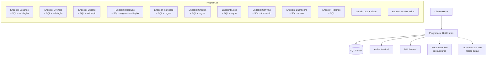
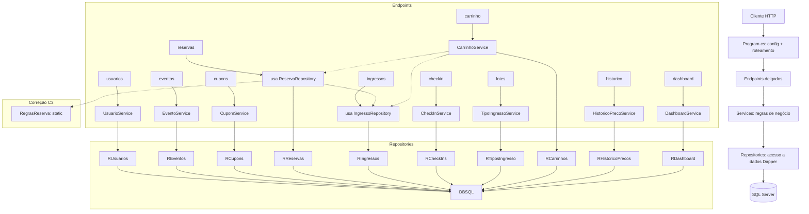

# Plano da Fase 2 — Separação de Camadas e Redução do Acoplamento

**Projeto:** TicketPrime
**Data:** 2026-06-03
**Versão:** 3.0.0 (Final Aprovada — pós validação V4 confirmada em 03/06/2026)
**Base:** Fase 1 concluída (Build OK, 103/103 testes aprovados)

**Contagem de testes:** 103 casos em runtime (71 `[Fact]` + 32 `[InlineData]` de 7 `[Theory]`), distribuídos em 5 arquivos: `IncrementoServiceTests` (64), `ReservaServiceTests` (26), `CupomValidationTests` (5), `EventoValidationTests` (3), `UsuarioValidationTests` (5).

---

## 0. Correções Validadas e Aprovadas pelo V4

O V4 realizou a revisão dos bloqueantes da Fase 2 em **03/06/2026** e **confirmou a validação** das três correções estruturais abaixo. Cada correção está explicitamente implementada nas etapas correspondentes deste plano.

| ID | Descrição | Tipo | Etapa |
|:--:|-----------|:----:|:-----:|
| **C6** | Todos os métodos de repositório devem aceitar `IDbTransaction? transaction = null` como último parâmetro | Convenção obrigatória | **Etapa 2** (seção 4.2) |
| **C3** | Antes de refatorar `ReservaService`, extrair `RegrasReserva` estática com os 4 métodos puros para proteger os 26 testes existentes | Pré-requisito de migração | **Etapa 10a** |
| **C1** | Dividir o domínio Carrinho em duas etapas: **11a (CRUD não-transacional)** e **11b (confirmação transacional)** | Separação de risco | **Etapas 11a e 11b** |

### Impacto das Correções na Ordem de Execução

A ordem de execução abaixo foi **validada e aprovada pelo V4**:

```
1 → 2 → 3 → 4 → 5 → 6 → 7 → 8 → 9 → 10a → 10b → 11a → 11b → 12
                                  ↑              ↑        ↑
                                 C3(10a)       C1(11a)  C1(11b)
```

| Passo | Correção | Descrição |
|:-----:|:--------:|-----------|
| 2 | **C6** | Convenção `IDbTransaction? transaction = null` estabelecida na infra de repositórios |
| 10a | **C3** | Extração de `RegrasReserva` estática **antes** da refatoração do `ReservaService` |
| 11a | **C1** | CRUD do carrinho (não transacional) |
| 11b | **C1** | Confirmação do carrinho (transacional) — etapa separada por risco |

- **C6** é estabelecida na Etapa 2 e aplicada em **todas** as Etapas 3-12 como padrão obrigatório
- **C3** (Etapa 10a) é pré-requisito **obrigatório** para a Etapa 10b — sem ela, os 26 testes de `ReservaService` quebram
- **C1** separa o carrinho em duas etapas com níveis de risco distintos: 11a (médio) → 11b (alto)

---

## 1. Diagnóstico Arquitetural Atual

### 1.1. Estrutura Geral

```
TicketPrime.sln
├── src/TicketPrime.Api/
│   ├── Program.cs              ← 2265 linhas — TUDO AQUI
│   ├── Authentication/          ← 2 arquivos (ok, separado)
│   ├── Middleware/              ← 2 arquivos (ok, separado)
│   ├── Models/                  ← 36 arquivos (entidades + DTOs parciais)
│   └── Services/                ← 2 serviços (puros, sem DB)
└── tests/TicketPrime.Tests/     ← 5 arquivos, 103 testes
```

### 1.2. Responsabilidades Concentradas em [`Program.cs`](src/TicketPrime.Api/Program.cs)

| Responsabilidade | Linhas | Problema |
|:----------------|:------:|:---------|
| Configuração de infra (DI, CORS, Auth, JSON) | 1-58 | Aceitável em Minimal API |
| **Inicialização de banco (DDL + DML + Views)** | 60-396 | SQL de schema **dentro da aplicação** |
| **30 endpoints com SQL, validação e regras de negócio inline** | 398-2198 | Maior problema — mistura tudo |
| Métodos auxiliares (`GerarCodigoUnicoAsync`) | 2200-2221 | Podem ir para serviços |
| **Request models inline** (`UsuarioRequest`, `EventoRequest`, `CupomRequest`, `ReservaRequest`, `CriarCarrinhoRequest`, `AdicionarItensRequest`) | 2227-2265 | Duplicados — alguns já existem como arquivos separados em `Models/` |

### 1.3. O que já está separado (e bem)

- **Autenticação** → [`Authentication/`](src/TicketPrime.Api/Authentication/) (2 arquivos)
- **Exception Handling** → [`Middleware/`](src/TicketPrime.Api/Middleware/) (2 arquivos)
- **Entidades/DTOs** → [`Models/`](src/TicketPrime.Api/Models/) (36 arquivos) — **parcialmente**, pois 6 requests ainda estão inline
- **Regras de negócio puras** → [`Services/`](src/TicketPrime.Api/Services/) (2 arquivos) — sem dependência de banco

### 1.4. Diagrama do Estado Atual



---

## 2. Problemas Encontrados

### P1 — Acoplamento Extremo (Crítico)
**SQL, regras de negócio, validação e lógica de apresentação no mesmo método.**
Cada endpoint em [`Program.cs`](src/TicketPrime.Api/Program.cs) é autossuficiente: recebe request, valida, consulta banco, aplica regras, monta response. Não há separação de responsabilidades.

**Exemplo concreto:** O endpoint [`POST /api/reservas`](src/TicketPrime.Api/Program.cs:510) (87 linhas) faz:
1. Validação de CPF inline
2. Consulta SQL de usuário
3. Consulta SQL de evento
4. Verificação de limite (SQL)
5. Verificação de capacidade (SQL)
6. Consulta SQL de cupom
7. Cálculo de desconto inline
8. INSERT SQL
9. Montagem do response

### P2 — Request Models Duplicados (Alto)
6 classes de request estão declaradas **inline** no [`Program.cs`](src/TicketPrime.Api/Program.cs:2227-2265):
- [`UsuarioRequest`](src/TicketPrime.Api/Program.cs:2227)
- [`EventoRequest`](src/TicketPrime.Api/Program.cs:2234)
- [`CupomRequest`](src/TicketPrime.Api/Program.cs:2242)
- [`ReservaRequest`](src/TicketPrime.Api/Program.cs:2249)
- [`CriarCarrinhoRequest`](src/TicketPrime.Api/Program.cs:2256)
- [`AdicionarItensRequest`](src/TicketPrime.Api/Program.cs:2261)

Enquanto outros requests similares já estão em arquivos separados em [`Models/`](src/TicketPrime.Api/Models/) (ex: [`CarrinhoRequest`](src/TicketPrime.Api/Models/CarrinhoRequest.cs), [`CriarLoteRequest`](src/TicketPrime.Api/Models/CriarLoteRequest.cs)).

### P3 — SQL de Schema na Aplicação (Médio)
As funções [`InicializarBancoAsync`](src/TicketPrime.Api/Program.cs:60), [`TabelaExiste`](src/TicketPrime.Api/Program.cs:373), [`IndiceExiste`](src/TicketPrime.Api/Program.cs:379), [`ColunaExiste`](src/TicketPrime.Api/Program.cs:385) e [`CriarOuRecriarView`](src/TicketPrime.Api/Program.cs:392) deveriam ser scripts SQL executados externamente, não código da aplicação.

### P4 — SQL Duplicado (Médio)
A mesma consulta SQL aparece em múltiplos endpoints:
- `SELECT COUNT(1) FROM Usuarios WHERE Cpf = @Cpf` aparece em 3 endpoints
- `SELECT Id, Nome, CapacidadeTotal, DataEvento, PrecoPadrao FROM Eventos WHERE Id = @Id` aparece em 6+ endpoints
- `SELECT Codigo, PorcentagemDesconto, ValorMinimoRegra FROM Cupons WHERE Codigo = @Codigo` aparece em 4 endpoints

### P5 — Lógica de Transação Espalhada (Médio)
O fluxo de confirmação de carrinho ([`POST /api/carrinho/{cpf}/confirmar`](src/TicketPrime.Api/Program.cs:1695)) gerencia transação manualmente com `try/catch/rollback` inline (~200 linhas). Essa lógica pertence a um service.

### P6 — Métodos Auxiliares Órfãos (Baixo)
[`GerarCodigoUnicoAsync`](src/TicketPrime.Api/Program.cs:2203) é um método estático dentro de [`Program.cs`](src/TicketPrime.Api/Program.cs) que poderia estar em [`IncrementoService`](src/TicketPrime.Api/Services/IncrementoService.cs), mas precisa de DB — o que quebraria a pureza atual do service.

---

## 3. Plano Detalhado da Fase 2

### 3.1. Estrutura-Alvo

```
src/TicketPrime.Api/
├── Program.cs                        ← ~200-300 linhas (só configuração)
├── Authentication/                   ← mantido
├── Middleware/                       ← mantido
├── Models/                           ← expandido (todos os DTOs)
│   ├── UsuarioRequest.cs             ← MOVIDO de Program.cs
│   ├── EventoRequest.cs              ← MOVIDO de Program.cs
│   ├── CupomRequest.cs               ← MOVIDO de Program.cs
│   ├── ReservaRequest.cs             ← MOVIDO de Program.cs
│   ├── CriarCarrinhoRequest.cs       ← MOVIDO de Program.cs
│   └── ... (mantidos os 36 existentes)
├── Repositories/                     ← NOVO
│   ├── IUsuarioRepository.cs
│   ├── UsuarioRepository.cs
│   ├── IEventoRepository.cs
│   ├── EventoRepository.cs
│   ├── ICupomRepository.cs
│   ├── CupomRepository.cs
│   ├── IReservaRepository.cs
│   ├── ReservaRepository.cs
│   ├── IIngressoRepository.cs
│   ├── IngressoRepository.cs
│   ├── ICheckInRepository.cs
│   ├── CheckInRepository.cs
│   ├── ITipoIngressoRepository.cs
│   ├── TipoIngressoRepository.cs
│   ├── ICarrinhoRepository.cs
│   ├── CarrinhoRepository.cs
│   ├── IHistoricoPrecoRepository.cs
│   ├── HistoricoPrecoRepository.cs
│   ├── IDashboardRepository.cs       ← consultas complexas + views
│   └── DashboardRepository.cs
├── Services/                         ← expandido
│   ├── UsuarioService.cs             ← NOVO
│   ├── EventoService.cs              ← NOVO
│   ├── CupomService.cs               ← NOVO
│   ├── ReservaService.cs             ← REFATORADO (injeta repositórios)
│   ├── RegrasReserva.cs              ← NOVO (C3: métodos puros estáticos)
│   ├── IngressoService.cs            ← NOVO
│   ├── CheckInService.cs             ← NOVO
│   ├── TipoIngressoService.cs        ← NOVO
│   ├── CarrinhoService.cs            ← NOVO (CRUD + Confirmação - C1)
│   ├── HistoricoPrecoService.cs      ← NOVO
│   ├── DashboardService.cs           ← NOVO
│   └── IncrementoService.cs          ← MANTIDO (regras puras)
└── Endpoints/                        ← NOVO (opcional, pode ficar em Program.cs enxuto)
    └── ...
```

### 3.2. Diagrama da Arquitetura-Alvo



---

## 4. Ordem das Migrações (do menor para o maior risco)

Cada migração é uma etapa independente, testável e reversível.

> **Ordem validada e aprovada pelo V4 em 03/06/2026:** 1 → 2 → 3 → 4 → 5 → 6 → 7 → 8 → 9 → 10a → 10b → 11a → 11b → 12

---

### Etapa 1 — Extrair Request Models (Risco: Muito Baixo)
**Objetivo:** Mover os 6 requests inline do [`Program.cs`](src/TicketPrime.Api/Program.cs:2227-2265) para arquivos separados em [`Models/`](src/TicketPrime.Api/Models/).

**Arquivos a criar:**
- [`Models/UsuarioRequest.cs`](src/TicketPrime.Api/Models/UsuarioRequest.cs)
- [`Models/EventoRequest.cs`](src/TicketPrime.Api/Models/EventoRequest.cs)
- [`Models/CupomRequest.cs`](src/TicketPrime.Api/Models/CupomRequest.cs)
- [`Models/ReservaRequest.cs`](src/TicketPrime.Api/Models/ReservaRequest.cs)
- [`Models/CriarCarrinhoRequest.cs`](src/TicketPrime.Api/Models/CriarCarrinhoRequest.cs)
- [`Models/AdicionarItensRequest.cs`](src/TicketPrime.Api/Models/AdicionarItensRequest.cs) + `CarrinhoItemRequest` (já existe em [`CarrinhoRequest.cs`](src/TicketPrime.Api/Models/CarrinhoRequest.cs))

**Critério de aceite:** Build passa, `dotnet test` passa, contratos da API inalterados.

**Rollback:** Reverter criação dos arquivos e restaurar as classes inline em [`Program.cs`](src/TicketPrime.Api/Program.cs).

---

### Etapa 2 — Criar Interface e Implementação Base de Repositórios (Risco: Baixo) 🟢 C6
**Objetivo:** Estabelecer o padrão de repositório com injeção de `IDbConnection` e a **convenção C6 obrigatória**.

**Interface base:**
```csharp
namespace TicketPrime.Api.Repositories;

// Apenas estabelece o padrão, sem métodos genéricos
```

**Repositório inicial (exemplo — [`UsuarioRepository`](src/TicketPrime.Api/Repositories/UsuarioRepository.cs)):**
- Injeta `IDbConnection` via construtor
- Encapsula todas as consultas SQL relacionadas a usuários
- Métodos: `ObterPorCpfAsync(string cpf)`, `InserirAsync(Usuario usuario)`, `ExisteAsync(string cpf)`

**Convenção C6 — `IDbTransaction?` como último parâmetro (OBRIGATÓRIO):**

> **Todos** os métodos de repositório que executam SQL DEVEM aceitar `IDbTransaction? transaction = null` como último parâmetro e repassá-lo ao Dapper:

```csharp
public async Task<bool> ExisteAsync(string cpf, IDbTransaction? transaction = null)
{
    return await _db.ExecuteScalarAsync<int>(
        "SELECT COUNT(1) FROM Usuarios WHERE Cpf = @Cpf",
        new { Cpf = cpf },
        transaction: transaction) > 0;
}
```

**Justificativa (C6):** Na Etapa 11b (confirmação de carrinho), múltiplos repositories precisam participar da **mesma transação**. Sem esse parâmetro, cada repository executa SQL fora da transação, quebrando a atomicidade. O parâmetro é opcional (`= null`) para não afetar operações simples que não precisam de transação.

**Críticas (C6):**
1. NÃO usar `IRepository<T>` genérico — cada repositório é específico do domínio.
2. NÃO usar UnitOfWork pattern — excesso de engenharia para um único endpoint transacional.
3. O `CarrinhoService` (Etapa 11b) gerencia a transação via `IDbConnection.BeginTransaction()` e passa o objeto `transaction` para cada chamada de repositório.

---

### Etapa 3 — Migrar Domínio Usuários (Risco: Muito Baixo)
**Objetivo:** Extrair SQL, validação e regras do endpoint de [`/api/usuarios`](src/TicketPrime.Api/Program.cs:417) para Repository + Service.

**Repository:** [`IUsuarioRepository`](src/TicketPrime.Api/Repositories/IUsuarioRepository.cs) / [`UsuarioRepository`](src/TicketPrime.Api/Repositories/UsuarioRepository.cs)
- `Task<Usuario?> ObterPorCpfAsync(string cpf, IDbTransaction? transaction = null)` — C6
- `Task<bool> ExisteAsync(string cpf, IDbTransaction? transaction = null)` — C6
- `Task InserirAsync(Usuario usuario, IDbTransaction? transaction = null)` — C6

**Service:** [`UsuarioService`](src/TicketPrime.Api/Services/UsuarioService.cs)
- `Task<ResultadoOperacao> CriarAsync(UsuarioRequest request)` — valida + chama repository

**Endpoint:** Reduzido a 3-5 linhas: `app.MapPost("/api/usuarios", async (UsuarioService service, UsuarioRequest request) => ...)`

---

### Etapa 4 — Migrar Domínio Cupons (Risco: Muito Baixo)
Exatamente o mesmo padrão da Etapa 3.

**Repository:** [`ICupomRepository`](src/TicketPrime.Api/Repositories/ICupomRepository.cs) / [`CupomRepository`](src/TicketPrime.Api/Repositories/CupomRepository.cs)
- `Task<Cupom?> ObterPorCodigoAsync(string codigo, IDbTransaction? transaction = null)` — C6
- `Task<bool> ExisteAsync(string codigo, IDbTransaction? transaction = null)` — C6
- `Task InserirAsync(Cupom cupom, IDbTransaction? transaction = null)` — C6

**Service:** [`CupomService`](src/TicketPrime.Api/Services/CupomService.cs)

---

### Etapa 5 — Migrar Domínio Eventos (Risco: Baixo)
**Repository:** [`IEventoRepository`](src/TicketPrime.Api/Repositories/IEventoRepository.cs) / [`EventoRepository`](src/TicketPrime.Api/Repositories/EventoRepository.cs)
- Todos os métodos com `IDbTransaction? transaction = null` — C6

**Service:** [`EventoService`](src/TicketPrime.Api/Services/EventoService.cs)

**Endpoints migrados:**
- `POST /api/eventos`
- `GET /api/eventos`

---

### Etapa 6 — Migrar Domínio Histórico de Preços (Risco: Baixo)
**Repository:** [`IHistoricoPrecoRepository`](src/TicketPrime.Api/Repositories/IHistoricoPrecoRepository.cs) / [`HistoricoPrecoRepository`](src/TicketPrime.Api/Repositories/HistoricoPrecoRepository.cs)
- Todos os métodos com `IDbTransaction? transaction = null` — C6

**Service:** [`HistoricoPrecoService`](src/TicketPrime.Api/Services/HistoricoPrecoService.cs)

**Endpoints migrados:**
- `GET /api/eventos/{eventoId}/historico-precos`
- `GET /api/lotes/{loteId}/historico-precos`

---

### Etapa 7 — Migrar Domínio Lotes/TiposIngresso (Risco: Médio)
**Repository:** [`ITipoIngressoRepository`](src/TicketPrime.Api/Repositories/ITipoIngressoRepository.cs) / [`TipoIngressoRepository`](src/TicketPrime.Api/Repositories/TipoIngressoRepository.cs)
- Todos os métodos com `IDbTransaction? transaction = null` — C6

**Service:** [`TipoIngressoService`](src/TicketPrime.Api/Services/TipoIngressoService.cs)

**Endpoints migrados (7 endpoints):**
- `POST /api/eventos/{eventoId}/lotes`
- `GET /api/eventos/{eventoId}/lotes`
- `GET /api/lotes/{loteId}`
- `PUT /api/lotes/{loteId}`
- `DELETE /api/lotes/{loteId}`
- `POST /api/tipos-ingresso`
- `GET /api/eventos/{eventoId}/tipos-ingresso`

---

### Etapa 8 — Migrar Domínio Ingressos (Risco: Médio)
**Repository:** [`IIngressoRepository`](src/TicketPrime.Api/Repositories/IIngressoRepository.cs) / [`IngressoRepository`](src/TicketPrime.Api/Repositories/IngressoRepository.cs)
- Todos os métodos com `IDbTransaction? transaction = null` — C6

**Service:** [`IngressoService`](src/TicketPrime.Api/Services/IngressoService.cs)

**Endpoints migrados:**
- `POST /api/reservas/{id}/ingresso`
- `GET /api/reservas/{id}/ingresso`
- `GET /api/ingressos/{codigo}`

**Nota:** O método [`GerarCodigoUnicoAsync`](src/TicketPrime.Api/Program.cs:2203) deve ser movido para este repositório, já que precisa de acesso ao banco para verificar colisões.

---

### Etapa 9 — Migrar Domínio CheckIn (Risco: Médio)
**Repository:** [`ICheckInRepository`](src/TicketPrime.Api/Repositories/ICheckInRepository.cs) / [`CheckInRepository`](src/TicketPrime.Api/Repositories/CheckInRepository.cs)
- Todos os métodos com `IDbTransaction? transaction = null` — C6

**Service:** [`CheckInService`](src/TicketPrime.Api/Services/CheckInService.cs)

**Endpoints migrados:**
- `POST /api/ingressos/{codigo}/checkin`
- `POST /api/checkin`
- `GET /api/eventos/{eventoId}/checkins`
- `GET /api/eventos/{eventoId}/checkins/stats`

---

### Etapa 10a — Extrair RegrasReserva (Risco: Baixo) 🟢 C3 ⚠️ PRÉ-REQUISITO para Etapa 10b

**Objetivo:** Isolar as regras de negócio puras do [`ReservaService`](src/TicketPrime.Api/Services/ReservaService.cs) em uma classe estática **antes** de refatorar o service para injetar repositórios. Isso protege os 26 testes existentes de quebrarem.

**Motivação (C3):** O `ReservaService` atual é um serviço puro (sem DB) com 4 métodos testados por 26 casos de runtime. Se a Etapa 10b refatorá-lo diretamente para injetar repositórios, as assinaturas dos métodos mudam e **todos os 26 testes quebram**, violando o critério CA2.

**Procedimento:**
1. Criar `Services/RegrasReserva.cs` como classe `public static`
2. Mover os 4 métodos puros para `RegrasReserva` como `static`:
   - `ValidarReserva(...)` → `RegrasReserva.ValidarReserva(...)`
   - `CalcularValorFinal(...)` → `RegrasReserva.CalcularValorFinal(...)`
   - `CupomPodeSerAplicado(...)` → `RegrasReserva.CupomPodeSerAplicado(...)`
   - `ConstruirReservaResponse(...)` → `RegrasReserva.ConstruirReservaResponse(...)`
3. Atualizar `ReservaService` existente para delegar a `RegrasReserva` (mantendo mesmas assinaturas públicas)
4. Atualizar `ReservaServiceTests` para referenciar `RegrasReserva` diretamente
5. Atualizar `IncrementoService` se ele referenciar `ReservaService`

**Arquivos a criar:** `Services/RegrasReserva.cs`
**Arquivos a modificar:** `Services/ReservaService.cs`, `tests/.../ReservaServiceTests.cs`

**Critério de aceite:** Build passa, `dotnet test` 103/103, `ReservaService` existente mantém assinaturas públicas idênticas.

**Rollback:** Reverter criação de `RegrasReserva.cs` e restaurar métodos ao `ReservaService.cs`.

---

### Etapa 10b — Migrar Domínio Reservas (Risco: Médio-Alto)
**Repository:** [`IReservaRepository`](src/TicketPrime.Api/Repositories/IReservaRepository.cs) / [`ReservaRepository`](src/TicketPrime.Api/Repositories/ReservaRepository.cs)
- Todos os métodos com `IDbTransaction? transaction = null` — C6

**Service:** [`ReservaService`](src/TicketPrime.Api/Services/ReservaService.cs) — **REFATORADO**
- O service atual é puro (sem DB). A nova versão injeta repositórios.
- As regras puras já estão em [`RegrasReserva`](src/TicketPrime.Api/Services/RegrasReserva.cs) (extraídas na Etapa 10a — C3).
- O service orquestra: chama repositórios para buscar dados → delega validação para `RegrasReserva.ValidarReserva()` → chama repositórios para persistir.
- Os 26 testes existentes continuam testando `RegrasReserva` diretamente, sem mock.

**Endpoints migrados:**
- `POST /api/reservas`
- `POST /api/reservas/simular-preco`
- `GET /api/reservas/{cpf}`

**Cuidados especiais:**
- O endpoint de simulação usa regras do [`IncrementoService`](src/TicketPrime.Api/Services/IncrementoService.cs) (`SimularPreco`)
- Preservar comportamento exato

---

### Etapa 11a — Migrar Domínio Carrinho CRUD (Risco: Médio) 🟢 C1

**Objetivo:** Migrar os 4 endpoints não-transacionais do carrinho. O endpoint `confirmar` fica para a Etapa 11b por envolver transação multi-domínio (separação C1).

**Repository:** [`ICarrinhoRepository`](src/TicketPrime.Api/Repositories/ICarrinhoRepository.cs) / [`CarrinhoRepository`](src/TicketPrime.Api/Repositories/CarrinhoRepository.cs)
- `Task<Carrinho?> ObterPorIdAsync(int id, IDbTransaction? transaction = null)` — C6
- `Task<Carrinho?> ObterAtivoPorCpfAsync(string cpf, IDbTransaction? transaction = null)` — C6
- `Task<int> CriarAsync(string usuarioCpf, IDbTransaction? transaction = null)` — C6
- `Task AtualizarStatusAsync(int id, string status, IDbTransaction? transaction = null)` — C6
- `Task<IEnumerable<CarrinhoItem>> ObterItensAsync(int carrinhoId, IDbTransaction? transaction = null)` — C6
- `Task InserirItemAsync(CarrinhoItem item, IDbTransaction? transaction = null)` — C6
- `Task LimparItensAsync(int carrinhoId, IDbTransaction? transaction = null)` — C6
- `Task<bool> PossuiItensAsync(int carrinhoId, IDbTransaction? transaction = null)` — C6

**Service:** [`CarrinhoService`](src/TicketPrime.Api/Services/CarrinhoService.cs)
- Métodos CRUD: `CriarAsync()`, `AdicionarItensAsync()`, `ObterAtivoAsync()`, `CancelarAsync()`
- **Não** inclui `ConfirmarAsync()` — este será adicionado na Etapa 11b (C1)

**Endpoints migrados (4 endpoints):**
- `POST /api/carrinho`
- `POST /api/carrinho/{id}/itens`
- `GET /api/carrinho/{cpf}`
- `DELETE /api/carrinho/{cpf}`

**Dependências:** Etapa 2, 3, 5, 7 (não depende da Etapa 10b — pode avançar em paralelo)

---

### Etapa 11b — Migrar Confirmação de Carrinho (Transacional) (Risco: Alto) 🟢 C1

**Objetivo:** Migrar o endpoint `POST /api/carrinho/{cpf}/confirmar` (~200 linhas de lógica transacional) para `CarrinhoService.ConfirmarAsync()`.

**Repository adicional:** Nenhum novo — reutiliza repositories existentes com `IDbTransaction?` (C6):
- `ICarrinhoRepository` (11a), `IReservaRepository` (10b), `IIngressoRepository` (8), `IEventoRepository` (5), `ICupomRepository` (4), `ITipoIngressoRepository` (7)

**Service:** [`CarrinhoService`](src/TicketPrime.Api/Services/CarrinhoService.cs) — adicionar método:
- `Task<CarrinhoConfirmacaoResponse> ConfirmarAsync(string cpf, string? cupomUtilizado)`
- Gerencia a transação via `IDbConnection.BeginTransaction()`
- Passa o objeto `transaction` para **todas** as chamadas de repositório (C6)
- Orquestra: validar CPF → validar cupom → verificar estoque → criar reservas → gerar ingressos → confirmar
- Padrão `try/catch/rollback` preservado exatamente como no código original

**Endpoints migrados (1 endpoint):**
- `POST /api/carrinho/{cpf}/confirmar` ← transacional, maior cuidado

**Dependências:** Etapa 2, 3, 4, 5, 7, 8, **10b** (ReservaService refatorado)

**Riscos específicos:**
- Quebrar atomicidade da transação (mitigado pela convenção C6 — `IDbTransaction?` da Etapa 2)
- Alterar ordem de operações dentro da transação
- Mudar comportamento de rollback
- `GerarCodigoUnicoAsync` deve ser movido para `IngressoService`, não para o repositório (preserva separação regra vs SQL)

---

### Etapa 12 — Migrar Domínio Dashboard/Admin (Risco: Médio)
**Repository:** [`IDashboardRepository`](src/TicketPrime.Api/Repositories/IDashboardRepository.cs) / [`DashboardRepository`](src/TicketPrime.Api/Repositories/DashboardRepository.cs)
- Consultas às views `vw_DashboardEventos` e `vw_DashboardLotes`
- Consultas com filtros opcionais (já refatorados na Fase 1)

**Service:** [`DashboardService`](src/TicketPrime.Api/Services/DashboardService.cs)

**Endpoints migrados (7 endpoints, todos com `.RequireAuthorization()`):**
- `GET /api/admin/eventos`
- `GET /api/admin/eventos/{eventoId}`
- `GET /api/admin/eventos/{eventoId}/lotes`
- `GET /api/admin/reservas`
- `GET /api/admin/eventos/{eventoId}/resumo`
- `GET /api/admin/eventos/{eventoId}/checkins`
- `GET /api/admin/eventos/{eventoId}/reservas`

---

## 5. Estratégia de Rollback

### 5.1. Por Etapa

Cada etapa é isolada e reversível via Git:

```bash
# Antes de iniciar cada etapa, criar um commit/tag
git add -A && git commit -m "checkpoint antes da Etapa N"

# Em caso de falha:
git checkout HEAD~1  # ou git revert
```

### 5.2. Matriz de Rollback por Etapa

| Etapa | Rollback | Esforço | Correção |
|:-----:|----------|:-------:|:--------:|
| 1 | Remover arquivos criados, restaurar classes inline | 5 min | — |
| 2 | Remover diretório `Repositories/` | 2 min | **C6** |
| 3-6 | Reverter commits, restaurar endpoints originais | 15 min cada | C6 |
| 7-9 | Reverter commits, endpoints voltam a ter SQL inline | 20 min cada | C6 |
| **10a** | Reverter extração de `RegrasReserva`, restaurar métodos ao `ReservaService` | 10 min | **C3** |
| 10b | Reverter refatoração do [`ReservaService`](src/TicketPrime.Api/Services/ReservaService.cs) | 30 min | C3, C6 |
| **11a** | Reverter CRUD do carrinho (4 endpoints) | 25 min | **C1**, C6 |
| **11b** | Reverter transação e confirmação do carrinho | 45 min | **C1**, C6 |
| 12 | Reverter dashboard | 15 min | C6 |

### 5.3. Garantia de Rollback Seguro

1. Cada etapa DEVE passar em `dotnet test` antes do commit
2. Cada etapa DEVE passar em `dotnet build` sem warnings novos
3. Testes manuais nos endpoints migrados (via curl ou Postman) antes de declarar etapa concluída
4. Nunca migrar mais de um domínio por commit
5. **Especial C3:** Antes da Etapa 10a, garantir que `ReservaServiceTests` está em estado conhecido (103/103 passando)
6. **Especial C1:** As Etapas 11a e 11b DEVEM ser comitadas separadamente — nunca mesclar CRUD com transação no mesmo commit

---

## 6. Critérios de Aceite

### 6.1. Obrigatórios (Fase 2)

- [ ] **CA1:** `dotnet build` compila sem erros nem warnings (exceto possíveis warnings de nullability pré-existentes)
- [ ] **CA2:** `dotnet test` passa os 103 testes existentes **sem modificações** (protegido por C3)
- [ ] **CA3:** Nenhum endpoint da API mudou de rota, método HTTP, request body ou response body
- [ ] **CA4:** Nenhuma regra de negócio foi alterada (mesmas validações, mesmos cálculos)
- [ ] **CA5:** Nenhuma tabela, coluna, constraint, índice ou view foi alterada no banco
- [ ] **CA6:** Autenticação e autorização permanecem idênticas
- [ ] **CA7:** CORS permanece idêntico
- [ ] **CA8:** [`Program.cs`](src/TicketPrime.Api/Program.cs) reduzido para no máximo ~300 linhas (excluindo endpoints inline)

### 6.2. Desejáveis

- [ ] **CD1:** Cobertura de testes aumentada com pelo menos 5 testes de integração para repositórios (opcional, pode ser fase futura)
- [ ] **CD2:** Documentação de endpoints atualizada se houver mudanças de descrição

### 6.3. Critérios Específicos por Correção

| Correção | Critério | Verificação |
|:--------:|----------|:-----------:|
| **C6** | Todos os métodos de repositório que executam SQL possuem `IDbTransaction? transaction = null` como último parâmetro | Revisão de código em cada PR de repositório |
| **C3** | Após Etapa 10a, `ReservaServiceTests` continua passando 26/26 sem alterações | `dotnet test --filter ReservaServiceTests` |
| **C1** | Etapas 11a e 11b são comitadas separadamente; `CarrinhoService.ConfirmarAsync()` gerencia transação com `IDbConnection.BeginTransaction()` e repassa `transaction` a todos os repositórios | Revisão de código + teste manual de rollback |

### 6.4. O que NÃO muda (Blindado)

```
Contratos da API    ❌ Não alterar
Banco de Dados      ❌ Não alterar (nem DDL, nem DML)
Regras de Negócio   ❌ Não alterar
Autenticação        ❌ Não alterar
CORS                ❌ Não alterar
Testes Existentes   ❌ Não alterar (nem 1 linha)
```

---

## 7. Riscos da Fase 2

### 7.1. Riscos Atualizados (pós validação V4)

| # | Risco | Probabilidade | Impacto | Mitigação | Correção |
|:-:|-------|:-------------:|:-------:|-----------|:--------:|
| R1 | **Quebra de contrato da API** ao refatorar endpoints | Baixa | Crítico | Testes existentes + testes manuais; CA3 como critério de aceite | — |
| R2 | **Regressão em regra de negócio** durante extração para services | Média | Alto | Etapas pequenas; cada service novo tem os testes existentes como rede de segurança | — |
| **R3** | **Perda de atomicidade** na transação do carrinho | Média | Alto | Etapa 11b por último; transação extraída com mesmo padrão `try/catch/rollback`; **convenção C6** garante que todos os repositories participem da mesma transação | **C1, C6** |
| R4 | **Injeção de dependência cíclica** entre services (ex: CarrinhoService → ReservaService → ...) | Baixa | Médio | Services orquestradores podem referenciar outros services; evitar dependência bidirecional | — |
| R5 | **Performance degradada** por overhead de múltiplas chamadas a repositórios | Baixa | Médio | Repositórios são thin wrappers sobre Dapper; overhead mínimo | — |
| R6 | **Dificuldade de testar repositórios** sem banco real | Alta | Médio | Repositórios não serão testados unitariamente (apenas integração futura); services mantêm lógica testável | — |
| R7 | **Commit grande demais** em uma etapa | Média | Médio | Nunca migrar mais de um domínio por commit; cada etapa é um PR separado | — |
| R8 | **Conflito com autenticação** — endpoints admin têm `.RequireAuthorization()` | Baixa | Alto | Preservar o `.RequireAuthorization()` exatamente como está; não mover a chamada | — |
| R9 | **Esquecer de registrar DI** para novo service/repository | Média | Médio | Checklist de cada etapa incluir verificação de `builder.Services.AddScoped<...>()` | — |
| R10 | **`GerarCodigoUnicoAsync`** perder a lógica de colisão com o banco | Baixa | Alto | Manter a lógica de loop + verificação SQL exatamente como está, apenas movendo de local | — |
| **R11** | **Quebra dos 26 testes de `ReservaService`** ao refatorar para injeção de repositórios | Alta | Alto | **C3**: extrair `RegrasReserva` estática na Etapa 10a **antes** de refatorar o service na Etapa 10b | **C3** |
| **R12** | **Repository sem `IDbTransaction?`** — impossibilidade de participar de transação multi-domínio | Média | Alto | **C6**: convenção obrigatória estabelecida na Etapa 2 e verificada em code review; qualquer novo método de repositório SEM o parâmetro é considerado violação | **C6** |
| **R13** | **Confundir CRUD com transação** no carrinho — commit único misturando 11a + 11b | Média | Médio | **C1**: Etapas 11a e 11b são explicitamente separadas em commits distintos; checklist de cada etapa proíbe mesclar | **C1** |

### 7.2. Riscos Remanescentes (pós Fase 2)

Mesmo com a Fase 2 concluída, os seguintes riscos permanecem:

| # | Risco | Probabilidade | Impacto | Fase sugerida para correção |
|:-:|-------|:-------------:|:-------:|---------------------------|
| RR1 | Race condition no limite de 2 reservas por CPF/evento (TD-003) | Média | Médio | Concorrência (futura) |
| RR2 | Logging de `ex.Message` em exceções genéricas (TD-001) | Baixa | Baixo | Observabilidade (futura) |
| RR3 | Schema SQL dentro do `Program.cs` (P3) — iniciação de banco via código | Baixa | Médio | Fase 3 (scripts externos) |
| RR4 | Ausência de testes de integração para repositórios | Alta | Médio | Fase 3 (testes de integração) |

### 7.3. Riscos Fora de Escopo (não abordar na Fase 2)

- **TD-001:** Logging de `ex.Message` — fase futura de observabilidade
- **TD-003:** Race condition no limite de 2 reservas — fase futura de concorrência
- **Melhorias de performance** — fora do escopo
- **Migrations automáticas** — fora do escopo
- **Adoção de Entity Framework** — proibido por requisito

---

## 8. Nota de Maturidade Arquitetural

### 8.1. Atual (Fase 1 concluída)

```
+------------------------------------------+-------+
| Dimensão                                 | Nota  |
+------------------------------------------+-------+
| Separação de responsabilidades           |  1/10 |
| Organização de código (coesão)           |  3/10 |
| Testabilidade                            |  6/10 |
| Manutenibilidade                         |  2/10 |
| Acoplamento                              |  1/10 |
| Consistência de padrões                  |  4/10 |
+------------------------------------------+-------+
| Média                                    | 2.8/10 |
+------------------------------------------+-------+
```

**Justificativa:** [`Program.cs`](src/TicketPrime.Api/Program.cs) com 2265 linhas contendo SQL, regras, validação e endpoints é arquiteturalmente imaturo. Os únicos pontos positivos são: (a) serviços de regras puras já separados, (b) autenticação/middleware já isolados, (c) 103 testes unitários.

### 8.2. Esperada após Fase 2

```
+------------------------------------------+-------+
| Dimensão                                 | Nota  |
+------------------------------------------+-------+
| Separação de responsabilidades           |  7/10 |
| Organização de código (coesão)           |  7/10 |
| Testabilidade                            |  8/10 |
| Manutenibilidade                         |  7/10 |
| Acoplamento                              |  6/10 |
| Consistência de padrões                  |  8/10 |
+------------------------------------------+-------+
| Média                                    | 7.2/10 |
+------------------------------------------+-------+
```

**Ganhos esperados:**
- [`Program.cs`](src/TicketPrime.Api/Program.cs) reduzido de 2265 para ~300 linhas
- SQL centralizado em repositórios (sem duplicação)
- Regras de negócio em services testáveis
- Padrão Repository + Service consistente em todos os 10 domínios
- Injeção de dependência unificada
- **C6** garante que toda operação de banco é transacionável
- **C3** protege os 26 testes de reserva contra regressão
- **C1** separa riscos do carrinho em etapas gerenciáveis

---

## 9. Resumo das Etapas

| Etapa | Domínio | Arquivos Novos | Arquivos Modificados | Risco | Correção | Depende de |
|:-----:|:--------|:--------------:|:--------------------:|:----:|:--------:|:----------:|
| 1 | Request Models | 6 | [`Program.cs`](src/TicketPrime.Api/Program.cs) | Muito Baixo | — | — |
| **2** | **Infra Repositórios** | ~2 (base) | [`Program.cs`](src/TicketPrime.Api/Program.cs) (DI) | Baixo | **C6** | — |
| 3 | Usuários | 4 | [`Program.cs`](src/TicketPrime.Api/Program.cs) | Muito Baixo | C6 | Etapa 2 |
| 4 | Cupons | 4 | [`Program.cs`](src/TicketPrime.Api/Program.cs) | Muito Baixo | C6 | Etapa 2 |
| 5 | Eventos | 4 | [`Program.cs`](src/TicketPrime.Api/Program.cs) | Baixo | C6 | Etapa 2 |
| 6 | Histórico Preços | 4 | [`Program.cs`](src/TicketPrime.Api/Program.cs) | Baixo | C6 | Etapa 2 |
| 7 | Lotes/TiposIngresso | 4 | [`Program.cs`](src/TicketPrime.Api/Program.cs) | Médio | C6 | Etapa 2 |
| 8 | Ingressos | 4 | [`Program.cs`](src/TicketPrime.Api/Program.cs) | Médio | C6 | Etapa 2 |
| 9 | CheckIn | 4 | [`Program.cs`](src/TicketPrime.Api/Program.cs) | Médio | C6 | Etapa 2 |
| **10a** | **RegrasReserva** | 1 | [`ReservaService.cs`](src/TicketPrime.Api/Services/ReservaService.cs), testes | Baixo | **C3** | — |
| 10b | Reservas | 2 | [`Program.cs`](src/TicketPrime.Api/Program.cs), [`ReservaService.cs`](src/TicketPrime.Api/Services/ReservaService.cs) | Médio-Alto | C3, C6 | Etapa 2, 3, 5, **10a** |
| **11a** | **Carrinho CRUD** | 4 | [`Program.cs`](src/TicketPrime.Api/Program.cs) | Médio | **C1**, C6 | Etapa 2, 3, 5, 7 |
| **11b** | **Carrinho Confirmar** | 0 (só adiciona método ao service) | [`Program.cs`](src/TicketPrime.Api/Program.cs), [`CarrinhoService.cs`](src/TicketPrime.Api/Services/CarrinhoService.cs) | Alto | **C1**, C6 | Etapa 2, 3, 4, 5, 7, 8, **10b** |
| 12 | Dashboard/Admin | 4 | [`Program.cs`](src/TicketPrime.Api/Program.cs) | Médio | C6 | Etapa 2, 5, 8, 9 |

**Total de novos arquivos:** ~47  
**Arquivos modificados (principalmente [`Program.cs`](src/TicketPrime.Api/Program.cs)):** 1-2 por etapa  
**Testes existentes modificados:** ZERO (critério obrigatório, protegido por C3)

---

## 10. Checklist de Cada Etapa

Para cada etapa de migração, seguir este checklist:

- [ ] Criar arquivo(s) de repositório (interface + implementação)
- [ ] **Verificar C6:** todo método de repositório com SQL possui `IDbTransaction? transaction = null` como último parâmetro
- [ ] Criar arquivo(s) de service
- [ ] Registrar DI em [`Program.cs`](src/TicketPrime.Api/Program.cs) (`builder.Services.AddScoped<I??Repository, ??Repository>()`)
- [ ] Extrair SQL do endpoint para o repositório
- [ ] Extrair validações/regras para o service
- [ ] Substituir endpoint inline por chamada ao service
- [ ] Remover classes/linhas duplicadas de [`Program.cs`](src/TicketPrime.Api/Program.cs)
- [ ] Executar `dotnet build` (zero erros)
- [ ] Executar `dotnet test` (103/103 aprovados)
- [ ] Testar endpoint manualmente (curl ou Postman)
- [ ] Fazer commit com mensagem descritiva

---

## 11. Critérios para Iniciar a Etapa 1

Antes de iniciar a execução da Fase 2, os seguintes pré-requisitos DEVEM ser atendidos:

### 11.1. Pré-requisitos de Ambiente

- [ ] **Build OK:** `dotnet build` em `src/TicketPrime.Api/` compila sem erros
- [ ] **Testes OK:** `dotnet test` em `tests/TicketPrime.Tests/` passa 103/103
- [ ] **Branch criada:** branch `feature/fase2-separacao-camadas` a partir de `main` (ou branch de trabalho equivalente)
- [ ] **Clean working tree:** `git status` limpo (sem modificações não comitadas)

### 11.2. Pré-requisitos de Conhecimento

- [ ] Equipe revisou a seção [Correções Validadas pelo V4](#0-correções-validadas-pelo-v4) e entende C1, C3, C6
- [ ] Equipe entende a convenção C6 (`IDbTransaction? transaction = null`) e por que ela é obrigatória
- [ ] Equipe entende que a Etapa 10a (C3) deve preceder a Etapa 10b obrigatoriamente
- [ ] Equipe entende a separação C1 (11a ≠ 11b) e que os commits não podem ser mesclados

### 11.3. Checkpoint Inicial

```bash
# Criar checkpoint antes de qualquer modificação
git add -A && git commit -m "checkpoint: estado inicial antes da Fase 2"
git tag fase2-checkpoint-inicial
```

### 11.4. O que NÃO é pré-requisito

- Não é necessário ter o banco SQL Server rodando (testes são unitários, sem DB)
- Não é necessário conhecimento profundo de Dapper (repositórios seguem padrão)
- Não é necessário alterar scripts SQL (CA5 protege o banco)

---

## Apêndice A — Mapa de Endpoints vs Domínios

| Método | Rota | Domínio | Etapa |
|--------|------|:-------:|:-----:|
| `GET` | `/health` | Infra | — |
| `GET` | `/` | Infra | — |
| `POST` | `/api/usuarios` | Usuários | 3 |
| `POST` | `/api/eventos` | Eventos | 5 |
| `GET` | `/api/eventos` | Eventos | 5 |
| `POST` | `/api/cupons` | Cupons | 4 |
| `POST` | `/api/reservas` | Reservas | 10b |
| `POST` | `/api/reservas/simular-preco` | Reservas | 10b |
| `GET` | `/api/reservas/{cpf}` | Reservas | 10b |
| `POST` | `/api/reservas/{id}/ingresso` | Ingressos | 8 |
| `GET` | `/api/reservas/{id}/ingresso` | Ingressos | 8 |
| `GET` | `/api/ingressos/{codigo}` | Ingressos | 8 |
| `POST` | `/api/ingressos/{codigo}/checkin` | CheckIn | 9 |
| `POST` | `/api/checkin` | CheckIn | 9 |
| `GET` | `/api/eventos/{eventoId}/checkins` | CheckIn | 9 |
| `GET` | `/api/eventos/{eventoId}/checkins/stats` | CheckIn | 9 |
| `POST` | `/api/eventos/{eventoId}/lotes` | Lotes | 7 |
| `GET` | `/api/eventos/{eventoId}/lotes` | Lotes | 7 |
| `GET` | `/api/lotes/{loteId}` | Lotes | 7 |
| `PUT` | `/api/lotes/{loteId}` | Lotes | 7 |
| `DELETE` | `/api/lotes/{loteId}` | Lotes | 7 |
| `POST` | `/api/tipos-ingresso` | Lotes | 7 |
| `GET` | `/api/eventos/{eventoId}/tipos-ingresso` | Lotes | 7 |
| `POST` | `/api/carrinho` | Carrinho | **11a (C1)** |
| `POST` | `/api/carrinho/{id}/itens` | Carrinho | **11a (C1)** |
| `GET` | `/api/carrinho/{cpf}` | Carrinho | **11a (C1)** |
| `DELETE` | `/api/carrinho/{cpf}` | Carrinho | **11a (C1)** |
| `POST` | `/api/carrinho/{cpf}/confirmar` | Carrinho | **11b (C1)** |
| `GET` | `/api/eventos/{eventoId}/historico-precos` | Histórico | 6 |
| `GET` | `/api/lotes/{loteId}/historico-precos` | Histórico | 6 |
| `GET` | `/api/admin/eventos` | Dashboard | 12 |
| `GET` | `/api/admin/eventos/{eventoId}` | Dashboard | 12 |
| `GET` | `/api/admin/eventos/{eventoId}/lotes` | Dashboard | 12 |
| `GET` | `/api/admin/reservas` | Dashboard | 12 |
| `GET` | `/api/admin/eventos/{eventoId}/resumo` | Dashboard | 12 |
| `GET` | `/api/admin/eventos/{eventoId}/checkins` | Dashboard | 12 |
| `GET` | `/api/admin/eventos/{eventoId}/reservas` | Dashboard | 12 |

**Total: 31 endpoints públicos + 2 infraestrutura = 33 rotas.**

---

## Apêndice B — Análise dos Services Existentes

### [`ReservaService`](src/TicketPrime.Api/Services/ReservaService.cs) (129 linhas)

| Aspecto | Status |
|:--------|:-------|
| **Estado atual** | ✅ Service puro (sem dependência de banco) |
| **Problemas** | Nenhum — bem isolado, bem testado (26 testes) |
| **Recomendação** | **Etapa 10a (C3):** Extrair métodos puros para classe estática `RegrasReserva`. **Etapa 10b:** Refatorar `ReservaService` para injetar repositórios, delegando regras para `RegrasReserva`. Os 26 testes continuam testando `RegrasReserva` diretamente. |

### [`IncrementoService`](src/TicketPrime.Api/Services/IncrementoService.cs) (368 linhas)

| Aspecto | Status |
|:--------|:-------|
| **Estado atual** | ✅ Service puro (sem dependência de banco) |
| **Problemas** | Muitas responsabilidades: RF01 a RF06 em uma única classe |
| **Recomendação** | Dividir em services por domínio: `IngressoService`, `CheckInService`, `TipoIngressoService`, `CarrinhoService`, `HistoricoPrecoService`, `DashboardService`. Manter a classe original como legado durante a migração |

### Novos Services a Criar

| Service | Baseado em | Testes Existentes |
|:--------|:-----------|:-----------------:|
| `UsuarioService` | Novo | 5 (UsuarioValidation) |
| `EventoService` | Novo | 3 (EventoValidation) |
| `CupomService` | Novo | 5 (CupomValidation) |
| `ReservaService` (refatorado) | `ReservaService` existente | 26 (12 Facts + 14 InlineData) |
| `RegrasReserva` (C3) | Extraído de `ReservaService` | 26 (herdados) |
| `IngressoService` | Parte do `IncrementoService` (RF01) | 16 |
| `CheckInService` | Parte do `IncrementoService` (RF02) | 10 |
| `TipoIngressoService` | Parte do `IncrementoService` (RF03) | 14 |
| `CarrinhoService` | Parte do `IncrementoService` (RF04) | 7 |
| `HistoricoPrecoService` | Parte do `IncrementoService` (RF05) | 11 |
| `DashboardService` | Parte do `IncrementoService` (RF06) | 6 |
| **Total** | **11 services** (10 + RegrasReserva) | **103 testes** |

---

## Apêndice C — Repositories vs Acesso a Dados Atual

### Situação Atual (tudo inline)

```csharp
// Em Program.cs, dentro do endpoint:
var existe = await db.ExecuteScalarAsync<int>(
    "SELECT COUNT(1) FROM Usuarios WHERE Cpf = @Cpf",
    new { request.Cpf });
```

### Situação-Alvo (com C6)

```csharp
// UsuarioRepository.cs
public class UsuarioRepository : IUsuarioRepository
{
    private readonly IDbConnection _db;
    
    public UsuarioRepository(IDbConnection db) => _db = db;
    
    public async Task<bool> ExisteAsync(string cpf, IDbTransaction? transaction = null)  // C6
    {
        return await _db.ExecuteScalarAsync<int>(
            "SELECT COUNT(1) FROM Usuarios WHERE Cpf = @Cpf",
            new { Cpf = cpf },
            transaction: transaction) > 0;
    }
    
    public async Task InserirAsync(Usuario usuario, IDbTransaction? transaction = null)  // C6
    {
        await _db.ExecuteAsync(
            "INSERT INTO Usuarios (Cpf, Nome, Email) VALUES (@Cpf, @Nome, @Email)",
            usuario,
            transaction: transaction);
    }
}
```

**Nota sobre C6:** O parâmetro `IDbTransaction? transaction = null` é opcional. Em operações simples (ex: `POST /api/usuarios`), o repository é chamado sem transação. Na confirmação de carrinho (Etapa 11b), o `CarrinhoService` abre a transação e passa o objeto `transaction` para que todos os repositories participem da mesma unidade atômica.

---

## Histórico de Revisões

| Versão | Data | Descrição |
|:------:|------|-----------|
| 1.0.0 | 2026-06-01 | Versão inicial do plano da Fase 2 |
| 2.0.0 | 2026-06-01 | Pré-validação V4. Correções C1, C3, C6 propostas e incorporadas. |
| **3.0.0** | **2026-06-03** | **Versão final aprovada — pós confirmação V4.** V4 revisou e **validou** C1, C3 e C6 em 03/06/2026. Ordem de execução confirmada: 1→2→3→4→5→6→7→8→9→10a→10b→11a→11b→12. Plano pronto para execução. |

---

*Documento gerado em 2026-06-03. Versão final aprovada (v3.0.0) — Fase 2: Separação de Camadas e Redução do Acoplamento. Validação V4 confirmada.*
